# 数字大脑架构设计

## 一、设计目标

基于《总述.txt》中提出的核心思想，设计一套数字大脑架构。核心目标：

1. **低成本推理**：通过知识+程序的有机结合，替代暴力模式匹配，实现低推理成本
2. **高精度计算**：对封闭域问题实现确定性精确求解，消除幻觉
3. **通用学习**：所有能力（包括分词、推理、计算）均通过学习获得，无需硬编码
4. **可解释性**：每一步推理过程可追溯、可解释

## 二、核心设计理念

### 2.1 记忆统一观

系统的记忆系统是统一的，不同类型的记忆存储在同一个图结构中：

| 记忆类型 | 对应内容 |
|---------|---------|
| **陈述性记忆** | 事实、概念、实体、关系 |
| **程序性记忆** | 算法、技能、操作流程 |

**核心主张**：知识图谱是记忆系统的实现方式，陈述性记忆和程序性记忆统一存储在同一个知识图谱中。

### 2.2 学习优先观

所有能力都是学习的结果：
- 词素拆分是一种习得的程序性记忆
- 加法运算是一种习得的程序性记忆
- 推理能力是一种习得的程序性记忆
- 不存在"硬编码"的基本算法库，所有算法都通过学习获得

### 2.3 架构演进观

系统的能力不是预先设计好的，而是通过学习逐步生长出来的。系统的架构应支持从简单到复杂的渐进式学习。

## 三、整体架构

### 3.1 记忆系统（核心）

知识图谱即记忆系统，统一存储陈述性记忆与程序性记忆。

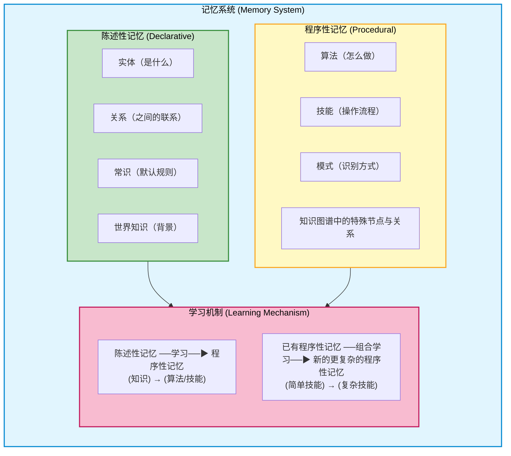

### 3.2 工作区模块

工作区模块是数字大脑的"工作台"，负责暂时存储和处理当前问题所需的信息。

**工作区核心特性**：
- 容量有限（同时处理的信息块数量有限）
- 是信息处理的"工作台"，所有推理和计算都在此完成
- 信息在任务完成后会被清除或巩固到长期记忆

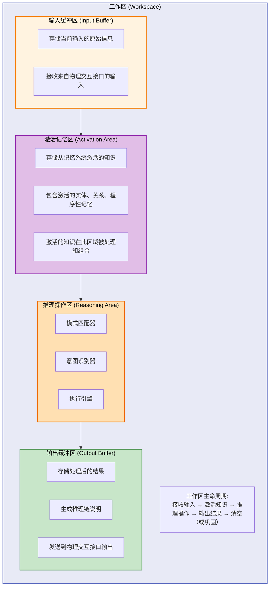

**工作区核心特性**：
- **临时性**：工作区中的信息在任务完成后会被清除，除非被巩固到长期记忆
- **有限容量**：同时处理的信息块数量有限
- **高速处理**：工作区中的信息可以快速访问和处理
- **动态激活**：工作区可以按需从长期记忆系统中激活相关知识
- **递归支持**：支持程序性记忆的递归调用，子任务也在工作区中完成

### 3.3 完整架构分层关系

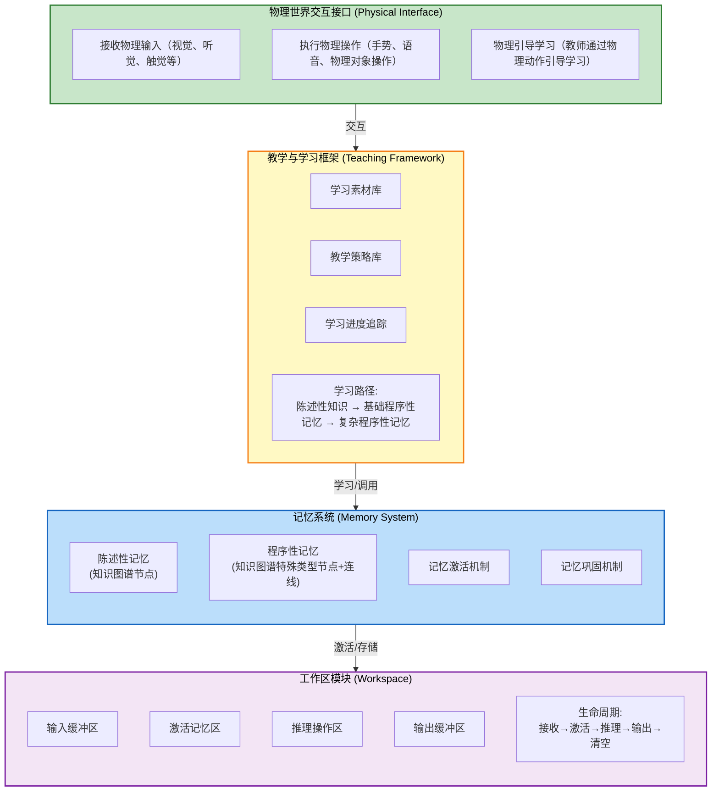

**架构组件说明**：

| 组件 | 位置 | 职责 |
|------|------|------|
| 物理世界交互接口 | 最外层 | 与物理世界交互，接收输入、执行操作、支持物理引导学习 |
| 教学与学习框架 | 外层 | 管理学习素材、教学策略、学习路径，是知识习得的入口 |
| 记忆系统 | 核心 | 存储陈述性记忆和程序性记忆，提供记忆激活和巩固机制 |
| 工作区模块 | 运行时 | 暂时存储和处理当前问题的信息，完成推理和计算 |

## 四、记忆系统详细设计

### 4.1 陈述性记忆

#### 4.1.1 实体

存储所有概念实体，每个实体包含：
- 唯一标识
- 名称及别名（支持多语言、多表达方式）
- 类型（物理实体、抽象实体、关系实体、过程实体）
- 属性集合（如数值、单位、可计数性等）
- 具身映射（物理世界中的对应物）

**实体分类体系**：
| 类型 | 示例 | 说明 |
|------|------|------|
| 物理实体 | 手指、苹果、桌子 | 可被感官直接感知 |
| 抽象实体 | 数字、颜色、情感 | 从物理实体中抽象而来 |
| 关系实体 | 大于、包含、因果 | 实体间的连接方式 |
| 过程实体 | 加法、跑步、思考 | 可分解的操作序列 |

#### 4.1.2 关系

存储实体间的关系，每条关系包含：
- 源实体与目标实体
- 关系类型
- 置信度
- 适用上下文

**关系类型体系**：
| 关系类型 | 符号 | 示例 |
|---------|------|------|
| 映射 (MAPS_TO) | → | "1" → "一根手指" |
| 组成 (COMPOSED_OF) | ⊂ | "加法" ⊂ "计数" + "合并" |
| 因果 (CAUSES) | ⇒ | 计数 ⇒ 得到结果 |
| 等价 (EQUIVALENT) | ≡ | "一" ≡ "1" ≡ "one" |
| 包含 (CONTAINS) | ⊃ | "整数" ⊃ "正整数" |
| 依赖 (DEPENDS_ON) | ← | "除法" ← "乘法" |

#### 4.1.3 常识

存储默认的世界知识和规则，用于在推理过程中提供背景知识支撑。

#### 4.1.4 世界模型

模拟物理世界的简化模型，用于具身推理。

### 4.2 程序性记忆

程序性记忆是知识图谱中的特殊节点，代表"知道怎么做"。它与陈述性记忆共享同一个图结构，但具有不同的语义和激活模式。

#### 4.2.1 程序性记忆的本质

程序性记忆不是一段代码，而是知识图谱中的一种特殊节点模式：

- 它包含一组**触发条件**（何时激活）
- 它包含一组**操作序列**（做什么）
- 它包含一组**依赖知识**（需要哪些陈述性记忆和其他程序性记忆）
- 它通过**学习机制**从经验中获得

#### 4.2.2 程序性记忆示例

以"计数"算法为例，它在知识图谱中的表示：

```
程序性记忆节点: "计数"
├── 触发条件:
│   · 输入为一组可计数对象
│   · 意图为确定对象数量
├── 操作序列:
│   1. 逐个遍历对象
│   2. 对每个可计数对象，计数+1
│   3. 遍历结束，返回计数值
├── 依赖:
│   · 陈述性记忆: "可计数"属性
│   · 陈述性记忆: "对象"概念
│   · 程序性记忆: "遍历"（如果已学习）
└── 适用场景:
    · 确定物理对象数量
    · 确定抽象概念数量
    · 作为加法等更复杂算法的基础
```

**关键要点**：
- "计数"不是硬编码的，而是通过学习获得的程序性记忆
- "遍历"能力也是学习获得的程序性记忆，"计数"依赖于它
- 更复杂的算法（如"加法"）通过组合简单的程序性记忆习得

#### 4.2.3 程序性记忆的层次

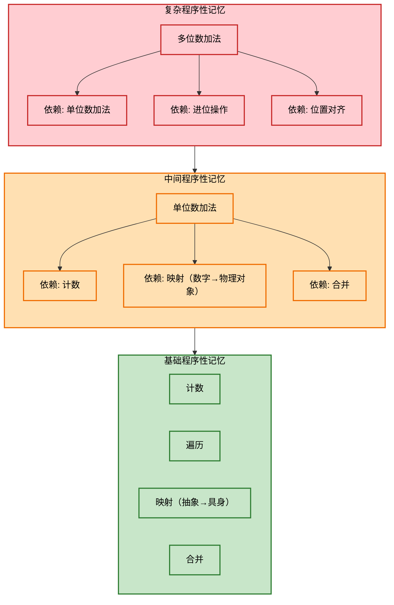

#### 4.2.4 程序性记忆的学习路径

所有程序性记忆都通过以下路径习得：

**路径一：经验归纳**
- 通过大量示例，归纳出操作模式
- 例：儿童数多个苹果后，归纳出"计数"技能

**路径二：知识指导**
- 在已有陈述性知识的指导下，组合已有程序性记忆
- 例：已知"加法=计数+合并"，通过组合已有技能习得加法

**路径三：类比迁移**
- 将已有程序性记忆迁移到新的领域
- 例：将"计数"技能迁移到"数抽象概念"

### 4.3 学习机制

学习机制是从陈述性记忆生成程序性记忆的过程。

#### 4.3.1 学习触发

学习在以下情况下被触发：
- 系统尝试解决问题，但现有程序性记忆无法完成
- 用户提供了新的示例或指导
- 系统在执行过程中发现了更优的操作方式

#### 4.3.2 学习过程

```mermaid
flowchart TD
    S1["Step 1: 问题/示例输入"] --> S2["Step 2: 激活相关的陈述性记忆和程序性记忆"]
    S2 --> S3["Step 3: 尝试组合现有程序性记忆解决问题"]
    S3 --> S4{Step 4: 是否成功?}
    S4 -->|成功| S5["巩固该组合为新的程序性记忆"]
    S4 -->|失败| S6["分析问题结构，尝试发现新的操作模式"]
    S5 --> S7["Step 7: 将新程序性记忆整合到知识图谱中"]
    S6 --> S7
    S7 --> S8["Step 8: 验证新习得的程序性记忆"]
    
    classDef start fill:#c8e6c9,stroke:#2e7d32,stroke-width:2px,color:#000
    classDef process fill:#bbdefb,stroke:#1565c0,stroke-width:2px,color:#000
    classDef decision fill:#fff9c4,stroke:#f57f17,stroke-width:2px,color:#000
    classDef end fill:#f8bbd0,stroke:#c2185b,stroke-width:2px,color:#000
    
    class S1 start
    class S2,S3,S5,S6,S7 process
    class S4 decision
    class S8 end
```

#### 4.3.3 学习的渐进性

学习是一个渐进的过程：
- 初始阶段：只能习得最基础的程序性记忆（如计数、遍历）
- 中期阶段：通过组合基础技能，习得更复杂的技能（如加法、比较）
- 高级阶段：通过组合复杂技能，习得高级能力（如多位数运算、逻辑推理）

### 4.4 记忆激活机制

记忆激活机制负责从输入激活相关的陈述性记忆和程序性记忆，是问题理解的起点。

#### 4.4.1 激活触发

当系统接收到输入后，激活机制被触发：
- 输入可以是文本、语音、物理对象等形式
- 激活的目标是找到与当前问题最相关的知识

#### 4.4.2 激活过程

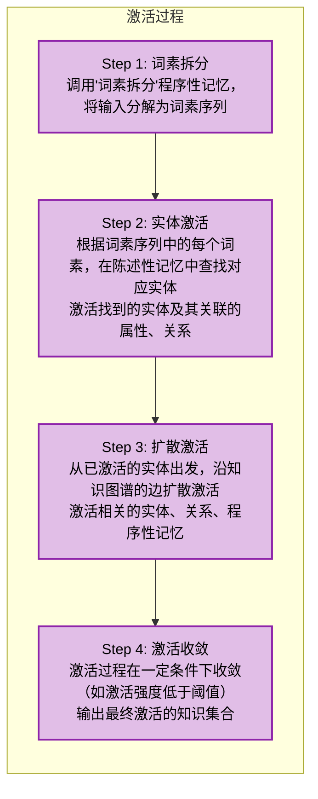

#### 4.4.3 激活强度与范围

- **激活强度**：与词素的匹配度、实体的重要性、上下文相关性有关
- **激活范围**：从直接匹配的实体向外扩展1-3跳
- **激活优先级**：与当前问题类型相关的知识优先激活

#### 4.4.4 冲突解决

当多个知识同时激活且存在冲突时：
- 置信度高的知识优先
- 与上下文更相关的知识优先
- 被多次验证的知识优先

### 4.5 记忆巩固机制

记忆巩固机制负责将临时学习的知识转化为稳定的长期记忆。

#### 4.5.1 巩固触发

记忆巩固在以下情况下被触发：
- 新知识被连续多次成功调用
- 新知识通过了充分的验证
- 系统完成了一个学习周期

#### 4.5.2 巩固过程

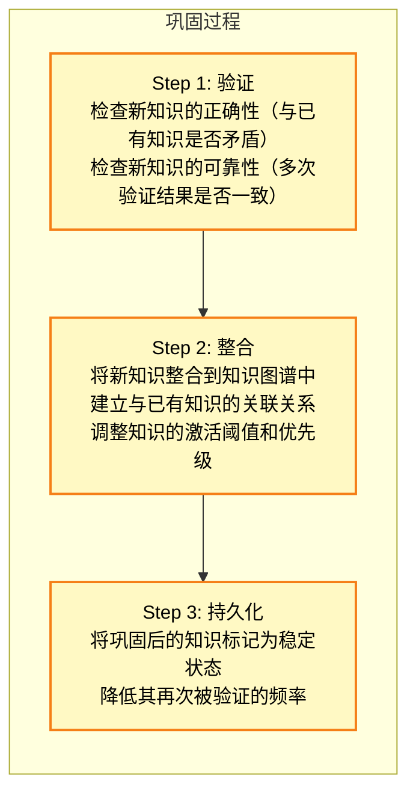

#### 4.5.3 记忆的时效性

- **短期记忆**：刚学习的知识，激活阈值高，容易被遗忘
- **长期记忆**：经过巩固的知识，激活阈值低，稳定可靠
- **遗忘机制**：长期未被调用的知识，激活阈值逐渐提高

## 五、物理世界交互接口

物理世界交互接口是数字大脑与外部世界的连接点，支持物理引导学习和物理操作执行。

### 5.1 输入接口

#### 5.1.1 物理输入接收

接收来自物理世界的输入：
- 视觉输入：识别物理对象（手指、苹果等）
- 听觉输入：接收语音指令、教师的讲解
- 触觉输入：感知物理操作的结果

#### 5.1.2 符号输入接收

接收符号化的输入：
- 文本输入：接收自然语言、数学表达式
- 结构化输入：接收格式化的问题描述

### 5.2 输出接口

#### 5.2.1 物理操作执行

执行物理操作：
- 手势操作：伸出手指、合并手掌等
- 对象操作：拾取、移动、合并物理对象

#### 5.2.2 符号输出生成

生成符号化的输出：
- 文本输出：生成自然语言回答
- 计算输出：生成精确的计算结果
- 推理解释：生成完整的推理链说明

### 5.3 物理引导学习

物理引导学习是学习的起点，对应人类的早期学习方式：

#### 5.3.1 引导方式

- **教师演示**：教师通过物理动作展示概念（如伸手指表示数字1）
- **环境交互**：系统通过与环境交互获得反馈
- **自我探索**：系统主动探索物理世界，发现规律

#### 5.3.2 学习示例

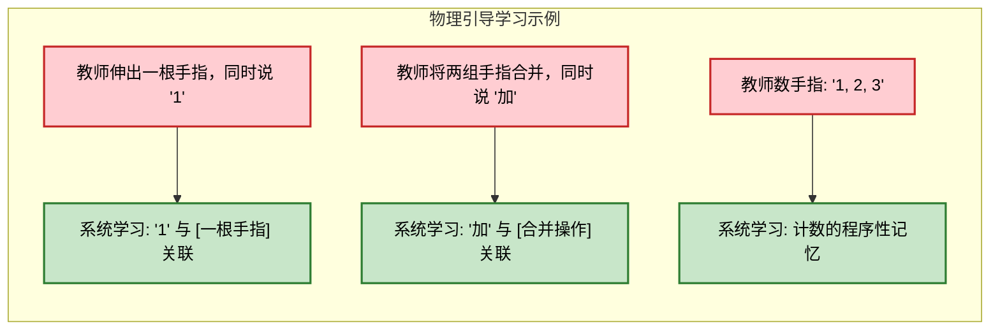

## 六、教学与学习框架

教学与学习框架管理整个学习过程，确保知识习得的有序性和有效性。

### 6.1 学习素材库

学习素材库存储用于学习的示例和任务。

#### 6.1.1 素材类型

| 素材类型 | 说明 | 示例 |
|---------|------|------|
| 物理示例 | 通过物理动作展示的示例 | 伸手指表示数字 |
| 符号示例 | 通过符号表达的示例 | "1+1=2" |
| 自然语言示例 | 通过自然语言描述的示例 | "小明有1个苹果，再加1个" |
| 引导任务 | 带有指导的学习任务 | "试试用手指数一数" |
| 探索任务 | 需要自主探索的任务 | "看看你能不能发现这个规律" |

#### 6.1.2 素材组织

学习素材按学习路径组织：
- **入门素材**：最基础的概念和技能
- **进阶素材**：需要组合基础技能的任务
- **高级素材**：需要创造性应用的问题

### 6.2 教学策略库

教学策略库存储不同的教学方法和策略。

#### 6.2.1 教学策略类型

| 策略类型 | 说明 | 适用场景 |
|---------|------|---------|
| 示范教学 | 教师演示操作过程 | 基础技能学习 |
| 引导发现 | 教师提供线索，学生发现规律 | 算法归纳学习 |
| 组合教学 | 指导学生组合已有技能 | 复杂技能学习 |
| 类比教学 | 通过类比帮助理解新概念 | 迁移学习 |

#### 6.2.2 策略选择

根据学习进度和素材类型自动选择最合适的教学策略。

### 6.3 学习路径规划

学习路径规划确保学习的渐进性和系统性。

#### 6.3.1 路径规划原则

- **由浅入深**：从最简单的概念开始，逐步深入
- **温故知新**：在学习新知识前，复习相关旧知识
- **适度挑战**：任务难度略高于当前能力水平
- **即时反馈**：学习过程中提供即时的正确/错误反馈

#### 6.3.2 示例学习路径

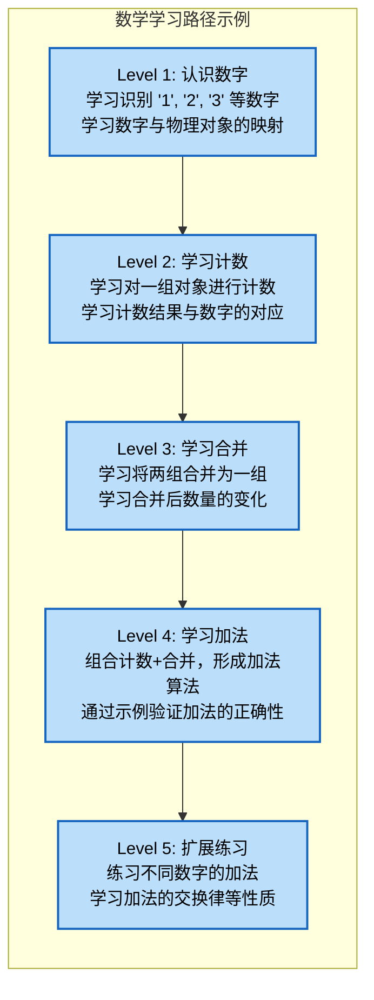

## 七、模式匹配与意图识别机制

模式匹配与意图识别机制是问题理解的核心，负责从词素序列中识别用户意图。

### 7.1 模式存储

模式以特殊的陈述性记忆形式存储在知识图谱中。

#### 7.1.1 模式表示

```
模式节点: "算术计算-加法"
├── 结构: [数字] [运算符:加法] [数字] [关系符] [查询词]
├── 关联程序性记忆: "加法"
├── 适用范围: 所有加法运算
└── 优先级: 高（常见问题类型）
```

#### 7.1.2 模式分类

| 模式类型 | 示例结构 | 关联程序性记忆 |
|---------|---------|--------------|
| 算术计算 | [数][运算符][数]=[?] | 对应运算符的算法 |
| 比较判断 | [数][关系符][数] | 比较算法 |
| 排序任务 | [数1,数2,数3][排序指令] | 排序算法 |
| 应用题 | 自然语言描述的数量关系 | 推理+计算组合 |

### 7.2 模式匹配过程

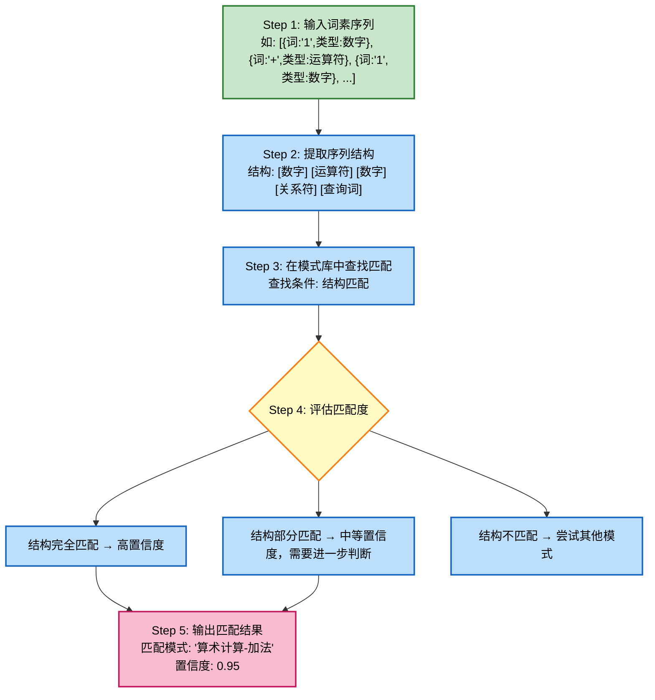

### 7.3 意图识别

在模式匹配的基础上，进一步识别具体的用户意图。

#### 7.3.1 意图要素

一个完整的意图包含：
- **操作类型**：如加法、减法、比较等
- **操作对象**：如具体的数字、实体
- **操作约束**：如范围、精度要求
- **目标**：如求出结果、判断对错等

#### 7.3.2 意图输出

```
识别的意图:
  操作类型: 加法
  操作对象: [数字1, 数字1]
  操作约束: 无特殊约束
  目标: 求出两数之和
  关联程序性记忆: "加法"
```

### 7.4 不确定性处理

当模式匹配或意图识别不确定时：
- 低置信度（<0.5）：请求用户澄清
- 中等置信度（0.5-0.8）：基于最可能的意图执行，同时标记不确定性
- 高置信度（>0.8）：直接执行

## 八、工作区模块详细设计

工作区模块是数字大脑的"工作台"。

### 8.1 工作区缓冲区

#### 8.1.1 输入缓冲区

输入缓冲区存储当前输入的原始信息。

**功能**：
- 接收来自物理交互接口的输入（文本、语音、物理对象等）
- 保持输入信息的完整性，直到被处理
- 支持多模态输入的统一存储

**示例**：

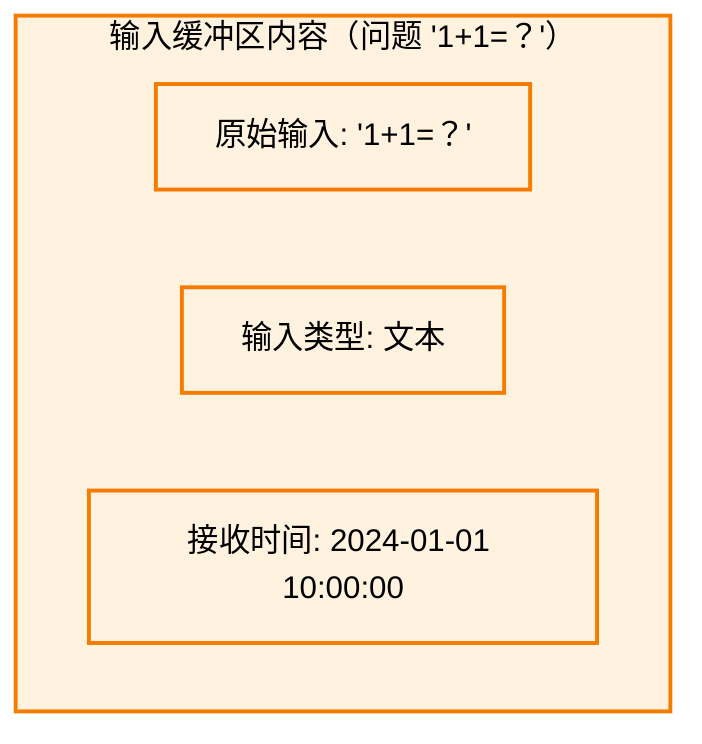

#### 8.1.2 激活记忆区

激活记忆区存储从记忆系统激活的知识，是工作区的核心数据区。

**功能**：
- 根据当前问题，从长期记忆系统中激活相关知识
- 存储激活的实体、关系、程序性记忆
- 保持激活知识的高可访问性

**激活过程**：

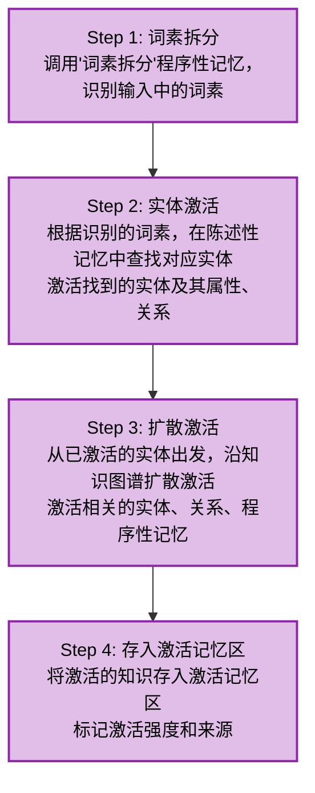

**示例**：

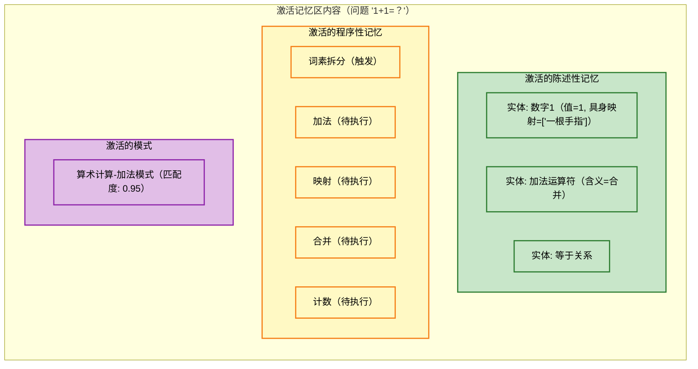

#### 8.1.3 推理操作区

推理操作区是工作区的"操作台"，完成模式匹配、意图识别和算法执行。

**功能**：
- 模式匹配：将激活的知识与已知模式进行匹配
- 意图识别：根据匹配模式，识别用户意图
- 算法执行：调用程序性记忆执行具体的操作

**处理流程**：

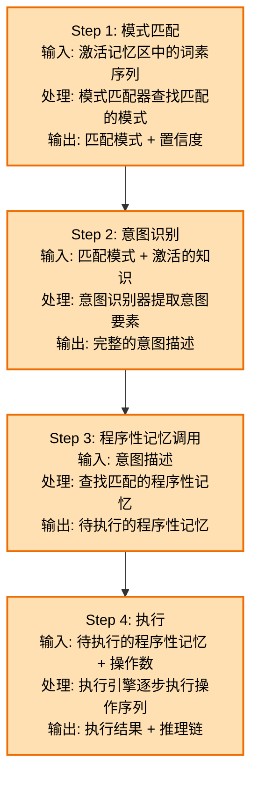

**示例**：

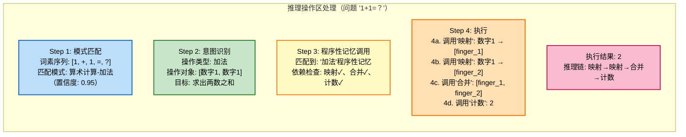

#### 8.1.4 输出缓冲区

输出缓冲区存储最终结果和推理链说明。

**功能**：
- 存储处理后的最终结果
- 生成完整的推理链说明
- 准备发送到物理交互接口

**示例**：

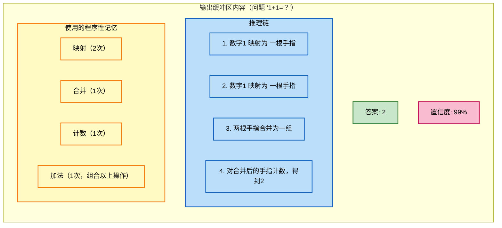

### 8.2 工作区生命周期

工作区的生命周期：接收信息 → 处理信息 → 输出结果 → 清空/巩固。


**各阶段说明**：

| 阶段 | 输入缓冲区 | 激活记忆区 | 推理操作区 | 输出缓冲区 |
|------|-----------|-----------|-----------|-----------|
| 接收 | 写入原始输入 | 空 | 空 | 空 |
| 激活 | 保持输入 | 写入激活知识 | 空 | 空 |
| 推理 | 保持输入 | 保持激活知识 | 执行推理操作 | 空 |
| 输出 | 保持输入 | 保持激活知识 | 操作完成 | 写入结果 |
| 清空/巩固 | 清除 | 清除（可选巩固） | 清除 | 清除 |

### 8.3 工作区与记忆系统的交互

工作区与记忆系统的交互是双向的：

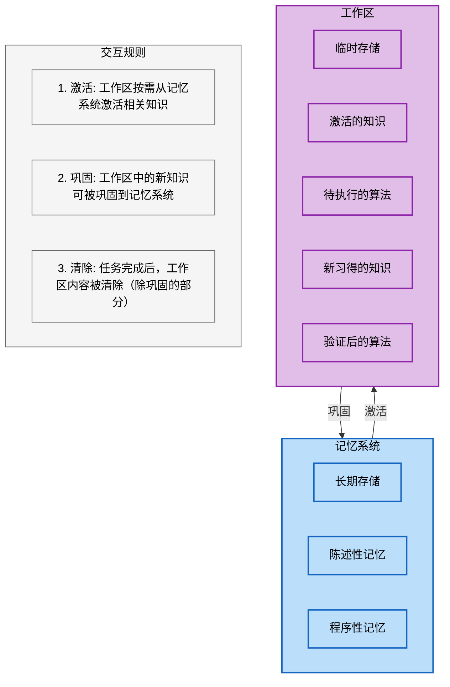

**激活规则**：
- 按需激活：只有与当前问题相关的知识才会被激活
- 有限激活：激活的知识量受工作区容量限制
- 动态调整：激活的知识可以在推理过程中动态调整

**巩固规则**：
- 新知识验证后可被巩固
- 被多次成功调用的知识更容易被巩固
- 巩固的知识从工作区转移到长期记忆系统

### 8.4 工作区容量管理

工作区的容量有限，需要有效的管理策略。

#### 8.4.2 容量管理策略

| 策略 | 说明 |
|------|------|
| 按需激活 | 只激活与当前问题相关的知识 |
| 优先级排序 | 重要/相关的知识优先保留 |
| 动态替换 | 容量不足时，低优先级知识被替换 |
| 子任务分离 | 复杂任务分解为多个子任务，串行处理 |

#### 8.4.3 复杂任务的处理

当遇到复杂任务时，工作区通过**子任务分解**来管理容量：

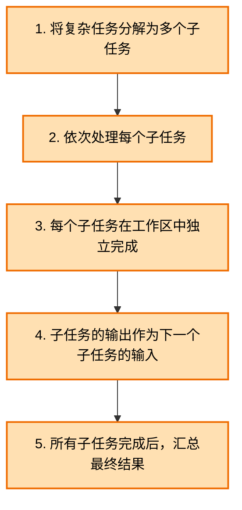

### 8.5 词素拆分作为程序性记忆

词素拆分本身就是一种程序性记忆，在工作区中被调用：

```
程序性记忆节点: "词素拆分"
├── 触发条件:
│   · 输入为自然语言文本
│   · 需求为理解文本含义
├── 操作序列:
│   1. 识别文本中的基本语义单元
│   2. 标注每个单元的语义类型
│   3. 将单元映射到知识图谱中的实体
│   4. 推断文本的整体意图
├── 依赖:
│   · 陈述性记忆: 词汇表（有哪些词素存在）
│   · 程序性记忆: 实体识别
│   · 程序性记忆: 意图推断
└── 学习过程:
    · 通过接触大量文本，学习识别词素边界
    · 通过知识图谱中的实体，学习将词素映射到实体
    · 通过文本-意图对，学习推断意图
```

**关键意义**：词素拆分不是系统的"输入端"，而是系统通过学习获得的一项能力。这意味着：
- 系统可以学习多种语言的词素拆分
- 系统可以学习特定领域的专业术语拆分
- 词素拆分能力会随着知识的增长而改进

## 九、数据流转全景

以完整应用题为例，展示记忆系统与工作区的协作：

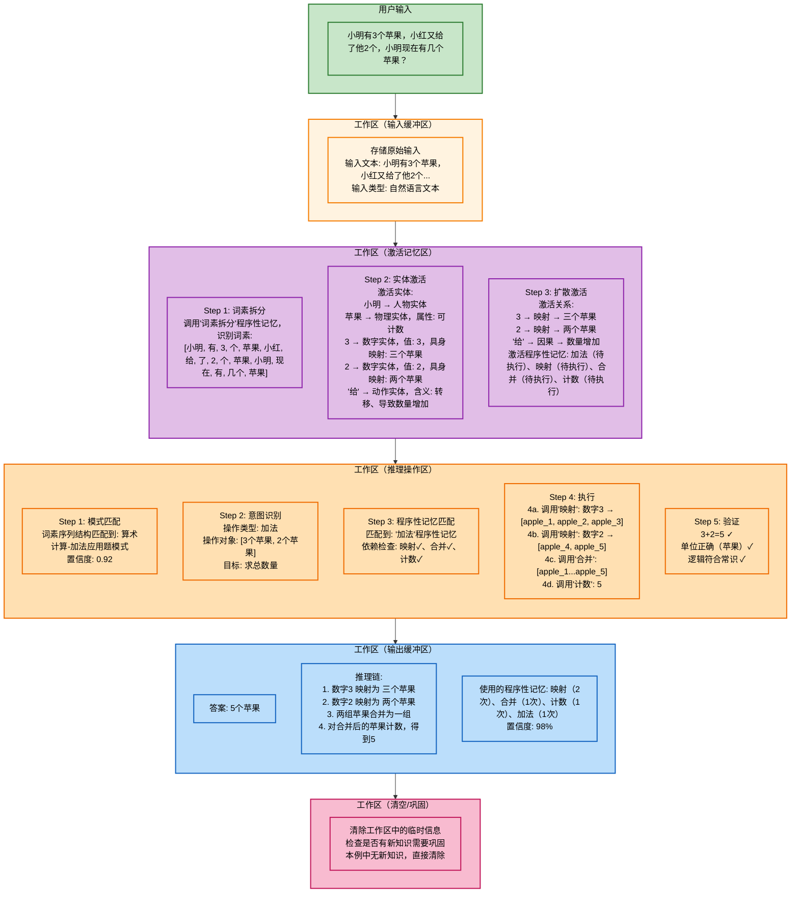

## 十、与现有大模型的对比

| 维度 | 大模型 (LLM) | 数字大脑 (本架构) |
|------|-------------|------------------|
| 知识存储 | 隐式编码在参数中 | 显式图结构存储（陈述性记忆） |
| 程序存储 | 隐式编码在参数中 | 显式图结构存储（程序性记忆） |
| 推理方式 | 模式匹配（概率推理） | 程序性记忆调用（确定性计算） |
| 训练成本 | 极高（万亿参数） | 极低（学习程序性记忆） |
| 推理成本 | 高（需GPU） | 低（可在CPU运行） |
| 计算精度 | 可能产生幻觉 | 确定性精确计算 |
| 可解释性 | 黑箱 | 每步可追溯（调用了哪些程序性记忆） |
| 学习本质 | 统计拟合 | 程序性记忆的习得与组合 |
| 知识更新 | 需重新训练 | 直接修改/补充记忆 |
| 能力边界 | 通用但模糊 | 专用但精确 |

## 十一、实施路线图

### Phase 1: 核心基础设施 (1-3个月)
- [ ] 实现统一的记忆存储（陈述性+程序性记忆的图结构）
- [ ] 实现记忆激活机制（从输入激活相关知识）
- [ ] 实现模式匹配与意图识别机制
- [ ] 构建物理交互接口的基础版本（支持符号输入输出）
- [ ] 实现基础学习机制（从示例归纳程序性记忆）
- [ ] 构建核心陈述性记忆（数字、基本实体、简单关系）
- [ ] 实现工作区的基本框架（输入缓冲区、激活记忆区、推理操作区、输出缓冲区）
- [ ] 支持最简单的程序性记忆学习（如"计数"）

### Phase 2: 教学框架与基础能力 (3-6个月)
- [ ] 实现学习素材库（构建入门级学习素材）
- [ ] 实现教学策略库（示范教学、引导发现）
- [ ] 实现学习路径规划
- [ ] 支持更多程序性记忆的学习（加法、减法、映射等）
- [ ] 实现程序性记忆的组合学习机制
- [ ] 支持词素拆分作为程序性记忆的学习
- [ ] 实现记忆巩固机制
- [ ] 实现工作区生命周期管理（接收→激活→推理→输出→清空）
- [ ] 实现工作区容量管理
- [ ] 支持10以内的加减法精确计算

### Phase 3: 物理交互与能力扩展 (6-12个月)
- [ ] 增强物理交互接口（支持简单的物理引导学习）
- [ ] 实现物理引导学习的完整流程
- [ ] 学习更复杂的程序性记忆（乘除法、排序、比较）
- [ ] 支持推理模板作为程序性记忆的学习
- [ ] 实现知识指导的学习路径
- [ ] 支持100以内的四则运算和简单应用题

### Phase 4: 通用化演进 (12-24个月)
- [ ] 拓展到几何、物理等学科领域
- [ ] 实现世界模型相关的程序性记忆
- [ ] 支持多模态输入的程序性记忆学习
- [ ] 构建自主学习闭环
- [ ] 实现完整的自主教学与学习能力

## 十二、关键风险与应对

| 风险 | 可能性 | 影响 | 应对策略 |
|------|--------|------|---------|
| 程序性记忆的表示方式不明确 | 高 | 高 | 先以简化的图节点+触发条件+操作序列方式表示，后续优化 |
| 学习机制的有效性 | 高 | 高 | 先用监督学习路径验证，再扩展到自主学习 |
| 陈述性记忆的构建成本 | 中 | 高 | 聚焦封闭域（数学），先构建核心知识子图 |
| 程序性记忆的组合爆炸 | 中 | 中 | 引入组合约束，限制可组合的程序性记忆范围 |
| 工作区容量限制的合理性 | 中 | 中 | 先设置较大容量，根据实际效果调整 |
| 工作区与记忆系统的交互效率 | 中 | 中 | 优化激活算法，缓存热点知识 |
| 性能瓶颈 | 中 | 中 | 热记忆缓存；学习结果持久化 |
| 物理交互的实现难度 | 中 | 高 | 先在虚拟环境中模拟物理交互，再迁移到真实环境 |
| 教学素材的质量 | 中 | 中 | 建立素材质量评估体系，持续优化 |
| 学习路径的合理性 | 低 | 中 | 参考认知科学研究成果，结合实际效果调整 |

## 十三、总结

本架构的核心是一个**统一的记忆系统**，辅以**工作区模块**、**物理交互接口**和**教学学习框架**：

1. **知识图谱 = 记忆系统**：陈述性记忆（知识）和程序性记忆（算法）统一存储
2. **工作区 = 工作台**：负责暂时存储和处理当前问题的所有信息
3. **物理交互接口**：支持物理引导学习和物理操作执行，是学习的起点
4. **教学学习框架**：管理学习素材、教学策略、学习路径，确保知识习得的有序性
5. **所有能力都是学习的结果**：词素拆分、推理、计算等都是习得的程序性记忆
6. **学习是渐进的**：从物理引导的基础程序性记忆开始，逐步组合出更复杂的能力
7. **记忆的激活与巩固**：知识通过激活机制被检索，通过巩固机制被持久化