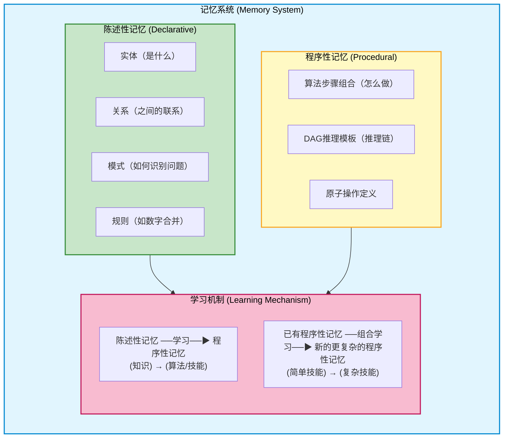
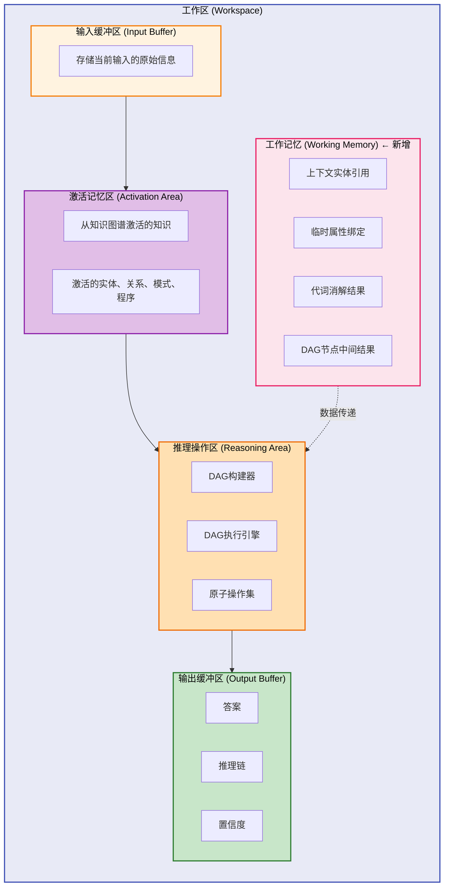
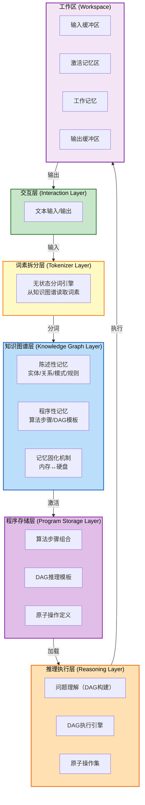
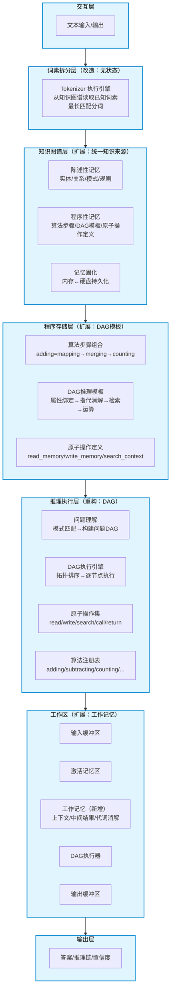
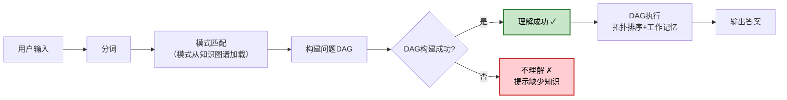
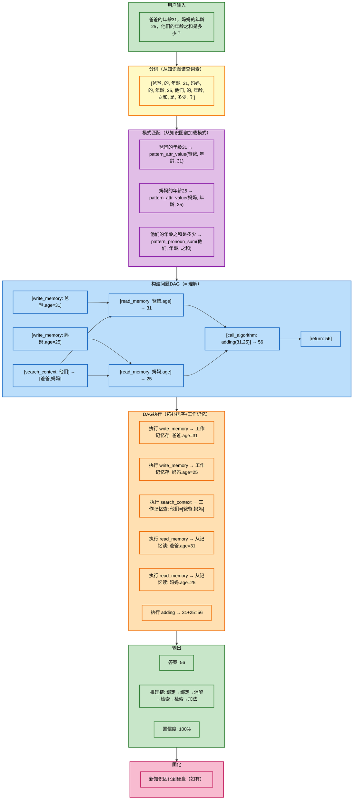

# 数字大脑架构设计

## 一、设计目标

基于《总述.txt》中提出的核心思想，设计一套数字大脑架构。核心目标：

1. **低成本推理**：通过知识+程序的有机结合，替代暴力模式匹配，实现低推理成本
2. **高精度计算**：对封闭域问题实现确定性精确求解，消除幻觉
3. **通用学习**：所有能力（包括分词、推理、计算）均通过学习获得，无需硬编码
4. **可解释性**：每一步推理过程可追溯、可解释

## 二、核心设计理念

### 2.1 记忆统一观

系统的记忆系统是统一的，不同类型的记忆存储在同一个图结构中：

| 记忆类型 | 对应内容 |
|---------|---------|
| **陈述性记忆** | 事实、概念、实体、关系、模式、规则 |
| **程序性记忆** | 算法、技能、操作流程、DAG推理模板 |

**核心主张**：知识图谱是记忆系统的实现方式，陈述性记忆和程序性记忆统一存储在同一个知识图谱中。不存在第二份知识拷贝。

### 2.2 学习优先观

所有能力都是学习的结果：
- 词素拆分知识存储在知识图谱中，通过学习获得
- 加法运算是一种习得的程序性记忆
- 推理能力（DAG构建与执行）是一种习得的程序性记忆
- 不存在"硬编码"的基本算法库，所有算法都通过学习获得

### 2.3 架构演进观

系统的能力不是预先设计好的，而是通过学习逐步生长出来的。系统的架构应支持从简单到复杂的渐进式学习。

## 三、整体架构

### 3.1 记忆系统（核心）

知识图谱即记忆系统，统一存储陈述性记忆与程序性记忆。

### 3.2 工作区模块

工作区模块是数字大脑的"工作台"，对应前额叶皮层（工作记忆+决策控制）。

### 3.3 完整架构分层关系

## 四、设计变更（v2）

基于 MVP 实施过程中的发现，架构设计做以下变更。详细设计见 [详细设计](详细设计/) 目录下各模块文档。

### 4.1 变更总览

| # | 变更项 | 变更前 | 变更后 | 影响层 |
|---|--------|--------|--------|--------|
| 1 | 词素知识统一 | LearnableTokenizer 有独立知识库（known_morphemes） | 删除内部状态，分词从知识图谱读取 | 词素拆分层 |
| 2 | 模式可学习 | PatternMatcher 硬编码模式 | 模式存知识图谱，通过知识包学习 | 知识图谱层 |
| 3 | 算法可学习 | AlgorithmRegistry 代码实现 | 原子操作组合，步骤存知识图谱 | 程序存储层 |
| 4 | DAG 推理 | 单步：意图→算法→输出 | 多步：问题DAG构建→拓扑排序执行 | 推理执行层 |
| 5 | 工作记忆 | 无 | 新增 WorkingMemory（上下文+中间结果） | 工作区 |
| 6 | 记忆持久化 | 全内存，重启丢失 | 固化到硬盘 + 启动加载 | 记忆系统 |

### 4.2 核心原则（不变）

- 知识图谱是唯一知识来源，不存在第二份拷贝
- 执行引擎通用化，不针对特定问题
- 所有知识（模式、算法步骤、推理链）通过知识包学习
- 执行能力（原子操作）是先天的"硬件"，什么时候用、怎么用是学来的

### 4.3 变更后架构

### 4.4 问题理解 = DAG 构建

变更后引入的核心概念：**用户问题转换为问题DAG = 系统理解了问题**。

## 五、详细设计索引

详细设计已按模块拆分至 [详细设计](详细设计/) 目录：

| 模块 | 文档 | 核心职责 |
|------|------|---------|
| 记忆系统 | [记忆系统设计.md](详细设计/记忆系统设计.md) | 知识图谱统一存储、记忆固化与恢复 |
| 工作区 | [工作区设计.md](详细设计/工作区设计.md) | 工作记忆、DAG执行环境、生命周期 |
| 分词引擎 | [分词引擎设计.md](详细设计/分词引擎设计.md) | 无状态分词，从知识图谱读取词素 |
| 模式匹配 | [模式匹配设计.md](详细设计/模式匹配设计.md) | 从知识图谱加载模式、通用匹配引擎 |
| 推理执行 | [推理执行设计.md](详细设计/推理执行设计.md) | DAG构建、DAG执行、原子操作集 |
| 教学框架 | [教学框架设计.md](详细设计/教学框架设计.md) | 知识包格式、学习接口、课程编排 |

## 六、与现有大模型的对比

| 维度 | 大模型 (LLM) | 数字大脑 (本架构) |
|------|-------------|------------------|
| 知识存储 | 隐式编码在参数中 | 显式图结构存储（知识图谱统一） |
| 程序存储 | 隐式编码在参数中 | 程序性记忆（原子操作组合） |
| 推理方式 | 模式匹配（概率推理） | DAG推理（确定性计算） |
| 训练成本 | 极高（万亿参数） | 极低（学习知识包） |
| 推理成本 | 高（需GPU） | 低（可在CPU运行） |
| 计算精度 | 可能产生幻觉 | 确定性精确计算 |
| 可解释性 | 黑箱 | DAG每步可追溯 |
| 学习本质 | 统计拟合 | 知识包学习+程序性记忆组合 |
| 知识更新 | 需重新训练 | 学习新知识包 |
| 能力边界 | 通用但模糊 | 专用但精确 |

## 七、数据流转全景

以完整应用题为例，展示变更后记忆系统与工作区的协作：

## 八、实施路线图

### Phase 1: 架构升级 (当前)
- [ ] 词素拆分层改造：删除 LearnableTokenizer 内部状态，从知识图谱读取
- [ ] 知识图谱层扩展：新增模式实体、规则实体
- [ ] 程序存储层扩展：新增 DAG 模板、原子操作定义
- [ ] 推理执行层重构：DAG 构建器 + DAG 执行引擎 + 原子操作集
- [ ] 工作区新增工作记忆模块
- [ ] 记忆固化实现：save_json / load_json 自动调用

### Phase 2: 知识包与能力验证
- [ ] 基础知识包：一年级数学 + 一年级语文 + 分词技能 + 指代消解
- [ ] 验证：空白脑 → learn 基础知识包 → 能解应用题
- [ ] 验证：DAG 构建成功 = 理解成功
- [ ] 验证：未学知识 → DAG 构建失败 → 提示缺什么

### Phase 3: 能力扩展
- [ ] 更多知识包（二年级数学、语文下册等）
- [ ] 更复杂的 DAG 模板（多步应用题、逻辑推理）
- [ ] 记忆固化与恢复的完整流程
- [ ] 更多种类的原子操作

### Phase 4: 通用化演进
- [ ] 拓展到其他学科领域
- [ ] 自主学习闭环
- [ ] 多模态输入支持

## 九、关键风险与应对

| 风险 | 可能性 | 影响 | 应对策略 |
|------|--------|------|---------|
| DAG构建器复杂度 | 高 | 高 | 先支持简单模式，逐步扩展 |
| 原子操作集设计 | 中 | 高 | 参考 CPU 指令集设计，保持精简 |
| 工作记忆管理 | 中 | 中 | 明确生命周期，任务完成即清空 |
| 模式归纳有效性 | 中 | 中 | 先用人工定义模式样本，后续探索自动归纳 |
| 记忆持久化性能 | 低 | 中 | 增量保存，避免全量序列化 |
| 知识包质量 | 中 | 中 | 建立验证机制，学习后自动测试 |

## 十、总结

本架构的核心是一个**统一的知识图谱记忆系统**，辅以**工作区模块**和**知识包学习框架**：

1. **知识图谱 = 唯一记忆**：所有知识（实体、关系、模式、算法步骤、DAG模板）统一存储，不存在第二份拷贝
2. **工作区 = 工作台**：工作记忆 + DAG执行环境，负责暂时存储和处理当前问题
3. **DAG = 理解**：用户问题转换为问题DAG = 系统理解了问题，DAG构建成功 = 理解成功
4. **原子操作 = 执行硬件**：read_memory/write_memory/search_context等，类似CPU指令集
5. **所有能力都是学习的结果**：分词、模式、算法步骤、推理链全通过知识包学习
6. **记忆可持久化**：学习→写入知识图谱→固化到硬盘→启动时恢复
