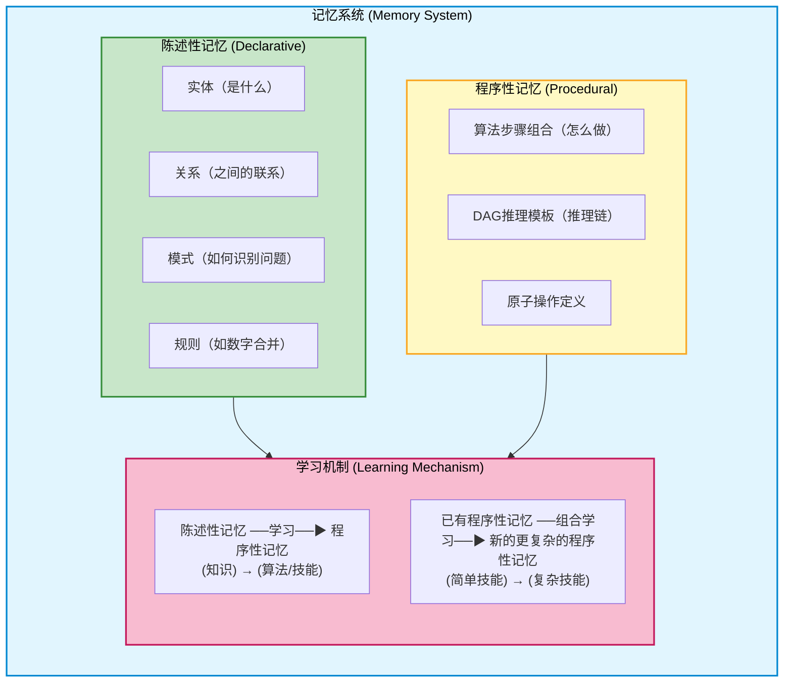
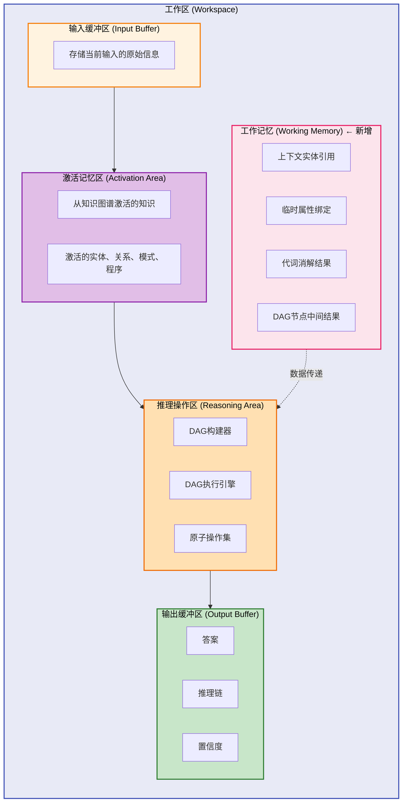
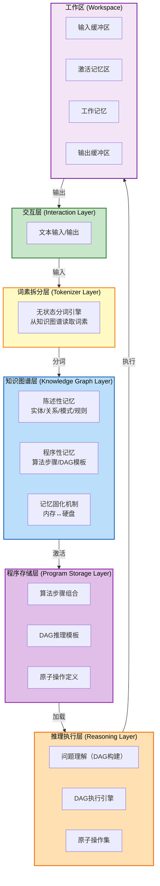
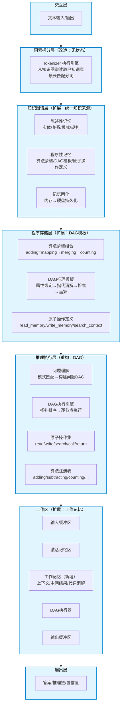
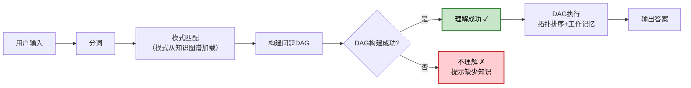
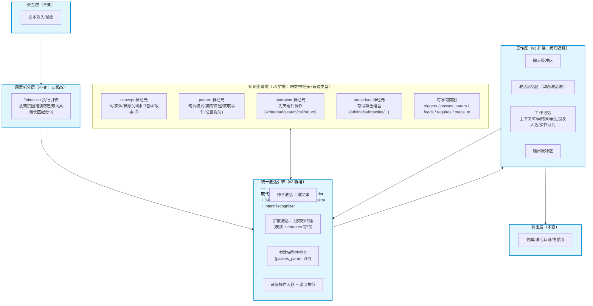
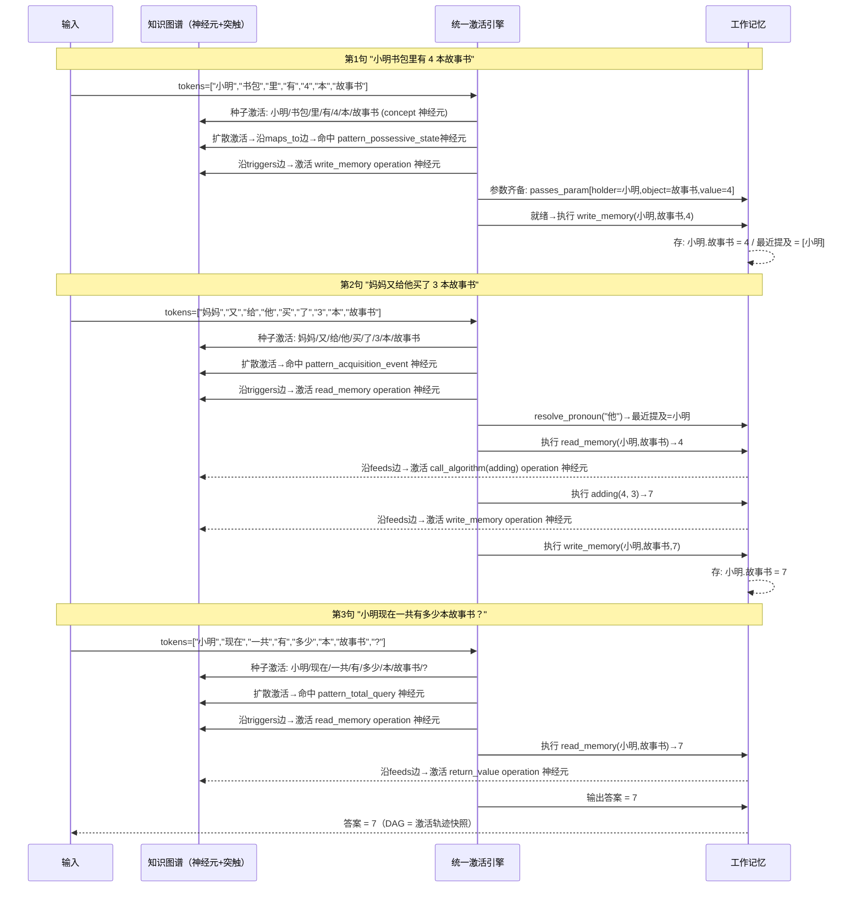

# 数字大脑架构设计

## 一、设计目标

基于《总述.txt》中提出的核心思想，设计一套数字大脑架构。核心目标：

1. **低成本推理**：通过知识+程序的有机结合，替代暴力模式匹配，实现低推理成本
2. **高精度计算**：对封闭域问题实现确定性精确求解，消除幻觉
3. **通用学习**：所有能力（包括分词、推理、计算）均通过学习获得，无需硬编码
4. **可解释性**：每一步推理过程可追溯、可解释

## 二、核心设计理念

### 2.1 记忆统一观

系统的记忆系统是统一的，不同类型的记忆存储在同一个图结构中：

| 记忆类型 | 对应内容 |
|---------|---------|
| **陈述性记忆** | 事实、概念、实体、关系、模式、规则 |
| **程序性记忆** | 算法、技能、操作流程、DAG推理模板 |

**核心主张**：知识图谱是记忆系统的实现方式，陈述性记忆和程序性记忆统一存储在同一个知识图谱中。不存在第二份知识拷贝。

### 2.2 学习优先观

所有能力都是学习的结果：
- 词素拆分知识存储在知识图谱中，通过学习获得
- 加法运算是一种习得的程序性记忆
- 推理能力（DAG构建与执行）是一种习得的程序性记忆
- 不存在"硬编码"的基本算法库，所有算法都通过学习获得

### 2.3 架构演进观

系统的能力不是预先设计好的，而是通过学习逐步生长出来的。系统的架构应支持从简单到复杂的渐进式学习。

## 三、整体架构

### 3.1 记忆系统（核心）

知识图谱即记忆系统，统一存储陈述性记忆与程序性记忆。



### 3.2 工作区模块

工作区模块是数字大脑的"工作台"，对应前额叶皮层（工作记忆+决策控制）。



### 3.3 完整架构分层关系



## 四、设计变更（v2）

基于 MVP 实施过程中的发现，架构设计做以下变更。详细设计见 [详细设计](详细设计/) 目录下各模块文档。

### 4.1 变更总览

| # | 变更项 | 变更前 | 变更后 | 影响层 |
|---|--------|--------|--------|--------|
| 1 | 词素知识统一 | LearnableTokenizer 有独立知识库（known_morphemes） | 删除内部状态，分词从知识图谱读取 | 词素拆分层 |
| 2 | 模式可学习 | PatternMatcher 硬编码模式 | 模式存知识图谱，通过知识包学习 | 知识图谱层 |
| 3 | 算法可学习 | AlgorithmRegistry 代码实现 | 原子操作组合，步骤存知识图谱 | 程序存储层 |
| 4 | DAG 推理 | 单步：意图→算法→输出 | 多步：问题DAG构建→拓扑排序执行 | 推理执行层 |
| 5 | 工作记忆 | 无 | 新增 WorkingMemory（上下文+中间结果） | 工作区 |
| 6 | 记忆持久化 | 全内存，重启丢失 | 固化到硬盘 + 启动加载 | 记忆系统 |

### 4.2 核心原则（不变）

- 知识图谱是唯一知识来源，不存在第二份拷贝
- 执行引擎通用化，不针对特定问题
- 所有知识（模式、算法步骤、推理链）通过知识包学习
- 执行能力（原子操作）是先天的"硬件"，什么时候用、怎么用是学来的

### 4.3 变更后架构



### 4.4 v2 核心概念：问题理解 = DAG 构建

v2 引入的核心概念：**用户问题转换为问题DAG = 系统理解了问题**。



### 4.5 v3 变更总览：统一激活引擎

v2 落地后（Phase 1-4 实现完成），用小学应用题 `小明书包里有4本故事书,妈妈又给他买了3本。小明现在一共有多少本故事书?` 验证，暴露 v2 架构根本缺陷：

- `PatternMatcher / DAGBuilder / DAGExecutor / AlgorithmRegistry` 四类解释器构成"领域特定的硬编码脑区"
- 知识图谱在这四类眼里只是查表数据库，真正解题的是 Python if/elif 分发
- 不符合《自由神经网络.txt》与《总述.txt》的脑科学范式：脑皮层只有**神经元+突触+激活扩散**，不存在"模式匹配脑区""DAG构建脑区"

因此启动 v3 架构演进，核心目标：**消除四类解释器，统一为单一机制——激活扩散 + 程序性记忆触发**。

| # | 变更项 | v2 | v3 | 影响层 |
|---|--------|----|----|--------|
| 1 | 模式匹配 | PatternMatcher 类（滑动匹配 + 词性 if 分发） | 激活到达 `kind=pattern` 神经元即命中，并入统一激活引擎 | 推理执行层 → 记忆系统 |
| 2 | DAG 构建 | DAGBuilder 类（elif template 链，4 种硬编码模板） | 激活扩散沿 `triggers` 边到达 `kind=operation` 神经元后，在工作记忆中自动建立条目，无专用构建器 | 推理执行层 → 记忆系统 |
| 3 | DAG 执行 | DAGExecutor 类（if action == OP_* 分发） | 统一调度器：`requires` 边满足的就绪操作入队执行，操作神经元的 `op_type` 属性决定行为 | 推理执行层 → 记忆系统 |
| 4 | 算法 | AlgorithmRegistry 类（类初始化硬编码 5 个算法） | 算法作为 `kind=procedure` 神经元，steps 存为图谱边序列，激活时按边序列触发操作链 | 程序存储层 → 记忆系统 |
| 5 | 词性 | N/OP/=/CMP/?/word 六类 + classify_token 分类 | 词实体属性 `pos` 细粒度区分（person_name/noun/verb_possess/verb_acquire/prep/adv/classifier） | 知识图谱层 |
| 6 | 神经元类型 | concept/number/operator/marker/pattern/procedure | 新增 `kind=operation`（write/read/search/call/return 先天硬件指令） | 知识图谱层 |
| 7 | 关系类型 | has_value/has_operator/follows 等 | 新增 `triggers / passes_param / feeds / requires / maps_to`（操作触发与数据流的边类型） | 知识图谱层 |
| 8 | 跨句实体追踪 | resolve_pronoun 仅处理"他们/她们/它们" | 工作记忆维护"最近提及 person_name"列表，按就近原则消解 | 工作区 |
| 9 | 意图识别 | IntentRecognizer 类（if intent_type 分发） | 意图识别等价于"哪个 pattern 神经元被激活"，无独立模块，由激活强度竞争自然产生 | 推理执行层 → 删除 |

### 4.6 v3 核心原则（承继 v2）

v2 §4.2 的四项核心原则在 v3 中保持不变，但表述更精确：

1. **知识图谱是唯一知识来源**：所有神经元（concept/pattern/operation/procedure）+ 所有突触（triggers/passes_param/feeds/requires/maps_to）统一存在图谱，不存在第二份拷贝或独立内部状态。
2. **不存在专用解释器**：PatternMatcher / DAGBuilder / DAGExecutor / AlgorithmRegistry / IntentRecognizer 五类 Python 类全部消除，职责统一归为激活引擎调度。
3. **所有知识通过学习获得**：pattern 神经元、operation 的触发条件、词到操作的 `maps_to` 连接、procedure 的 steps 边，全部通过知识包写入图谱。
4. **执行能力是先天硬件，使用方式是后天知识**：write/read/search/call/return 五种原子操作的"能做什么"是先天（硬件原语），但"什么时候做、做什么参数、跟谁衔接"全是学来的突触连接。

### 4.7 v3 变更后架构



### 4.8 v3 问题理解 = 激活扩散到达 operation 神经元

v3 更新了"理解"的定义：**输入激活扩散到达一组参数齐备的 operation 神经元并完成执行 = 系统理解了问题**。问题 DAG 由激活轨迹自然生成（不是预先构建再执行的两阶段）。

```mermaid
flowchart LR
    A["用户输入"] --> B["分词"]
    B --> C["种子激活<br/>词→concept 神经元"]
    C --> D["扩散激活<br/>沿 maps_to/triggers 边→pattern→operation"]
    D --> E{到达 operation 神经元?}
    E -->|否| F["继续扩散"]
    E -->|是| G{参数齐备?<br/>(passes_param)}
    G -->|否| F
    G -->|是| H["就绪操作入队<br/>检查 requires 依赖"]
    H --> I{"依赖满足?"}
    I -->|否| H
    I -->|是| J["执行操作<br/>输出写回工作记忆"]
    J --> K["沿 feeds 边激活下游 operation"]
    K --> L{return_value?}
    L -->|否| E
    L -->|是| M["理解+求解成功 ✓<br/>DAG = 激活轨迹快照"]
    J --> N["激活强度低于阈值?"]
    N -->|是| O["不理解 ✗<br/>提示缺少知识"]

    classDef success fill:#c8e6c9,stroke:#2e7d32,stroke-width:2px,color:#000
    classDef fail fill:#ffcdd2,stroke:#c62828,stroke-width:2px,color:#000
    class M success
    class O fail
```

## 五、详细设计索引

详细设计已按模块拆分至 [详细设计](详细设计/) 目录：

| 模块 | 文档 | 核心职责 | 版本 |
|------|------|---------|------|
| 记忆系统 | [记忆系统设计.md](详细设计/记忆系统设计.md) | 知识图谱统一存储、记忆固化与恢复 | v2（v3 补充 operation/procedure 神经元与 triggers 等边） |
| 工作区 | [工作区设计.md](详细设计/工作区设计.md) | 工作记忆、DAG执行环境、生命周期 | v2（v3 补充跨句实体追踪） |
| 分词引擎 | [分词引擎设计.md](详细设计/分词引擎设计.md) | 无状态分词，从知识图谱读取词素 | v2（不变） |
| 模式匹配 | [模式匹配设计.md](详细设计/模式匹配设计.md) | 从知识图谱加载模式、通用匹配引擎 | v2（v3 将被消除，职责并入激活引擎） |
| 推理执行 | [推理执行设计.md](详细设计/推理执行设计.md) | DAG构建、DAG执行、原子操作集 | v2（v3 将被消除，职责并入激活引擎） |
| 教学框架 | [教学框架设计.md](详细设计/教学框架设计.md) | 知识包格式、学习接口、课程编排 | v2（v3 补充 learn_semantic_link 接口） |
| **统一激活引擎** | **[统一激活引擎设计.md](详细设计/统一激活引擎设计.md)** | **消除四类解释器：激活扩散 + 程序性记忆触发的统一机制** | **v3 新增（架构演进方向）** |

> v3 演进目标：模式匹配 + 推理执行两个模块将在 v3 落地后删除，其职责由《统一激活引擎设计》中的单一机制承载。

## 六、与现有大模型的对比

| 维度 | 大模型 (LLM) | 数字大脑 (本架构) |
|------|-------------|------------------|
| 知识存储 | 隐式编码在参数中 | 显式图结构存储（知识图谱统一） |
| 程序存储 | 隐式编码在参数中 | 程序性记忆（原子操作组合） |
| 推理方式 | 模式匹配（概率推理） | v2: DAG推理（两阶段：先构建DAG再执行）<br/>v3: 激活扩散到达操作神经元（DAG由激活轨迹自然生成，非两阶段）—— 确定性计算 |
| 训练成本 | 极高（万亿参数） | 极低（学习知识包） |
| 推理成本 | 高（需GPU） | 低（可在CPU运行） |
| 计算精度 | 可能产生幻觉 | 确定性精确计算 |
| 可解释性 | 黑箱 | DAG每步可追溯 |
| 学习本质 | 统计拟合 | 知识包学习+程序性记忆组合 |
| 知识更新 | 需重新训练 | 学习新知识包 |
| 能力边界 | 通用但模糊 | 专用但精确 |

## 七、数据流转全景

### 7.1 v2：应用题 1（爸爸/妈妈年龄之和 = 56）两阶段：构建 DAG → 执行 DAG


> 注：v2 数据流在"应用题 1（X 的年龄N / 他们的年龄之和）"结构上正确；但若换成更自然语言的"X 书包里有 N 本故事书，妈妈又给他买了 M 本"（v2 未教对应硬编码模板），则 PatternMatcher 无法命中，DAG 构建失败。

### 7.2 v3：应用题 2（故事书题 = 7）单阶段：激活扩散 → 执行随扩散自然发生



> v3 核心变化：① 模式匹配/意图识别/算法选择全部是"激活哪个神经元"，不是 Python if/elif；② DAG 不是先构建再执行的两阶段，而是激活扩散到达 operation 后**随扩散立即执行**，最终问题 DAG 是对"激活轨迹快照"的回溯整理；③ 跨句指代（"他"→小明）由工作记忆"最近提及人名表"消解。

## 八、实施路线图

> 以下任务状态对应 2026-08-17 时点：Phase 1-4 **已实现并完成回归（105 个测试全过）**；Phase 5 为 v3 架构演进，处于设计阶段。

### Phase 1: 架构升级 ✅ 完成
- [x] 词素拆分层改造：删除 LearnableTokenizer 内部状态，从知识图谱读取
- [x] 知识图谱层扩展：新增模式实体、规则实体
- [x] 程序存储层扩展：新增 DAG 模板、原子操作定义
- [x] 推理执行层重构：DAG 构建器 + DAG 执行引擎 + 原子操作集
- [x] 工作区新增工作记忆模块
- [x] 记忆固化实现：save_json / load_json 自动调用

### Phase 2: 知识包与能力验证 ✅ 完成
- [x] 基础知识包 base_curriculum：一年级数学（加减） + 一年级语文 + 分词技能 + 指代消解
- [x] 验证：空白脑 → learn 基础知识包 → 能解应用题 1（爸爸/妈妈年龄之和 = 56）
- [x] 验证：DAG 构建成功 = 理解成功
- [x] 验证：未学知识 → DAG 构建失败 → 返回 `answer=None`（"不理解"语义）

### Phase 3: 能力扩展 ✅ 完成（在 DAG 框架下的扩展）
- [x] 更复杂的 DAG 模板：`pronoun_sum / pronoun_diff`（代词聚合 + adding/subtracting）
- [x] 记忆固化与恢复：`consolidate_to_disk / restore_from_disk`
- [x] 原子操作集：`write_memory / read_memory / search_context / call_algorithm / return_value` 五种

### Phase 4: 端到端验证 ✅ 完成
- [x] 空白脑 → `learn base_curriculum` → solve 应用题 1 → 56 ✓
- [x] 持久化：固化后重启 → 恢复知识 → 应用题 1 仍 56 ✓
- [x] 105 个 pytest 全过 ✓

### Phase 5: 统一激活引擎（v3 — 设计阶段）

依据《统一激活引擎设计.md》，分 4 个子阶段渐进迁移，每阶段保持 105 个测试全过。

#### Phase 5a：操作神经元入图谱 + DAGExecutor 改查图谱调度
- [ ] 定义 `kind=operation` 实体，`op_type` 区分 write/read/search/call/return
- [ ] 算法 `adding/subtracting` 等改为 `kind=procedure` 实体，steps 存为图谱边
- [ ] DAGExecutor 删除 `if action == OP_*` 分发，改为查 operation 节点的 `op_type` 属性统一调度
- [ ] 105 个测试全过 ✓

#### Phase 5b：模式实体的 dag_template + 激活到达即触发
- [ ] pattern 实体 `attributes` 中存 `dag_template`（节点列表 + 边关系）
- [ ] DAGBuilder 删除 elif 链，改为从 `pattern.dag_template` 读节点 + 边来实例化
- [ ] 105 个测试全过 ✓

#### Phase 5c：消除 DAGBuilder，统一激活扩散调度
- [ ] 模式匹配命中 → 激活 pattern 神经元 → 沿 triggers 边扩散到 operation
- [ ] 工作记忆维护"参数齐备就绪"队列，按 requires 边拓扑执行
- [ ] 删除 DAGBuilder 类
- [ ] 105 个测试全过 + 应用题 1（年龄题）仍 56 ✓

#### Phase 5d：消除 PatternMatcher，模式匹配变为激活到达 + 应用题 2 验证
- [ ] pattern 神经元 `attributes` 含 `slots`（词性约束 + 捕获变量）
- [ ] 词实体增加 `pos` 属性（person_name / noun / verb_possess / verb_acquire / prep / adv / classifier）
- [ ] 激活引擎滑动窗口匹配：tokens 词性序列若命中 `pattern.slots`，激活该 pattern 神经元
- [ ] 删除 PatternMatcher 类
- [ ] 跨句实体追踪：工作记忆维护"最近提及人名"列表，`resolve_pronoun` 查询
- [ ] 新增 `learn_semantic_link(word, op, param_name)` 接口：建立 `maps_to` 连接
- [ ] `base_curriculum` 扩展：补充词性 + 新增通用句式模式（拥有陈述/获取事件/总量提问）+ 补充 `maps_to` 连接
- [ ] 应用题 2：`"小明书包里有4本故事书,妈妈又给他买了3本"` → 答案 = 7 ✓
- [ ] 通用性验证：`"哥哥铅笔盒里有5支铅笔,妹妹又给他2支,哥哥现在共多少支"` → 7 ✓（同句式模式复用）
- [ ] 105 个测试全过 + 新增应用题 2/3 测试 ✓

## 九、关键风险与应对

| 版本 | 风险 | 可能性 | 影响 | 应对策略 |
|------|------|--------|------|---------|
| v2 | 原子操作集设计 | 中 | 高 | 参考 CPU 指令集设计，保持精简（write/read/search/call/return 五种即可覆盖绝大多数小学算术场景） |
| v2 | 工作记忆管理 | 中 | 中 | 明确生命周期，任务完成即清空（当前：每个 solve 调用独立 BrainContext） |
| v3 | 激活扩散噪声控制（无关节点也被激活） | 高 | 高 | 引入激活强度阈值 + 操作就绪条件（`passes_param` 齐才入队）+ 激活扩散深度上限（BFS 层级） |
| v3 | 多操作同时就绪时的调度顺序 | 中 | 高 | 就绪队列按 `requires` 边拓扑排序；同级多个操作按激活强度降序（竞争机制） |
| v3 | 跨句实体追踪正确性 | 中 | 中 | 先采用"最近提及 person_name 池"（FIFO）；代词消解按就近原则；后续扩展性别/属性一致性约束 |
| v3 | 学习接口复杂度（教 maps_to 连接 vs 教词） | 中 | 低 | 提供 `learn_semantic_link` 高级接口；知识包 YAML 直接声明 `semantic_links` 段，不要求用户写底层边 |
| v3 | 渐进迁移中每阶段回归稳定性 | 中 | 高 | Phase 5a-5d 严格串行，每阶段完成后全量跑 105 个 pytest；不并行改代码 |
| v2 | 模式归纳有效性 | 中 | 中 | 先用人工定义模式样本，后续探索自动归纳（v3 后同样适用） |
| v2 | 记忆持久化性能 | 低 | 中 | 增量保存，避免全量序列化（激活轨迹大时尤为重要） |
| v2 | 知识包质量 | 中 | 中 | 建立验证机制，学习后自动测试；v3 后需额外校验 maps_to 连接正确性 |

## 十、总结

本架构的核心是一个**统一的知识图谱记忆系统**，辅以**工作区模块**和**知识包学习框架**，并分 v2 / v3 两阶段持续向脑科学范式收敛。

### 10.1 v2 阶段核心理念（已实现：Phase 1-4，105 测试全过）

1. **知识图谱 = 唯一记忆**：所有知识（实体、关系、模式、算法步骤、DAG 模板）统一存储，不存在第二份拷贝
2. **工作区 = 工作台**：工作记忆 + DAG 执行环境，负责暂时存储和处理当前问题
3. **DAG = 理解**：用户问题转换为问题 DAG = 系统理解了问题，DAG 构建成功 = 理解成功
4. **原子操作 = 执行硬件**：read_memory / write_memory / search_context / call_algorithm / return_value，类似 CPU 指令集
5. **所有能力都是学习的结果**：分词、模式、算法步骤、推理链全通过知识包学习
6. **记忆可持久化**：学习→写入知识图谱→固化到硬盘→启动时恢复

### 10.2 v3 阶段核心理念（设计阶段：Phase 5a-5d）

v2 暴露了一个根本问题：知识图谱虽然是"唯一记忆"，但 PatternMatcher / DAGBuilder / DAGExecutor / AlgorithmRegistry / IntentRecognizer 五类解释器仍然是"硬编码脑区"，真正解题的是 Python if/elif 分发，知识图谱只是它们的查表数据库。v3 旨在回归《自由神经网络.txt》的脑科学范式：

1. **皮层只有神经元 + 突触 + 激活扩散**：所有模块（模式识别/意图识别/DAG 构建/算法执行）统一拆解为"激活哪个图谱节点 + 沿哪条边扩散"，无领域特定解释器
2. **统一激活引擎**：消除五类解释器类，单一引擎负责"种子激活→扩散→参数检查→就绪→执行→沿 feeds 扩散"循环
3. **操作神经元作为先天硬件**：`kind=operation` 节点对应五种原子操作（写入/读取/搜索/调用/返回），"能做什么"先天，但"什么时候做、参数是什么、跟谁衔接"全是学来的突触连接
4. **DAG 是激活轨迹快照，不是预构建产物**：两阶段（先构建 DAG 再执行）改为单阶段（激活扩散到达 operation 神经元就立即执行，最后回溯激活轨迹整理为可解释 DAG）
5. **教词 + 教句式 + 教连接 = 能理解新结构**：新应用题（如"小明书包里有 4 本故事书"）不需要专用"应用题结构知识包"，只需教会词、细粒度词性、通用句式模式、词到操作神经元的 `maps_to` 连接
6. **渐进迁移不回退**：Phase 5a-5d 严格串行，每阶段保持 105 个测试全过，最终保留既有能力并解锁对更自然语言的理解能力
