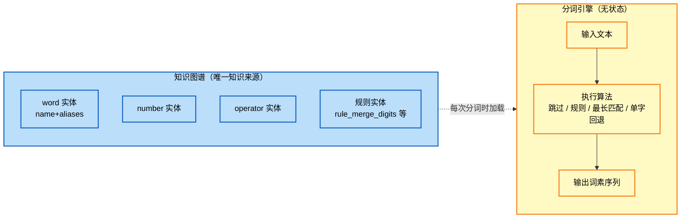
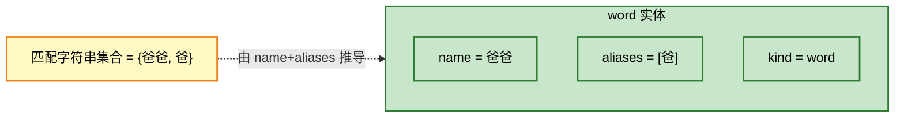
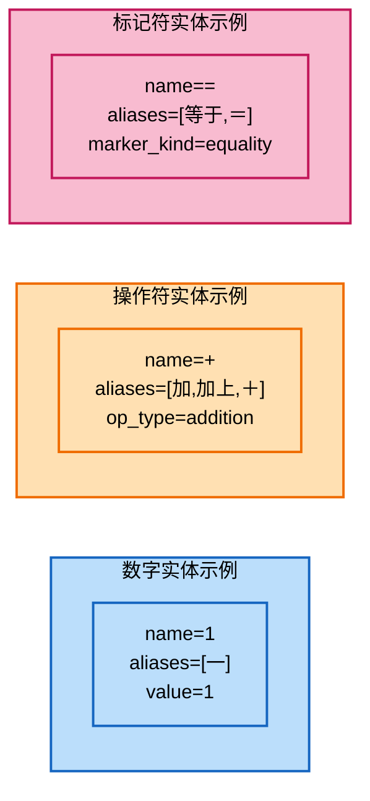
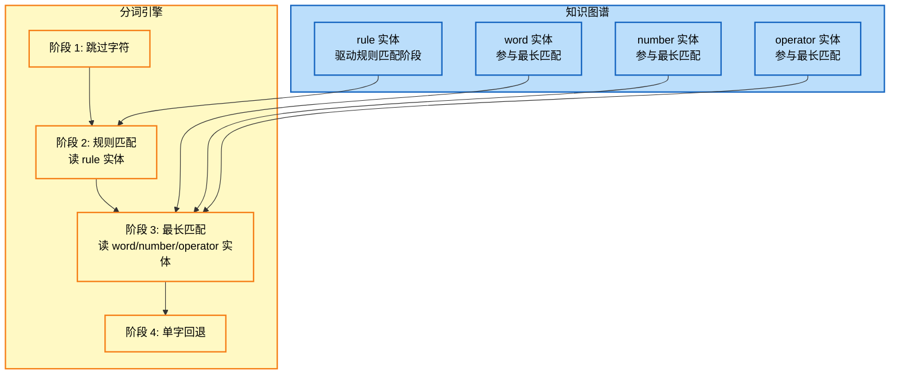
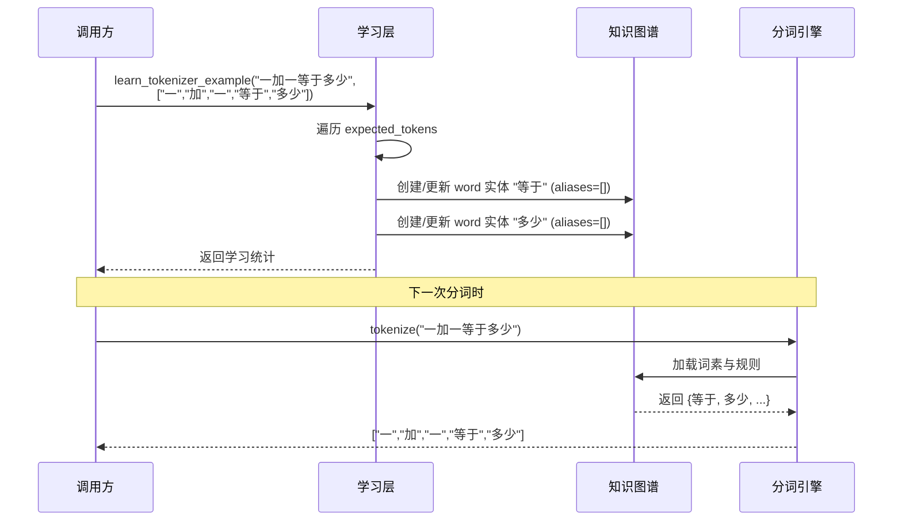
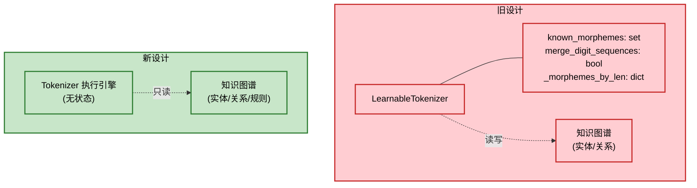
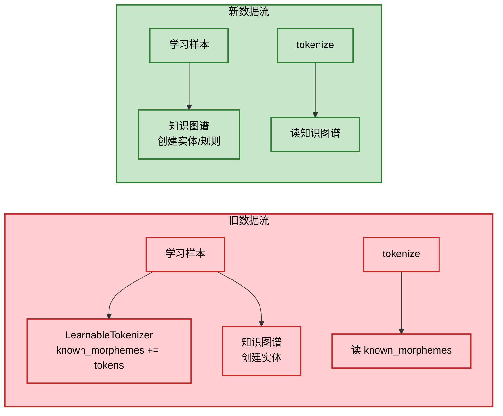

# 分词引擎详细设计

> 本文档对应架构设计 v2 中「词素拆分层」改造。核心变更为：删除 `LearnableTokenizer` 自带的独立知识库，分词引擎退化为**无状态执行引擎**，所有词素知识唯一来源于知识图谱。

## 1. 设计目标

### 1.1 三大核心目标

| # | 目标 | 含义 | 落地方式 |
|---|------|------|---------|
| 1 | **无状态执行引擎** | 分词引擎本身不持有任何词素集合、规则集合，调用结束后不留状态 | 每次 `tokenize` 时从知识图谱读取词素与规则，引擎内部只缓存本次会话的临时索引 |
| 2 | **知识唯一来源：知识图谱** | 词素、规则、数字合并策略全部以实体形式存于知识图谱，禁止第二份拷贝 | 词素 = 实体 `name` + `aliases`；规则 = 规则实体（如 `rule_merge_digits`） |
| 3 | **不学不会** | 知识图谱为空时，分词引擎只能逐字拆分，不具备任何"先天领域知识" | 空白知识图谱 → 无多字词素可匹配 → 全部单字回退 |

### 1.2 设计边界



### 1.3 不变量（Invariant）

- 分词引擎对象在生命周期内**不写入**任何持久化字段
- 学习动作只修改知识图谱，**不直接修改**分词引擎
- 同一知识图谱状态下，对同一输入的分词结果**确定且唯一**
- 知识图谱为空时，`tokenize("12+34")` 必然返回 `["1","2","+","3","4"]`

## 2. 分词流程

### 2.1 从知识图谱加载已知词素

分词开始前，从知识图谱拉取所有可用于匹配的字符串形态。来源包括实体的 `name` 字段与 `aliases` 列表。

| 实体类型 | 参与匹配的字段 | 用途 |
|---------|---------------|------|
| `kind=word` | `name` + `aliases` | 普通多字词与单字 |
| `kind=number` | `name` + `aliases` | 数字符号本身（如 "1"、"一"） |
| `kind=operator` | `name` + `aliases` | 操作符（如 "+"、"加"） |
| `kind=marker` | `name` + `aliases` | 标记符（如 "="、"等于"） |
| 规则实体 | 不直接参与匹配 | 仅用于驱动规则匹配阶段 |

### 2.2 从知识图谱加载规则

规则以独立实体形式存储，每个规则实体描述一种"非最长匹配"的结构性合并策略。

| 规则实体 name | 作用 | 触发条件 | 行为 |
|--------------|------|---------|------|
| `rule_merge_digits` | 数字串合并 | 当前字符为数字 | 贪婪吞掉整段数字串（含可选小数点）作为一个 token |

未来可扩展规则（同样以实体形式加入知识图谱即可，无需改引擎）：

| 规则实体 name | 作用 |
|--------------|------|
| `rule_merge_decimal` | 小数合并（如 "3.14"） |
| `rule_merge_pinyin` | 拼音音节合并 |

### 2.3 最长匹配分词

加载完词素与规则后，进入主分词循环：

1. 跳过空白与标点
2. 若当前字符命中某条规则（如数字合并），按规则产出 token
3. 否则用已知词素集合做最长匹配（2 字以上优先）
4. 都不命中则单字回退

### 2.4 分词流程图

```mermaid
flowchart TD
    START([输入文本 text]) --> LOAD[从知识图谱加载<br/>已知词素集合 M]
    LOAD --> LOADR[从知识图谱加载<br/>规则集合 R]
    LOADR --> INIT[i = 0, tokens = empty]
    INIT --> LOOP{i < len(text)?}
    LOOP -- 否 --> END([返回 tokens])
    LOOP -- 是 --> SKIP{当前字符 c ∈ skip_chars?}
    SKIP -- 是 --> ADV1[i += 1] --> LOOP
    SKIP -- 否 --> RULE{命中某条规则 r ∈ R?}
    RULE -- 是 --> APPLYR[按规则 r 吞并一段文本<br/>产出 token t]
    APPLYR --> APPEND1[tokens.append t<br/>i += len t] --> LOOP
    RULE -- 否 --> LONGEST{M 中存在以 i 起的最长匹配?}
    LONGEST -- 是 --> APPEND2[tokens.append 最长词素<br/>i += 词素长度] --> LOOP
    LONGEST -- 否 --> FALL[tokens.append c<br/>i += 1] --> LOOP

    classDef io fill:#c8e6c9,stroke:#2e7d32,stroke-width:2px,color:#000
    classDef load fill:#bbdefb,stroke:#1565c0,stroke-width:2px,color:#000
    classDef decision fill:#fff9c4,stroke:#f57f17,stroke-width:2px,color:#000
    classDef action fill:#ffe0b2,stroke:#ef6c00,stroke-width:2px,color:#000
    class START,END io
    class LOAD,LOADR,INIT load
    class LOOP,SKIP,RULE,LONGEST decision
    class ADV1,APPLYR,APPEND1,APPEND2,FALL action
```

## 3. 词素在知识图谱中的表示

### 3.1 普通字词实体（kind=word）

表示自然语言字词。`name` 为主形，`aliases` 为别名/异形。

| 字段 | 取值示例 | 说明 |
|------|---------|------|
| `name` | "爸爸" | 主形，参与分词匹配 |
| `aliases` | ["爸"] | 别名列表，每个都参与分词匹配 |
| `attributes.kind` | "word" | 实体种类标记 |
| `attributes.meaning` | "父亲" | 释义 |
| `attributes.pinyin` | "bà ba" | 拼音 |
| `attributes.word_type` | "名词" | 词性 |



### 3.2 数字实体（kind=number）

表示数字符号本身。"1" 与 "一" 通过同一实体的 `name` + `aliases` 关联。

| 字段 | 取值示例 | 说明 |
|------|---------|------|
| `name` | "1" | 主形（阿拉伯数字） |
| `aliases` | ["一"] | 中文数字别名 |
| `attributes.kind` | "number" | 实体种类 |
| `attributes.value` | 1 | 数值 |
| `attributes.numeric_value` | 1 | 数值冗余字段（兼容旧逻辑） |
| `embodied_mapping` | ["finger_1"] | 具身映射 |

### 3.3 操作符实体（kind=operator）

表示运算符。同一操作符的多语言/多写法通过 `aliases` 统一。

| 字段 | 取值示例 | 说明 |
|------|---------|------|
| `name` | "+" | 主形 |
| `aliases` | ["加", "加上", "＋"] | 别名 |
| `attributes.kind` | "operator" | 实体种类 |
| `attributes.op_type` | "addition" | 操作类型，下游算法注册表据此调度 |



### 3.4 规则实体

规则实体不参与最长匹配，而是作为分词算法第二阶段（规则匹配）的驱动数据。

| 字段 | 取值示例 | 说明 |
|------|---------|------|
| `name` | "rule_merge_digits" | 规则唯一标识 |
| `aliases` | [] | 通常为空 |
| `attributes.kind` | "rule" | 实体种类 |
| `attributes.rule_type` | "merge_digits" | 规则类型，引擎据此选择执行分支 |
| `attributes.description` | "将连续数字字符合并为一个 token" | 人类可读说明 |
| `attributes.priority` | 10 | 规则优先级（多条规则命中时使用） |



## 4. 分词算法

### 4.1 跳过字符（先天物理引导）

唯一保留的"先天"知识：视觉/听觉上的无意义边界符号。这部分属于物理引导，不属于领域知识。

| 类别 | 字符示例 | 处理 |
|------|---------|------|
| 空白 | 空格、Tab、换行 | 跳过 |
| 标点 | `，。！？；：、` 等 | 跳过 |
| 括号 | `()[]{}【】（）` | 跳过 |
| 引号 | `"'""''` | 跳过 |

> 注：问号 `？` 不在跳过集合中，因为它是疑问标记符实体（`kind=marker`），需作为 token 产出供下游使用。

### 4.2 规则匹配

若知识图谱中存在 `rule_merge_digits` 规则实体，且当前字符是数字，则按规则贪婪吞并整段数字串。

| 步骤 | 动作 |
|------|------|
| 1 | 检查当前字符 `c` 是否为数字 |
| 2 | 若是，向后贪婪匹配 `\d+(\.\d+)?` |
| 3 | 将整段数字串作为一个 token 产出 |
| 4 | 推进游标 `i` 到匹配结束位置 |

规则匹配**优先于**最长词素匹配，因为数字合并是一种结构性规则，不应被单字数字实体打断。

### 4.3 最长词素匹配

规则未命中时，在已知词素集合中做最长匹配。

| 步骤 | 动作 |
|------|------|
| 1 | 取当前已知多字词素的最大长度 `L_max` |
| 2 | 从 `L_max` 递减到 2，依次取 `text[i:i+L]` 与词素集合比对 |
| 3 | 命中则产出该词素，推进游标 |
| 4 | 全部未命中则进入单字回退 |

### 4.4 单字回退

当规则与最长词素都未命中时，将当前字符作为单字 token 产出。

- 单字回退**不写入**知识图谱（无状态原则）
- 单字回退保证系统在学习不足时也能继续运行，后续可通过教学补充知识
- 这是"不学不会"原则的兜底体现：知识图谱为空时，所有字符都走此分支

### 4.5 算法流程图

```mermaid
flowchart TD
    START([开始 tokenize]) --> INIT[i=0<br/>tokens=[]]
    INIT --> LOAD[加载词素 M 与规则 R<br/>构建长度索引]
    LOAD --> LOOP{i < n?}
    LOOP -- 否 --> DONE([返回 tokens])
    LOOP -- 是 --> C1[取 c = text[i]]
    C1 --> S1{c ∈ skip_chars?}
    S1 -- 是 --> ADV[i += 1] --> LOOP
    S1 -- 否 --> S2{R 中存在<br/>rule_merge_digits<br/>且 c 是数字?}
    S2 -- 是 --> MERGE[贪婪匹配数字串<br/>tokens.append 数字串<br/>i += 数字串长度]
    MERGE --> LOOP
    S2 -- 否 --> S3{M 中存在<br/>以 i 起的多字匹配?}
    S3 -- 是 --> LM[取最长匹配<br/>tokens.append 词素<br/>i += 词素长度]
    LM --> LOOP
    S3 -- 否 --> FALL[tokens.append c<br/>i += 1]
    FALL --> LOOP

    classDef io fill:#c8e6c9,stroke:#2e7d32,stroke-width:2px,color:#000
    classDef load fill:#bbdefb,stroke:#1565c0,stroke-width:2px,color:#000
    classDef decision fill:#fff9c4,stroke:#f57f17,stroke-width:2px,color:#000
    classDef action fill:#ffe0b2,stroke:#ef6c00,stroke-width:2px,color:#000
    class START,DONE io
    class INIT,LOAD load
    class LOOP,S1,S2,S3 decision
    class C1,ADV,MERGE,LM,FALL action
```

### 4.6 算法示例

以输入 `"爸爸的年龄31，妈妈的年龄25"` 为例（假设知识图谱已学会 "爸爸"、"妈妈"、"年龄" 三个多字词及 `rule_merge_digits` 规则）：

| 步骤 | i | 当前字符 | 命中分支 | 产出 token | i 推进后 |
|------|---|---------|---------|-----------|---------|
| 1 | 0 | 爸 | 最长匹配 | 爸爸 | 2 |
| 2 | 2 | 的 | 单字回退 | 的 | 3 |
| 3 | 3 | 年 | 最长匹配 | 年龄 | 5 |
| 4 | 5 | 3 | 规则匹配 | 31 | 7 |
| 5 | 7 | ， | 跳过 | — | 8 |
| 6 | 8 | 妈 | 最长匹配 | 妈妈 | 10 |
| 7 | 10 | 的 | 单字回退 | 的 | 11 |
| 8 | 11 | 年 | 最长匹配 | 年龄 | 13 |
| 9 | 13 | 2 | 规则匹配 | 25 | 15 |

最终输出：`["爸爸", "的", "年龄", "31", "妈妈", "的", "年龄", "25"]`

## 5. 学习接口

学习接口的职责是**修改知识图谱**，不再触碰分词引擎本身。分词引擎在下次 `tokenize` 时自然读到新知识。

### 5.1 学习接口总览

| 接口 | 作用 | 写入知识图谱的内容 |
|------|------|------------------|
| `learn_word(symbol, meaning, pinyin, word_type, aliases)` | 学一个普通字词 | 创建 `kind=word` 实体 |
| `learn_number_word(symbol, value, aliases, embodied_tag)` | 学一个数字词 | 创建 `kind=number` 实体；若 value 为多位数，额外创建/激活 `rule_merge_digits` 规则实体 |
| `learn_operator_word(symbol, op_type, aliases)` | 学一个操作符 | 创建 `kind=operator` 实体 |
| `learn_marker_word(symbol, marker_kind, aliases)` | 学一个标记符 | 创建 `kind=marker` 实体 |
| `learn_rule(rule_name, rule_type, description, priority)` | 学一条规则 | 创建 `kind=rule` 实体 |
| `learn_tokenizer_example(input_text, expected_tokens)` | 从分词样本学习 | 为每个 expected_token 调用上述对应接口，将多字词写入知识图谱 |

### 5.2 学习接口与知识图谱的关系

```mermaid
flowchart LR
    subgraph CALL["调用方"]
        U1["learn_word/learn_number_word/..."]
        U2["learn_tokenizer_example"]
    end

    subgraph LEARN["学习层（仅写知识图谱）"]
        L1["解析样本<br/>拆 expected_tokens"]
        L2["按 token 类型<br/>选择对应 learn_* 接口"]
        L3["创建/更新实体"]
        L4["必要时创建规则实体<br/>如 rule_merge_digits"]
    end

    subgraph KG["知识图谱"]
        E1["word/number/<br/>operator/marker 实体"]
        E2["rule 实体"]
    end

    U1 --> L3
    U2 --> L1 --> L2 --> L3
    L3 --> E1
    L4 --> E2
    L2 -.->|多位数字样本| L4

    classDef call fill:#c8e6c9,stroke:#2e7d32,stroke-width:2px,color:#000
    classDef learn fill:#fff9c4,stroke:#f57f17,stroke-width:2px,color:#000
    classDef kg fill:#bbdefb,stroke:#1565c0,stroke-width:2px,color:#000
    class CALL,U1,U2 call
    class LEARN,L1,L2,L3,L4 learn
    class KG,E1,E2 kg
```

### 5.3 学习词素 = 创建实体

以 `learn_number_word("1", 1, aliases=["一"])` 为例：

| 步骤 | 动作 |
|------|------|
| 1 | 检查知识图谱中是否已存在 `name="1"` 的实体 |
| 2 | 若存在，更新其 `aliases` 与 `attributes` |
| 3 | 若不存在，创建新实体并加入知识图谱 |
| 4 | value 为单位数（1），不触发规则学习 |

以 `learn_number_word("12", 12, aliases=[])` 为例：

| 步骤 | 动作 |
|------|------|
| 1 | 创建 `kind=number` 实体，`name="12"`, `value=12` |
| 2 | value 为多位数，触发 `rule_merge_digits` 规则学习 |
| 3 | 检查知识图谱中是否已存在 `rule_merge_digits`，若无则创建 |

### 5.4 学习规则 = 创建规则实体

`learn_rule("rule_merge_digits", "merge_digits", "将连续数字字符合并为一个 token", 10)` 直接在知识图谱中创建一个 `kind=rule` 实体。下次分词时引擎会自动加载并应用该规则。

### 5.5 分词样本 = 教知识图谱哪些是多字词

`learn_tokenizer_example(input_text, expected_tokens)` 的语义发生了根本变化：

| 旧设计 | 新设计 |
|--------|--------|
| 把 expected_tokens 加入 `LearnableTokenizer.known_morphemes` | 把 expected_tokens 中的多字词作为 `kind=word` 实体写入知识图谱 |
| 检测到 >=2 位数字 token 时设 `merge_digit_sequences=True` | 检测到 >=2 位数字 token 时创建 `rule_merge_digits` 规则实体 |
| 一致性检查结果存入 `self.conflicts` | 一致性检查失败时返回错误信息，不写入知识图谱 |



## 6. 与旧设计的对比

### 6.1 架构对比



### 6.2 关键差异对照表

| 维度 | 旧设计（LearnableTokenizer） | 新设计（无状态分词引擎） |
|------|----------------------------|------------------------|
| 知识存储位置 | 分词引擎内部 `known_morphemes` set + 知识图谱（双份） | 仅知识图谱（单份） |
| 数字合并规则 | `merge_digit_sequences: bool` 字段 | `rule_merge_digits` 规则实体 |
| 引擎状态 | 有状态（持有词素集合、规则标志、学习统计、冲突列表） | 无状态（每次分词时从知识图谱加载） |
| 学习动作 | 同时写 `known_morphemes` 和知识图谱 | 仅写知识图谱 |
| 单字回退副作用 | 把单字自动加入 `known_morphemes`（"独立符号识别"） | 不写入，保持无状态 |
| 持久化 | 重启丢失（除非重新加载 JSON 样本） | 随知识图谱固化到硬盘，重启自动恢复 |
| 知识一致性 | 可能出现两份不同步的知识 | 不可能不一致（只有一份） |
| 空白状态行为 | 已学默认数据集后才有能力 | 真正空白，必须显式学习 |

### 6.3 数据流对比



### 6.4 新设计的优势

| 优势 | 说明 |
|------|------|
| **知识只有一份** | 消除 `known_morphemes` 与知识图谱的双写同步问题 |
| **可持久化** | 知识图谱固化到硬盘后，重启即恢复分词能力，无需重新跑学习样本 |
| **可解释** | 询问"为什么这样分词"时，直接查知识图谱中的实体即可回答 |
| **可观测** | 知识图谱可被任意工具查询/导出，分词引擎不再有"私有状态" |
| **可教学** | 教学框架只需向知识图谱写入实体，无需了解分词引擎内部结构 |
| **真正"不学不会"** | 旧设计构造时默认加载 `tokenization_examples.json`，相当于先天有能力；新设计必须显式学习 |

### 6.5 迁移注意事项

| 旧 API | 迁移策略 |
|--------|---------|
| `LearnableTokenizer(auto_learn=True)` | 改为构造无状态引擎 + 显式调用 `learn_*` 或加载知识包 |
| `tokenizer.known_morphemes` | 改为查询知识图谱中所有 `kind in (word, number, operator, marker)` 实体的 `name`+`aliases` |
| `tokenizer.merge_digit_sequences` | 改为查询知识图谱中是否存在 `rule_merge_digits` 规则实体 |
| `tokenizer.learn_from_example(...)` | 保留接口名，但内部改为写知识图谱 |
| `tokenizer.conflicts` | 改为学习接口的返回值，不再持久化在引擎上 |
| `Tokenizer(merge_numbers=True)` | 改为先 `learn_rule("rule_merge_digits", ...)` 再分词 |
