# 工作区详细设计

> 本文档是数字大脑工作区模块的详细设计，对应架构设计 v2 中"工作区（扩展：工作记忆）"的细化。工作区是数字大脑的"工作台"，承载问题理解与求解的完整运行时过程。

## 1. 设计目标

工作区是数字大脑处理单个任务时的运行时容器。其核心设计目标如下：

1. **承载完整任务生命周期**：从输入接收到输出返回，工作区贯穿"接收→激活→DAG构建→DAG执行→输出→固化→清空"全过程
2. **支撑工作记忆机制**：保存当前任务的上下文实体、临时属性绑定、代词消解结果、DAG 节点中间结果，使推理过程具备跨步骤的上下文连续性
3. **支撑 DAG 推理**：从"单步推理"升级为"DAG 构建 + DAG 执行"，工作区需同时容纳构建阶段的结构与执行阶段的数据流
4. **成为 DAG 节点间数据传递的载体**：DAG 节点之间不直接传参，统一通过工作记忆读写数据，解耦节点实现
5. **与长期记忆解耦**：工作区是临时状态，任务完成即清空；只有需要固化的新知识才写入长期记忆
6. **可解释性**：工作区内各缓冲区的状态可追溯，DAG 节点对工作记忆的每一次读写都构成可审计的推理链

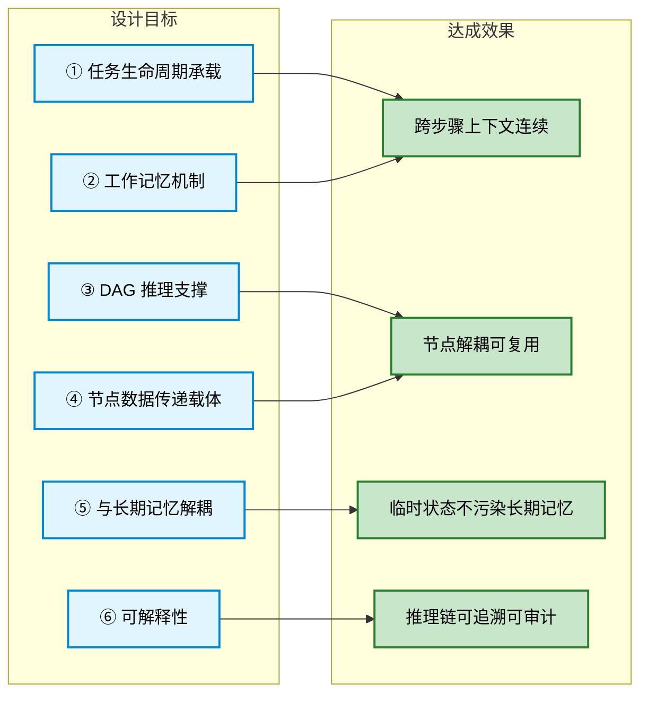
```mermaid
flowchart LR
    subgraph GOALS["设计目标"]
        direction TB
        G1["① 任务生命周期承载"]
        G2["② 工作记忆机制"]
        G3["③ DAG 推理支撑"]
        G4["④ 节点数据传递载体"]
        G5["⑤ 与长期记忆解耦"]
        G6["⑥ 可解释性"]
    end

    subgraph EFFECTS["达成效果"]
        E1["跨步骤上下文连续"]
        E2["节点解耦可复用"]
        E3["临时状态不污染长期记忆"]
        E4["推理链可追溯可审计"]
    end

    G1 --> E1
    G2 --> E1
    G3 --> E2
    G4 --> E2
    G5 --> E3
    G6 --> E4

    classDef goal fill:#e1f5fe,stroke:#0288d1,stroke-width:2px,color:#000
    classDef effect fill:#c8e6c9,stroke:#2e7d32,stroke-width:2px,color:#000
    class G1,G2,G3,G4,G5,G6 goal
    class E1,E2,E3,E4 effect
```

---

## 2. 工作区结构

工作区由五个子区域构成，按数据流向串接：输入缓冲区 → 激活记忆区 → 工作记忆 ↔ 推理操作区 → 输出缓冲区。其中工作记忆与推理操作区之间是双向交互的——DAG 节点执行时持续从工作记忆读、向工作记忆写。

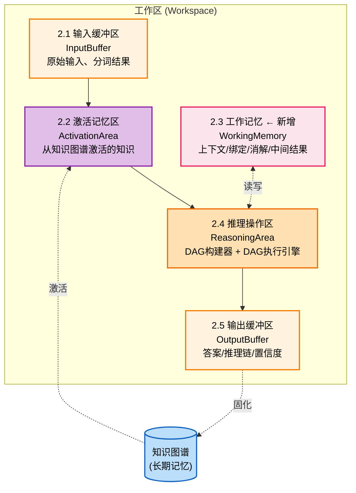
```mermaid
flowchart TD
    subgraph WS["工作区 (Workspace)"]
        direction TB

        IB["2.1 输入缓冲区<br/>InputBuffer<br/>原始输入、分词结果"]
        AA["2.2 激活记忆区<br/>ActivationArea<br/>从知识图谱激活的知识"]
        WM["2.3 工作记忆 ← 新增<br/>WorkingMemory<br/>上下文/绑定/消解/中间结果"]
        RA["2.4 推理操作区<br/>ReasoningArea<br/>DAG构建器 + DAG执行引擎"]
        OB["2.5 输出缓冲区<br/>OutputBuffer<br/>答案/推理链/置信度"]

        IB --> AA
        AA --> RA
        WM <-.读写.-> RA
        RA --> OB
    end

    KG[("知识图谱<br/>(长期记忆)")]
    KG -.激活.-> AA
    OB -.固化.-> KG

    classDef buffer fill:#fff3e0,stroke:#f57c00,stroke-width:2px,color:#000
    classDef activate fill:#e1bee7,stroke:#8e24aa,stroke-width:2px,color:#000
    classDef workmem fill:#fce4ec,stroke:#e91e63,stroke-width:2px,color:#000
    classDef reason fill:#ffe0b2,stroke:#ef6c00,stroke-width:2px,color:#000
    classDef output fill:#c8e6c9,stroke:#2e7d32,stroke-width:2px,color:#000
    classDef memory fill:#bbdefb,stroke:#1565c0,stroke-width:2px,color:#000

    class IB,OB buffer
    class AA activate
    class WM workmem
    class RA reason
    class KG memory
```

### 2.1 输入缓冲区

输入缓冲区是工作区的入口，负责暂存用户原始输入及其处理过程中的中间形态（分词结果、模式匹配结果）。输入缓冲区是只读性较强的缓冲，任务一旦进入推理阶段，输入缓冲区内容即冻结。

**承载内容**：
- 原始文本输入
- 分词后的词素序列
- 模式匹配命中结果

**核心职责**：
- 暂存原始输入，避免后续阶段重复解析
- 为激活记忆区提供"激活线索"
- 为 DAG 构建器提供"输入端节点"的素材

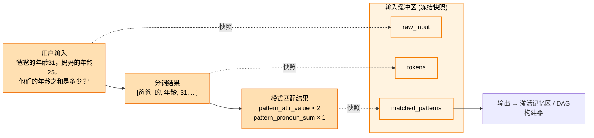
```mermaid
flowchart LR
    IN["用户输入<br/>'爸爸的年龄31，妈妈的年龄25，<br/>他们的年龄之和是多少？'"]
    T1["分词结果<br/>[爸爸, 的, 年龄, 31, ...]"]
    P1["模式匹配结果<br/>pattern_attr_value × 2<br/>pattern_pronoun_sum × 1"]

    IN --> T1 --> P1

    subgraph IB["输入缓冲区 (冻结快照)"]
        S1["raw_input"]
        S2["tokens"]
        S3["matched_patterns"]
    end

    IN -.快照.-> S1
    T1 -.快照.-> S2
    P1 -.快照.-> S3

    S3 --> OUT["输出 → 激活记忆区 / DAG构建器"]

    classDef buffer fill:#fff3e0,stroke:#f57c00,stroke-width:2px,color:#000
    classDef snapshot fill:#ffe0b2,stroke:#ef6c00,stroke-width:1px,color:#000
    class IB,S1,S2,S3 buffer
    class IN,T1,P1 snapshot
```

### 2.2 激活记忆区（从知识图谱激活知识）

激活记忆区存放本次任务从长期记忆（知识图谱）中"调取"出来的相关知识。它包括激活的实体、关系、模式、程序性记忆（算法步骤组合、DAG 模板、原子操作定义）。激活是按需的——只激活当前任务可能用到的知识，而非全量加载。

**承载内容**：
- 激活的陈述性记忆：实体、关系、属性、规则
- 激活的程序性记忆：算法步骤组合、DAG 推理模板
- 激活的原子操作定义：`write_memory` / `read_memory` / `search_context` / `call_algorithm` / `return`

**激活策略**：
- 由输入缓冲区中的词素序列作为激活线索
- 1~3 跳扩散激活
- 按激活强度排序，受工作区容量上限约束

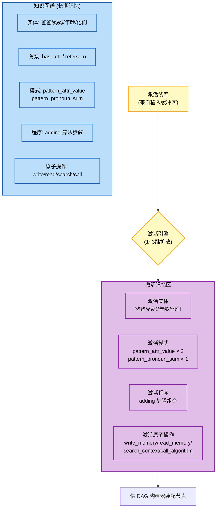
```mermaid
flowchart TD
    subgraph KG["知识图谱 (长期记忆)"]
        E1["实体: 爸爸/妈妈/年龄/他们"]
        E2["关系: has_attr / refers_to"]
        E3["模式: pattern_attr_value<br/>pattern_pronoun_sum"]
        E4["程序: adding 算法步骤"]
        E5["原子操作: write/read/search/call"]
    end

    CLUE["激活线索<br/>(来自输入缓冲区)"]

    CLUE --> ACT{"激活引擎<br/>(1~3跳扩散)"}
    ACT --> AA["激活记忆区"]

    subgraph AA["激活记忆区"]
        A1["激活实体<br/>爸爸/妈妈/年龄/他们"]
        A2["激活模式<br/>pattern_attr_value × 2<br/>pattern_pronoun_sum × 1"]
        A3["激活程序<br/>adding 步骤组合"]
        A4["激活原子操作<br/>write_memory/read_memory/<br/>search_context/call_algorithm"]
    end

    AA --> USE["供 DAG 构建器装配节点"]

    classDef memory fill:#bbdefb,stroke:#1565c0,stroke-width:2px,color:#000
    classDef activate fill:#e1bee7,stroke:#8e24aa,stroke-width:2px,color:#000
    classDef engine fill:#fff9c4,stroke:#f9a825,stroke-width:2px,color:#000
    class KG,E1,E2,E3,E4,E5 memory
    class AA,A1,A2,A3,A4 activate
    class ACT,CLUE engine
```

### 2.3 工作记忆（新增）

工作记忆是 v2 变更中新增的核心模块，也是本设计的重点。它承担两类数据：
1. **任务上下文相关数据**：上下文实体引用、临时属性绑定、代词消解结果
2. **DAG 执行相关数据**：DAG 各节点的中间结果

工作记忆是 DAG 节点间数据传递的唯一通道——节点 A 的输出写入工作记忆，节点 B 从工作记忆读取，A 与 B 之间无直接耦合。

**承载内容**：
- `context_entities`：上下文实体引用（如"爸爸""妈妈"指向当前任务中的具体实体）
- `attribute_bindings`：临时属性绑定（如 `爸爸.age = 31`，仅当前任务有效，不写回长期记忆）
- `resolved_references`：代词消解结果（如"他们"→`[爸爸, 妈妈]`）
- `intermediate_results`：DAG 节点中间结果（如节点 N3 的输出 `31`、节点 N4 的输出 `25`）

**关键特性**：
- 临时性：仅存在于任务执行期间，任务结束即清空
- 可读可写：DAG 节点通过原子操作读写
- 命名寻址：以"实体.属性"或"节点ID"为键，避免位置依赖

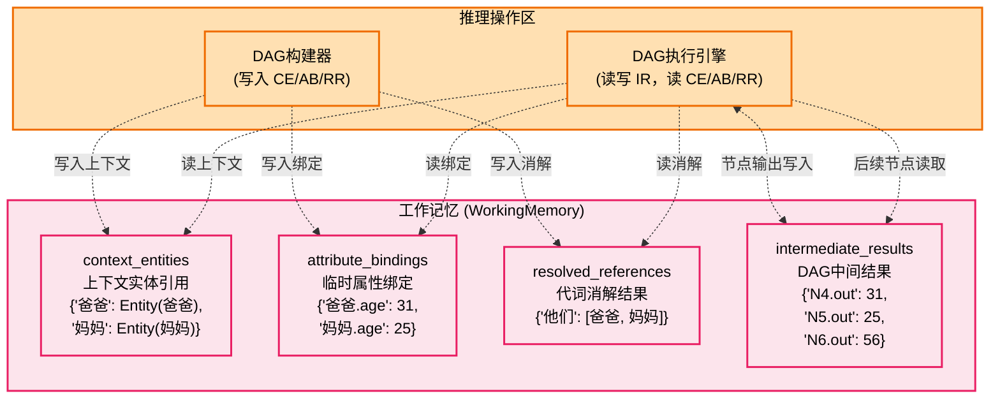
```mermaid
flowchart TD
    subgraph WM["工作记忆 (WorkingMemory)"]
        direction TB

        CE["context_entities<br/>上下文实体引用<br/>{'爸爸': Entity(爸爸),<br/> '妈妈': Entity(妈妈)}"]
        AB["attribute_bindings<br/>临时属性绑定<br/>{'爸爸.age': 31,<br/> '妈妈.age': 25}"]
        RR["resolved_references<br/>代词消解结果<br/>{'他们': [爸爸, 妈妈]}"]
        IR["intermediate_results<br/>DAG中间结果<br/>{'N4.out': 31,<br/> 'N5.out': 25,<br/> 'N6.out': 56}"]
    end

    subgraph RA["推理操作区"]
        NB["DAG构建器<br/>(写入 CE/AB/RR)"]
        NE["DAG执行引擎<br/>(读写 IR，读 CE/AB/RR)"]
    end

    NB -.写入上下文.-> CE
    NB -.写入绑定.-> AB
    NB -.写入消解.-> RR
    NE -.读上下文.-> CE
    NE -.读绑定.-> AB
    NE -.读消解.-> RR
    NE <-.节点输出写入.-> IR
    NE -.后续节点读取.-> IR

    classDef workmem fill:#fce4ec,stroke:#e91e63,stroke-width:2px,color:#000
    classDef reason fill:#ffe0b2,stroke:#ef6c00,stroke-width:2px,color:#000
    class WM,CE,AB,RR,IR workmem
    class RA,NB,NE reason
```

### 2.4 推理操作区（DAG构建器+DAG执行引擎）

推理操作区是工作区的"执行核心"，由两个子模块组成：

1. **DAG 构建器**：将模式匹配结果 + 激活的程序性记忆 + DAG 模板，组装成一个问题 DAG。构建成功 = 系统理解了问题
2. **DAG 执行引擎**：对问题 DAG 做拓扑排序，逐节点执行原子操作。节点之间通过工作记忆交换数据

**与工作记忆的关系**：
- 构建阶段：DAG 构建器会预先向工作记忆写入上下文相关数据（如属性绑定的占位、代词消解的预期目标）
- 执行阶段：每个节点执行时通过原子操作 `read_memory` / `write_memory` / `search_context` 与工作记忆交互

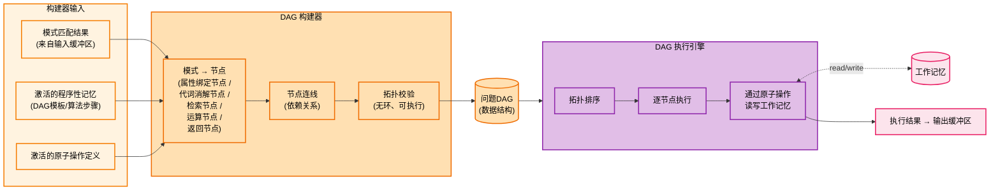
```mermaid
flowchart LR
    subgraph INPUTS["构建器输入"]
        I1["模式匹配结果<br/>(来自输入缓冲区)"]
        I2["激活的程序性记忆<br/>(DAG模板/算法步骤)"]
        I3["激活的原子操作定义"]
    end

    subgraph BUILDER["DAG 构建器"]
        B1["模式 → 节点<br/>(属性绑定节点 /<br/>代词消解节点 /<br/>检索节点 /<br/>运算节点 /<br/>返回节点)"]
        B2["节点连线<br/>(依赖关系)"]
        B3["拓扑校验<br/>(无环、可执行)"]
    end

    I1 --> B1
    I2 --> B1
    I3 --> B1
    B1 --> B2 --> B3

    B3 --> DAG[("问题DAG<br/>(数据结构)")]
    DAG --> EXEC

    subgraph EXEC["DAG 执行引擎"]
        E1["拓扑排序"]
        E2["逐节点执行"]
        E3["通过原子操作<br/>读写工作记忆"]
    end

    E1 --> E2 --> E3

    WM[("工作记忆")]
    E3 <-.read/write.-> WM

    E3 --> OUT["执行结果 → 输出缓冲区"]

    classDef input fill:#fff3e0,stroke:#f57c00,stroke-width:2px,color:#000
    classDef builder fill:#ffe0b2,stroke:#ef6c00,stroke-width:2px,color:#000
    classDef exec fill:#e1bee7,stroke:#8e24aa,stroke-width:2px,color:#000
    classDef data fill:#fce4ec,stroke:#e91e63,stroke-width:2px,color:#000
    class INPUTS,I1,I2,I3 input
    class BUILDER,B1,B2,B3,DAG builder
    class EXEC,E1,E2,E3 exec
    class WM,OUT data
```

### 2.5 输出缓冲区

输出缓冲区是工作区的出口，暂存任务执行结果及其元信息。输出缓冲区的内容同时是"是否触发固化"的判断依据——若执行过程中产生了应当固化的新知识，则将相关条目转交记忆系统固化。

**承载内容**：
- 答案（最终返回值）
- 推理链（DAG 节点执行序列 + 每步读写的工作记忆条目）
- 置信度（执行成功率、节点覆盖率）
- 待固化条目（如有新知识需要写入长期记忆）

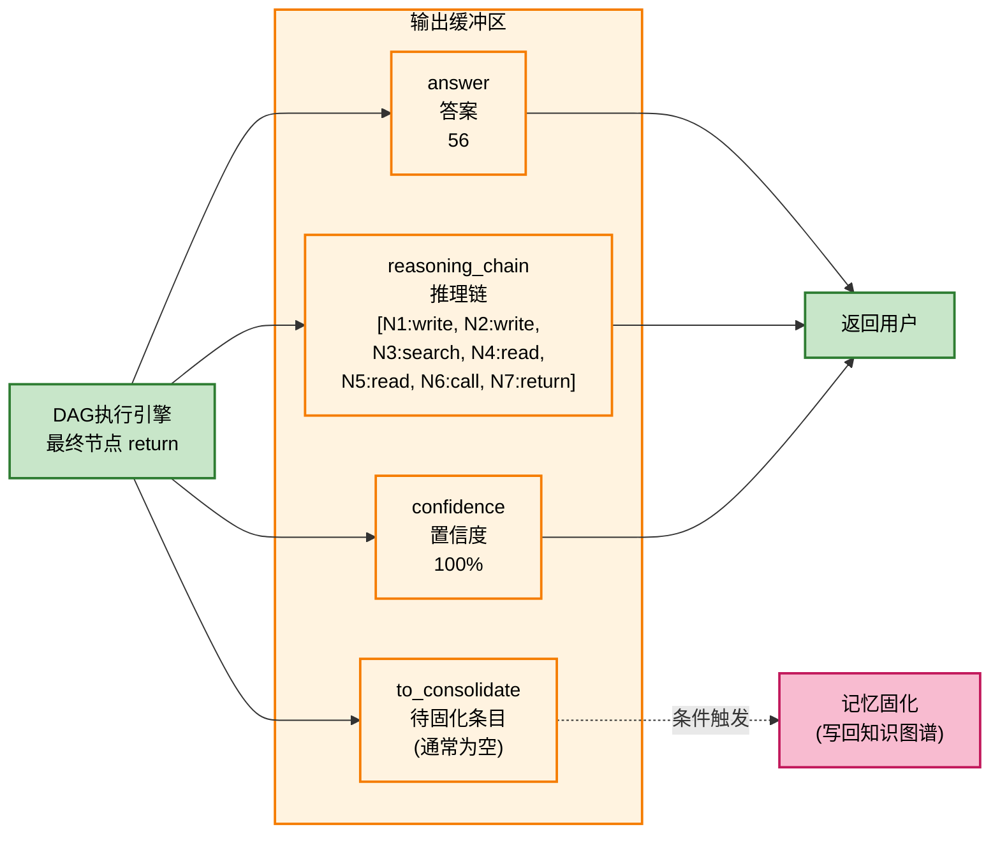
```mermaid
flowchart LR
    EXEC["DAG执行引擎<br/>最终节点 return"]

    subgraph OB["输出缓冲区"]
        O1["answer<br/>答案<br/>56"]
        O2["reasoning_chain<br/>推理链<br/>[N1:write, N2:write,<br/> N3:search, N4:read,<br/> N5:read, N6:call, N7:return]"]
        O3["confidence<br/>置信度<br/>100%"]
        O4["to_consolidate<br/>待固化条目<br/>(通常为空)"]
    end

    EXEC --> O1
    EXEC --> O2
    EXEC --> O3
    EXEC --> O4

    O1 --> USER["返回用户"]
    O2 --> USER
    O3 --> USER
    O4 -.条件触发.-> CONS["记忆固化<br/>(写回知识图谱)"]

    classDef buffer fill:#fff3e0,stroke:#f57c00,stroke-width:2px,color:#000
    classDef output fill:#c8e6c9,stroke:#2e7d32,stroke-width:2px,color:#000
    classDef consol fill:#f8bbd0,stroke:#c2185b,stroke-width:2px,color:#000
    class OB,O1,O2,O3,O4 buffer
    class EXEC,USER output
    class CONS consol
```

---

## 3. 工作记忆详细设计

工作记忆是工作区设计的核心。它既是"上下文容器"，又是"DAG 节点间的数据总线"。本节细化工作记忆的数据结构、生命周期与与 DAG 执行的交互方式。

### 3.1 数据结构（context_entities, attribute_bindings, resolved_references, intermediate_results）

工作记忆由四个并列的字段构成，每个字段承担不同职责：

| 字段 | 键 | 值 | 写入方 | 读取方 | 用途 |
|------|----|----|--------|--------|------|
| `context_entities` | 实体名 | 实体引用 | DAG构建器 | DAG节点 | 维护"当前任务谈到了哪些实体"的索引 |
| `attribute_bindings` | `实体.属性` | 属性值 | `write_memory` 节点 | `read_memory` 节点 | 存储临时属性赋值，不污染长期记忆 |
| `resolved_references` | 代词 | 实体引用列表 | `search_context` 节点 | `read_memory` / `call_algorithm` 节点 | 缓存代词消解结果，避免重复消解 |
| `intermediate_results` | `节点ID.out` | 节点输出值 | 任意 DAG 节点 | 后继 DAG 节点 | DAG 节点间数据传递的统一通道 |

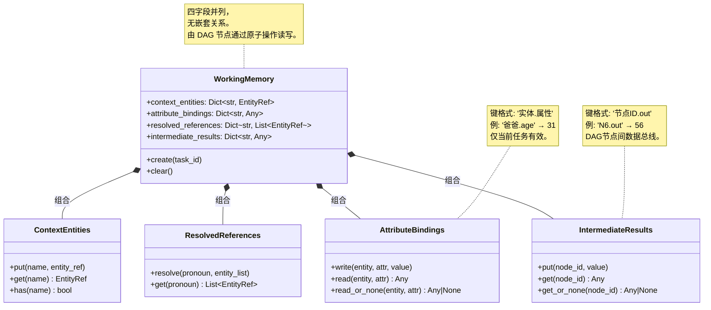
```mermaid
classDiagram
    class WorkingMemory {
        +context_entities: Dict~str, EntityRef~
        +attribute_bindings: Dict~str, Any~
        +resolved_references: Dict~str, List~EntityRef~~
        +intermediate_results: Dict~str, Any~
        +create(task_id)
        +clear()
    }

    class ContextEntities {
        +put(name, entity_ref)
        +get(name) EntityRef
        +has(name) bool
    }

    class AttributeBindings {
        +write(entity, attr, value)
        +read(entity, attr) Any
        +read_or_none(entity, attr) Any|None
    }

    class ResolvedReferences {
        +resolve(pronoun, entity_list)
        +get(pronoun) List~EntityRef~
    }

    class IntermediateResults {
        +put(node_id, value)
        +get(node_id) Any
        +get_or_none(node_id) Any|None
    }

    WorkingMemory *-- ContextEntities : 组合
    WorkingMemory *-- AttributeBindings : 组合
    WorkingMemory *-- ResolvedReferences : 组合
    WorkingMemory *-- IntermediateResults : 组合

    note for WorkingMemory "四字段并列，<br/>无嵌套关系。<br/>由 DAG 节点通过原子操作读写。"
    note for AttributeBindings "键格式: '实体.属性'<br/>例: '爸爸.age' → 31<br/>仅当前任务有效。"
    note for IntermediateResults "键格式: '节点ID.out'<br/>例: 'N6.out' → 56<br/>DAG节点间数据总线。"
```

**字段分工示意（以"爸爸的年龄31，妈妈的年龄25，他们的年龄之和是多少？"为例）**：

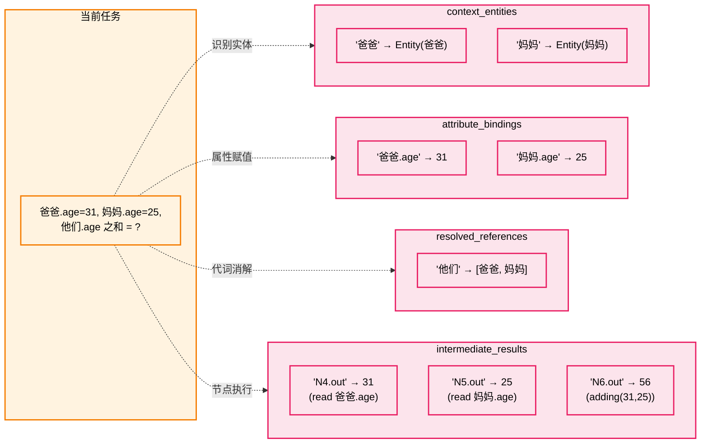
```mermaid
flowchart LR
    subgraph TASK["当前任务"]
        Q["爸爸.age=31, 妈妈.age=25,<br/>他们.age 之和 = ?"]
    end

    subgraph CE["context_entities"]
        CE1["'爸爸' → Entity(爸爸)"]
        CE2["'妈妈' → Entity(妈妈)"]
    end

    subgraph AB["attribute_bindings"]
        AB1["'爸爸.age' → 31"]
        AB2["'妈妈.age' → 25"]
    end

    subgraph RR["resolved_references"]
        RR1["'他们' → [爸爸, 妈妈]"]
    end

    subgraph IR["intermediate_results"]
        IR1["'N4.out' → 31<br/>(read 爸爸.age)"]
        IR2["'N5.out' → 25<br/>(read 妈妈.age)"]
        IR3["'N6.out' → 56<br/>(adding(31,25))"]
    end

    Q -.识别实体.-> CE
    Q -.属性赋值.-> AB
    Q -.代词消解.-> RR
    Q -.节点执行.-> IR

    classDef task fill:#fff3e0,stroke:#f57c00,stroke-width:2px,color:#000
    classDef workmem fill:#fce4ec,stroke:#e91e63,stroke-width:2px,color:#000
    class TASK,Q task
    class CE,CE1,CE2,AB,AB1,AB2,RR,RR1,IR,IR1,IR2,IR3 workmem
```

### 3.2 生命周期（任务开始创建→任务执行中传递→任务完成清除）

工作记忆的生命周期严格与单个任务对齐，**任务结束必须清空**——这是"工作记忆与长期记忆解耦"的边界保证。

**三阶段生命周期**：
1. **创建**：任务开始时创建空的 `WorkingMemory` 实例
2. **传递**：DAG 构建阶段写入上下文相关数据；DAG 执行阶段各节点持续读写 `intermediate_results`
3. **清除**：任务完成（无论成功失败）后，整体清空；若需保留新知识，先抽取为"待固化条目"转交记忆系统，再清空

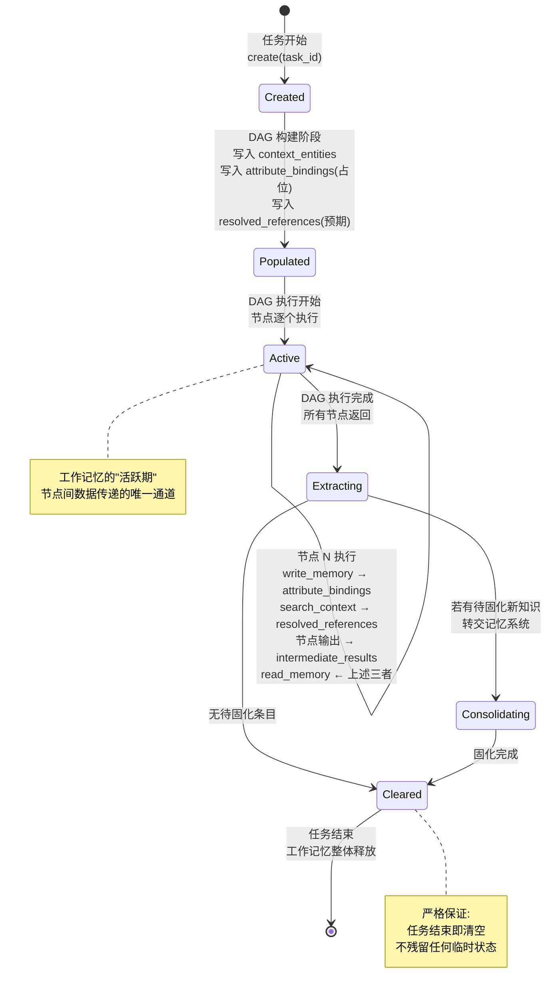
```mermaid
stateDiagram-v2
    [*] --> Created: 任务开始<br/>create(task_id)

    Created --> Populated: DAG 构建阶段<br/>写入 context_entities<br/>写入 attribute_bindings(占位)<br/>写入 resolved_references(预期)

    Populated --> Active: DAG 执行开始<br/>节点逐个执行

    Active --> Active: 节点 N 执行<br/>write_memory → attribute_bindings<br/>search_context → resolved_references<br/>节点输出 → intermediate_results<br/>read_memory ← 上述三者

    Active --> Extracting: DAG 执行完成<br/>所有节点返回

    Extracting --> Consolidating: 若有待固化新知识<br/>转交记忆系统
    Extracting --> Cleared: 无待固化条目

    Consolidating --> Cleared: 固化完成

    Cleared --> [*]: 任务结束<br/>工作记忆整体释放

    note right of Active
        工作记忆的"活跃期"
        节点间数据传递的唯一通道
    end note

    note right of Cleared
        严格保证:
        任务结束即清空
        不残留任何临时状态
    end note
```

**生命周期的关键约束**：

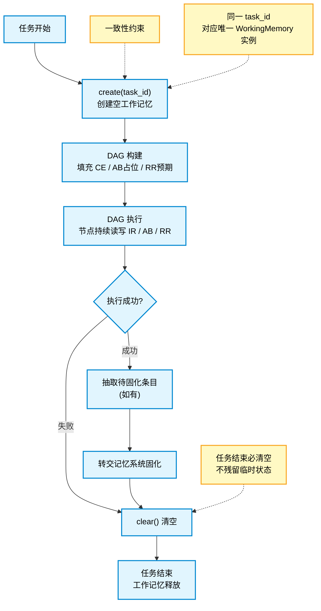
```mermaid
flowchart TD
    START["任务开始"] --> CREATE["create(task_id)<br/>创建空工作记忆"]
    CREATE --> BUILD["DAG 构建<br/>填充 CE / AB占位 / RR预期"]
    BUILD --> EXEC["DAG 执行<br/>节点持续读写 IR / AB / RR"]
    EXEC --> DONE{"执行成功?"}

    DONE -->|成功| EXTRACT["抽取待固化条目<br/>(如有)"]
    DONE -->|失败| CLEAR["clear() 清空"]

    EXTRACT --> CONSOL["转交记忆系统固化"]
    CONSOL --> CLEAR

    CLEAR --> END["任务结束<br/>工作记忆释放"]

    CONSIST["一致性约束"] -.-> CREATE
    CONSIST2["同一 task_id<br/>对应唯一 WorkingMemory 实例"] -.-> CREATE
    CONSIST3["任务结束必清空<br/>不残留临时状态"] -.-> CLEAR

    classDef lifecycle fill:#e1f5fe,stroke:#0288d1,stroke-width:2px,color:#000
    classDef constraint fill:#fff9c4,stroke:#f9a825,stroke-width:2px,color:#000
    class START,CREATE,BUILD,EXEC,DONE,EXTRACT,CONSOL,CLEAR,END lifecycle
    class CONSIST,CONSIST2,CONSIST3 constraint
```

### 3.3 与DAG执行的交互（节点输出写入工作记忆→后续节点从工作记忆读取）

DAG 节点之间**不直接传参**，统一通过工作记忆交换数据。这是工作记忆设计的核心约束，也是 DAG 节点可解耦、可复用的基础。

**交互模型**：
- 每个节点定义输入（从工作记忆读哪些键）和输出（向工作记忆写哪个键）
- 执行引擎按拓扑序调度节点：节点的所有前置节点都已写出输入键后，本节点才可执行
- 节点执行 `write_memory` / `read_memory` / `search_context` 等原子操作时，本质是在工作记忆上做读写

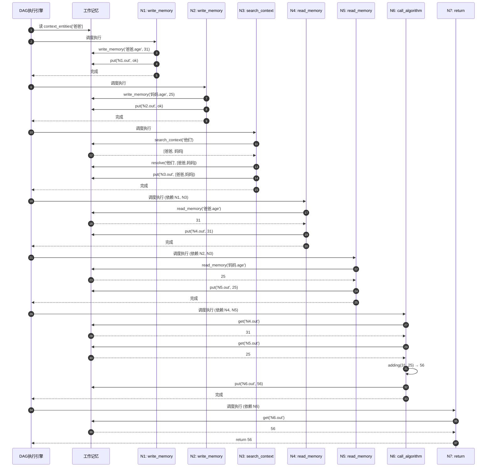
```mermaid
sequenceDiagram
    autonumber
    participant Engine as DAG执行引擎
    participant WM as 工作记忆
    participant N1 as N1: write_memory
    participant N2 as N2: write_memory
    participant N3 as N3: search_context
    participant N4 as N4: read_memory
    participant N5 as N5: read_memory
    participant N6 as N6: call_algorithm
    participant N7 as N7: return

    Engine->>WM: 读 context_entities['爸爸']
    Engine->>N1: 调度执行
    N1->>WM: write_memory('爸爸.age', 31)
    N1->>WM: put('N1.out', ok)
    N1-->>Engine: 完成

    Engine->>N2: 调度执行
    N2->>WM: write_memory('妈妈.age', 25)
    N2->>WM: put('N2.out', ok)
    N2-->>Engine: 完成

    Engine->>N3: 调度执行
    N3->>WM: search_context('他们')
    WM-->>N3: [爸爸, 妈妈]
    N3->>WM: resolve('他们', [爸爸,妈妈])
    N3->>WM: put('N3.out', [爸爸,妈妈])
    N3-->>Engine: 完成

    Engine->>N4: 调度执行 (依赖 N1, N3)
    N4->>WM: read_memory('爸爸.age')
    WM-->>N4: 31
    N4->>WM: put('N4.out', 31)
    N4-->>Engine: 完成

    Engine->>N5: 调度执行 (依赖 N2, N3)
    N5->>WM: read_memory('妈妈.age')
    WM-->>N5: 25
    N5->>WM: put('N5.out', 25)
    N5-->>Engine: 完成

    Engine->>N6: 调度执行 (依赖 N4, N5)
    N6->>WM: get('N4.out')
    WM-->>N6: 31
    N6->>WM: get('N5.out')
    WM-->>N6: 25
    N6->>N6: adding(31, 25) → 56
    N6->>WM: put('N6.out', 56)
    N6-->>Engine: 完成

    Engine->>N7: 调度执行 (依赖 N6)
    N7->>WM: get('N6.out')
    WM-->>N7: 56
    N7-->>Engine: return 56
```

**节点与工作记忆的读写契约**：

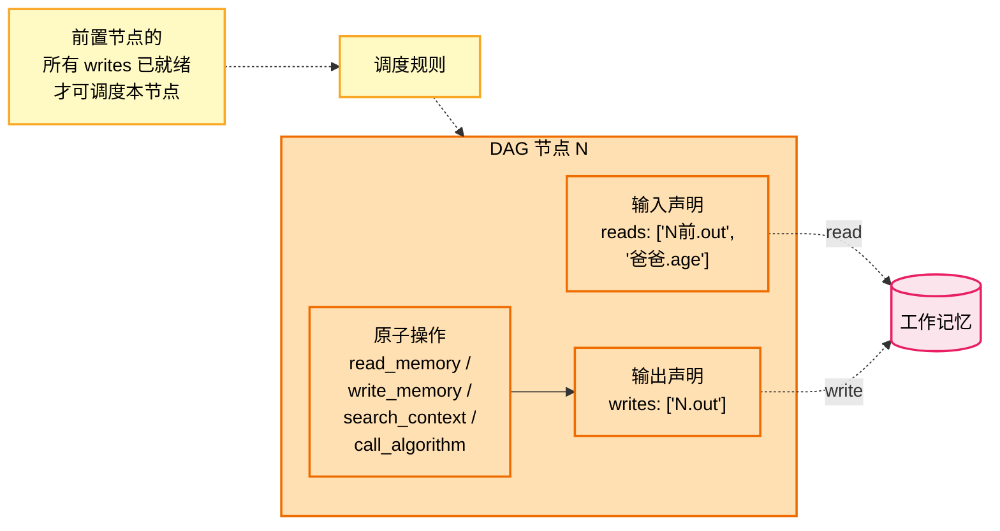
```mermaid
flowchart LR
    subgraph NODE["DAG 节点 N"]
        direction TB
        IN["输入声明<br/>reads: ['N前.out',<br/>          '爸爸.age']"]
        OP["原子操作<br/>read_memory /<br/>write_memory /<br/>search_context /<br/>call_algorithm"]
        OUT["输出声明<br/>writes: ['N.out']"]
    end

    WM[("工作记忆")]

    IN -.read.-> WM
    OP --> OUT
    OUT -.write.-> WM

    SCHED["调度规则"] -.-> NODE
    SCHED_NOTE["前置节点的<br/>所有 writes 已就绪<br/>才可调度本节点"] -.-> SCHED

    classDef node fill:#ffe0b2,stroke:#ef6c00,stroke-width:2px,color:#000
    classDef memory fill:#fce4ec,stroke:#e91e63,stroke-width:2px,color:#000
    classDef rule fill:#fff9c4,stroke:#f9a825,stroke-width:2px,color:#000
    class NODE,IN,OP,OUT node
    class WM memory
    class SCHED,SCHED_NOTE rule
```

---

## 4. 工作区生命周期

工作区自身也有生命周期，覆盖从输入接收到清空的全过程。生命周期的七个阶段对应架构设计 v2 中"工作区"的运行时状态机。每个阶段，五个缓冲区的状态各不相同。

**生命周期总览**：
**接收 → 激活 → DAG构建 → DAG执行 → 输出 → 固化 → 清空**

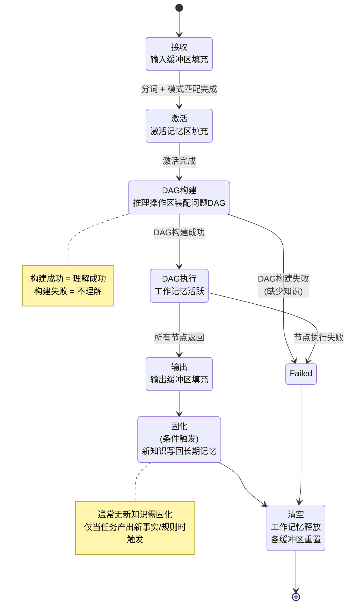
```mermaid
stateDiagram-v2
    [*] --> Receiving

    Receiving: 接收<br/>输入缓冲区填充
    Receiving --> Activating: 分词 + 模式匹配完成

    Activating: 激活<br/>激活记忆区填充
    Activating --> Building: 激活完成

    Building: DAG构建<br/>推理操作区装配问题DAG
    Building --> Executing: DAG构建成功
    Building --> Failed: DAG构建失败<br/>(缺少知识)

    Executing: DAG执行<br/>工作记忆活跃
    Executing --> Outputting: 所有节点返回
    Executing --> Failed: 节点执行失败

    Outputting: 输出<br/>输出缓冲区填充
    Outputting --> Consolidating

    Consolidating: 固化<br/>(条件触发)<br/>新知识写回长期记忆
    Consolidating --> Clearing

    Clearing: 清空<br/>工作记忆释放<br/>各缓冲区重置
    Clearing --> [*]

    Failed --> Clearing

    note right of Building
        构建成功 = 理解成功
        构建失败 = 不理解
    end note

    note right of Consolidating
        通常无新知识需固化
        仅当任务产出新事实/规则时触发
    end note
```

### 4.1 各阶段各缓冲区状态表

下表展示工作区生命周期每个阶段中，五个缓冲区（输入缓冲区、激活记忆区、工作记忆、推理操作区、输出缓冲区）的状态。

| 阶段 | 输入缓冲区 | 激活记忆区 | 工作记忆 | 推理操作区 | 输出缓冲区 |
|------|-----------|-----------|---------|-----------|-----------|
| ① 接收 | 填充中（原始输入、分词结果、模式匹配） | 空 | 空 | 空 | 空 |
| ② 激活 | 冻结（保留作为快照） | 填充中（激活实体/模式/程序/原子操作） | 空 | 空 | 空 |
| ③ DAG构建 | 冻结 | 冻结（保留供构建器引用） | 部分填充（CE / AB占位 / RR预期） | 装配中（构建问题DAG） | 空 |
| ④ DAG执行 | 冻结 | 冻结 | 活跃（IR持续读写，AB/RR持续读写） | 执行中（拓扑排序逐节点执行） | 空 |
| ⑤ 输出 | 冻结 | 冻结 | 冻结（保留供追溯） | 完成（DAG执行结束） | 填充（答案/推理链/置信度/待固化条目） |
| ⑥ 固化 | 冻结 | 冻结 | 冻结 | 完成 | 部分（待固化条目转交后清除） |
| ⑦ 清空 | 清空 | 清空 | 清空 | 清空 | 清空 |

```mermaid
gantt
    title 工作区生命周期各缓冲区活跃时段
    dateFormat X
    axisFormat %s

    section 输入缓冲区
    填充               :active, 0, 1
    冻结(快照)          :1, 6
    清空               :6, 7

    section 激活记忆区
    空                 :0, 1
    填充               :active, 1, 2
    冻结               :2, 6
    清空               :6, 7

    section 工作记忆
    空                 :0, 2
    部分填充(CE/AB/RR)   :active, 2, 3
    活跃(IR/AB/RR)      :crit, 3, 5
    冻结(供追溯)         :5, 6
    清空               :6, 7

    section 推理操作区
    空                 :0, 2
    装配DAG            :active, 2, 3
    执行DAG            :crit, 3, 5
    完成               :5, 6
    清空               :6, 7

    section 输出缓冲区
    空                 :0, 4
    填充               :active, 4, 6
    部分清空(固化后)     :5, 6
    清空               :6, 7
```

### 4.2 各阶段流转图

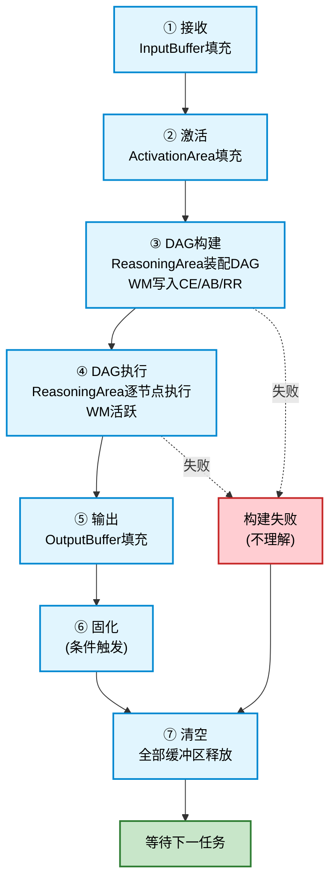
```mermaid
flowchart TD
    S1["① 接收<br/>InputBuffer填充"]
    S2["② 激活<br/>ActivationArea填充"]
    S3["③ DAG构建<br/>ReasoningArea装配DAG<br/>WM写入CE/AB/RR"]
    S4["④ DAG执行<br/>ReasoningArea逐节点执行<br/>WM活跃"]
    S5["⑤ 输出<br/>OutputBuffer填充"]
    S6["⑥ 固化<br/>(条件触发)"]
    S7["⑦ 清空<br/>全部缓冲区释放"]

    S1 --> S2 --> S3 --> S4 --> S5 --> S6 --> S7

    S3 -.失败.-> FAIL["构建失败<br/>(不理解)"]
    S4 -.失败.-> FAIL
    FAIL --> S7

    S7 --> NEXT["等待下一任务"]

    classDef stage fill:#e1f5fe,stroke:#0288d1,stroke-width:2px,color:#000
    classDef fail fill:#ffcdd2,stroke:#c62828,stroke-width:2px,color:#000
    classDef end_ fill:#c8e6c9,stroke:#2e7d32,stroke-width:2px,color:#000
    class S1,S2,S3,S4,S5,S6,S7 stage
    class FAIL fail
    class NEXT end_
```

---

## 5. 工作区与记忆系统的交互

工作区与记忆系统（知识图谱）之间存在双向交互：
- **激活（读）**：从知识图谱加载相关知识到激活记忆区
- **固化（写）**：将任务产出中的新知识写回知识图谱长期记忆

这两种交互是工作区与长期记忆解耦的"边界协议"——除此之外，工作区不直接读写知识图谱。

```mermaid
flowchart LR
    subgraph WS["工作区"]
        IB["输入缓冲区"]
        AA["激活记忆区"]
        WM["工作记忆"]
        RA["推理操作区"]
        OB["输出缓冲区"]
    end

    subgraph MS["记忆系统 (知识图谱)"]
        DM["陈述性记忆<br/>实体/关系/模式/规则"]
        PM["程序性记忆<br/>算法步骤/DAG模板/原子操作"]
        CON["记忆固化机制<br/>内存↔硬盘"]
    end

    IB --> AA: "激活线索"
    AA -.读激活.-> DM
    AA -.读激活.-> PM

    OB -.条件触发固化.-> CON
    CON -.写回.-> DM

    classDef workspace fill:#e8eaf6,stroke:#3f51b5,stroke-width:2px,color:#000
    classDef memory fill:#bbdefb,stroke:#1565c0,stroke-width:2px,color:#000
    class IB,AA,WM,RA,OB workspace
    class DM,PM,CON memory
```

### 5.1 激活：从知识图谱加载知识

激活发生在工作区生命周期的"② 激活"阶段。激活是按需的，只加载当前任务可能用到的知识。激活后，激活记忆区就成为工作区内部的"知识副本"，DAG 构建器和执行引擎只读激活记忆区，不再直接访问知识图谱。

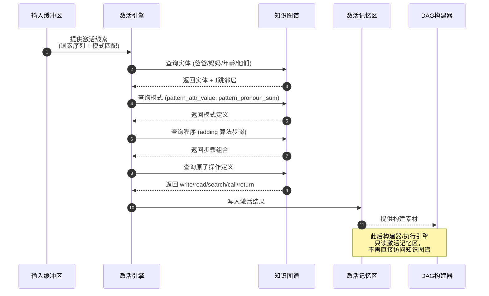
```mermaid
sequenceDiagram
    autonumber
    participant IB as 输入缓冲区
    participant Act as 激活引擎
    participant KG as 知识图谱
    participant AA as 激活记忆区
    participant Builder as DAG构建器

    IB->>Act: 提供激活线索<br/>(词素序列 + 模式匹配)
    Act->>KG: 查询实体 (爸爸/妈妈/年龄/他们)
    KG-->>Act: 返回实体 + 1跳邻居
    Act->>KG: 查询模式 (pattern_attr_value, pattern_pronoun_sum)
    KG-->>Act: 返回模式定义
    Act->>KG: 查询程序 (adding 算法步骤)
    KG-->>Act: 返回步骤组合
    Act->>KG: 查询原子操作定义
    KG-->>Act: 返回 write/read/search/call/return
    Act->>AA: 写入激活结果
    AA-->>Builder: 提供构建素材
    Note over AA,Builder: 此后构建器/执行引擎<br/>只读激活记忆区，<br/>不再直接访问知识图谱
```

**激活的边界约束**：
- 激活只在"② 激活"阶段发生，DAG 构建/执行阶段不再激活
- 若执行中发现激活不充分（缺知识），直接判失败，不中途激活
- 激活记忆区有容量上限，按激活强度截断

### 5.2 巩固：新知识固化到长期记忆

固化发生在工作区生命周期的"⑥ 固化"阶段，且**条件触发**——只有当任务产出中包含应当长期保留的新知识时，才执行固化。大多数常规任务（如解一道已学过的题）不会触发固化。

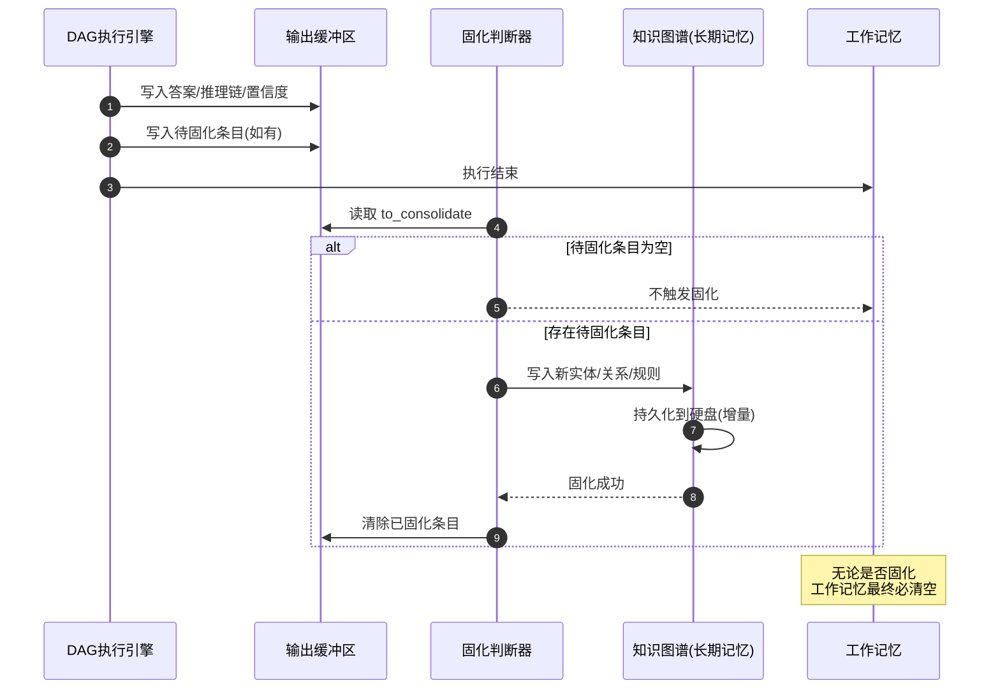
```mermaid
sequenceDiagram
    autonumber
    participant Exec as DAG执行引擎
    participant OB as 输出缓冲区
    participant Judge as 固化判断器
    participant KG as 知识图谱(长期记忆)
    participant WM as 工作记忆

    Exec->>OB: 写入答案/推理链/置信度
    Exec->>OB: 写入待固化条目(如有)
    Exec->>WM: 执行结束

    Judge->>OB: 读取 to_consolidate
    alt 待固化条目为空
        Judge-->>WM: 不触发固化
    else 存在待固化条目
        Judge->>KG: 写入新实体/关系/规则
        KG->>KG: 持久化到硬盘(增量)
        KG-->>Judge: 固化成功
        Judge->>OB: 清除已固化条目
    end

    Note over WM: 无论是否固化<br/>工作记忆最终必清空
```

**固化的触发场景（示例）**：
- 任务中产生了一个新的实体（如学习了新概念）
- 任务中产生了一条新的关系或规则
- 任务中产生了一个新的算法步骤组合（程序性记忆）

**固化的边界约束**：
- 固化只针对"新知识"，不固化临时属性绑定（如 `爸爸.age=31` 是任务级数据，不写回长期记忆）
- 固化是增量的，不全量重写
- 固化完成后，待固化条目从输出缓冲区清除，工作记忆随后整体清空

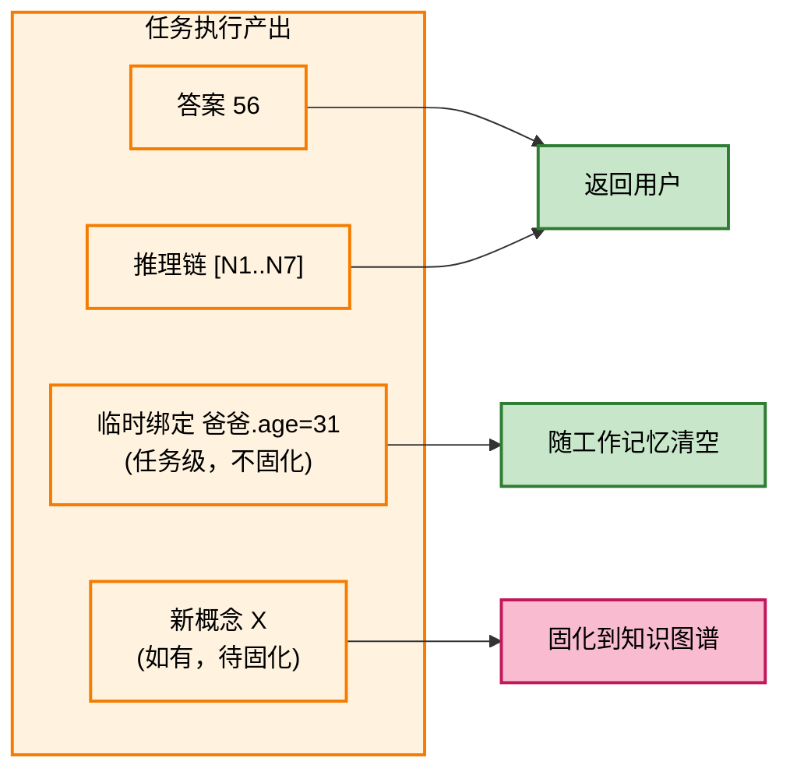
```mermaid
flowchart LR
    subgraph TASK["任务执行产出"]
        T1["答案 56"]
        T2["推理链 [N1..N7]"]
        T3["临时绑定 爸爸.age=31<br/>(任务级，不固化)"]
        T4["新概念 X<br/>(如有，待固化)"]
    end

    T1 --> USER["返回用户"]
    T2 --> USER
    T3 --> CLEAR["随工作记忆清空"]
    T4 --> CONSOL["固化到知识图谱"]

    classDef task fill:#fff3e0,stroke:#f57c00,stroke-width:2px,color:#000
    classDef output fill:#c8e6c9,stroke:#2e7d32,stroke-width:2px,color:#000
    classDef consol fill:#f8bbd0,stroke:#c2185b,stroke-width:2px,color:#000
    class TASK,T1,T2,T3,T4 task
    class USER,CLEAR output
    class CONSOL consol
```

---

## 6. 脑科学类比

工作区的设计对应人脑的前额叶皮层（Prefrontal Cortex, PFC）及其工作记忆、执行控制功能。这种类比不是装饰性的——它为设计决策提供了生理学参照，使架构与人脑机制保持同构。

```mermaid
flowchart LR
    subgraph BRAIN["人脑 (前额叶皮层 PFC)"]
        direction TB
        PFC["前额叶皮层"]
        WM_B["工作记忆<br/>(Working Memory)"]
        EC["执行控制<br/>(Executive Control)"]
        PFC --> WM_B
        PFC --> EC
    end

    subgraph DIGITAL["数字大脑 (工作区)"]
        direction TB
        WS["工作区 Workspace"]
        WM_D["工作记忆 WorkingMemory<br/>(CE/AB/RR/IR)"]
        RA["推理操作区 ReasoningArea<br/>(DAG构建器+执行引擎)"]
        WS --> WM_D
        WS --> RA
    end

    PFC -.对应.-> WS
    WM_B -.对应.-> WM_D
    EC -.对应.-> RA

    classDef brain fill:#e1bee7,stroke:#8e24aa,stroke-width:2px,color:#000
    classDef digital fill:#fce4ec,stroke:#e91e63,stroke-width:2px,color:#000
    class BRAIN,PFC,WM_B,EC brain
    class DIGITAL,WS,WM_D,RA digital
```

### 6.1 工作区 = 前额叶皮层

前额叶皮层是人脑负责高级认知功能的核心区域，承担"暂存信息 + 调度执行"的综合职责。数字大脑的工作区与之对应：

| 脑科学（前额叶皮层） | 数字大脑（工作区） | 对应说明 |
|--------------------|-------------------|---------|
| 接收感官输入 | 输入缓冲区 | 视觉/听觉皮层预处理后送入 PFC |
| 调取长期记忆 | 激活记忆区 | 海马体↔新皮层↔PFC 的记忆提取 |
| 工作记忆暂存 | 工作记忆 | PFC 的工作记忆功能 |
| 决策与执行控制 | 推理操作区 | PFC 的执行控制功能 |
| 输出动作指令 | 输出缓冲区 | PFC → 运动皮层 |
| 完成任务后释放 | 清空阶段 | 注意力转移，工作记忆内容被覆写 |

```mermaid
flowchart TD
    subgraph HUMAN["人脑认知流程"]
        H1["感官输入<br/>(视觉/听觉)"]
        H2["海马体提取记忆<br/>(长期记忆→PFC)"]
        H3["前额叶皮层 PFC<br/>工作记忆暂存 + 执行控制"]
        H4["运动皮层<br/>输出动作/语言"]
        H5["任务完成<br/>注意力转移，PFC释放"]

        H1 --> H2 --> H3 --> H4 --> H5
    end

    subgraph DIGITAL["数字大脑流程"]
        D1["输入缓冲区<br/>(文本输入)"]
        D2["激活记忆区<br/>(知识图谱→激活)"]
        D3["工作记忆 + 推理操作区<br/>(暂存 + DAG执行)"]
        D4["输出缓冲区<br/>(答案/推理链)"]
        D5["清空<br/>(工作记忆释放)"]

        D1 --> D2 --> D3 --> D4 --> D5
    end

    H1 -.类比.-> D1
    H2 -.类比.-> D2
    H3 -.类比.-> D3
    H4 -.类比.-> D4
    H5 -.类比.-> D5

    classDef brain fill:#e1bee7,stroke:#8e24aa,stroke-width:2px,color:#000
    classDef digital fill:#fce4ec,stroke:#e91e63,stroke-width:2px,color:#000
    class HUMAN,H1,H2,H3,H4,H5 brain
    class DIGITAL,D1,D2,D3,D4,D5 digital
```

### 6.2 工作记忆 = 前额叶的工作记忆功能

前额叶皮层的工作记忆功能负责"在短时间内保持和操作与当前任务相关的信息"。这与数字大脑的工作记忆模块高度同构。

| 脑科学（PFC 工作记忆） | 数字大脑（WorkingMemory） | 对应说明 |
|----------------------|--------------------------|---------|
| 保存当前任务的上下文实体 | `context_entities` | "我们在谈论谁/什么" |
| 维持临时属性赋值 | `attribute_bindings` | "爸爸.age=31" 这种任务内的事实 |
| 代词指代消解 | `resolved_references` | "他们"指向上下文中的实体 |
| 中间计算结果暂存 | `intermediate_results` | 多步推理的中间产物 |
| 容量有限（米勒定律 7±2） | 工作记忆容量上限 | 限制同时处理的信息量 |
| 任务结束即遗忘 | 任务完成即清空 | 不污染长期记忆 |
| 与海马体协作固化为长期记忆 | 固化阶段写回知识图谱 | 重要的新知识转为长期记忆 |

```mermaid
flowchart LR
    subgraph PFC["PFC 工作记忆 (生理)"]
        direction TB
        P1["语境实体保持<br/>'当前谈的是谁'"]
        P2["临时属性赋值<br/>'爸爸年龄31'"]
        P3["代词指代<br/>'他们→爸爸和妈妈'"]
        P4["中间结果<br/>'31, 25, 56'"]
        P5["容量受限<br/>米勒定律 7±2"]
        P6["任务结束遗忘<br/>不进入长期记忆"]
        P7["重要内容固化<br/>海马体→新皮层"]
    end

    subgraph WM["WorkingMemory (数字)"]
        direction TB
        W1["context_entities"]
        W2["attribute_bindings"]
        W3["resolved_references"]
        W4["intermediate_results"]
        W5["容量上限"]
        W6["任务完成 clear()"]
        W7["固化 → 知识图谱"]
    end

    P1 -.-> W1
    P2 -.-> W2
    P3 -.-> W3
    P4 -.-> W4
    P5 -.-> W5
    P6 -.-> W6
    P7 -.-> W7

    classDef brain fill:#e1bee7,stroke:#8e24aa,stroke-width:2px,color:#000
    classDef digital fill:#fce4ec,stroke:#e91e63,stroke-width:2px,color:#000
    class PFC,P1,P2,P3,P4,P5,P6,P7 brain
    class WM,W1,W2,W3,W4,W5,W6,W7 digital
```

### 6.3 DAG执行 = 执行控制功能

前额叶皮层的执行控制功能负责规划、调度、监控认知任务的执行。数字大脑的"DAG 构建 + DAG 执行"与之对应：构建阶段对应"规划"，执行阶段对应"调度与监控"。

| 脑科学（PFC 执行控制） | 数字大脑（推理操作区） | 对应说明 |
|----------------------|----------------------|---------|
| 任务规划：分解为子任务 | DAG 构建器：构建问题 DAG | 把"求解问题"分解为有序步骤 |
| 子任务调度：按依赖执行 | DAG 执行引擎：拓扑排序 | 先决条件满足才执行下一步 |
| 工作记忆读写控制 | 原子操作 `read/write_memory` | PFC 决定何时取/存工作记忆内容 |
| 监控执行：错误即中止 | 节点失败即任务失败 | 缺知识/计算错误都不容忽视 |
| 结果整合输出 | `return` 节点 + 输出缓冲区 | 整合各步结果形成最终答案 |
| 推理过程可追溯 | 推理链（DAG执行序列） | PFC 支持元认知，知道"我是怎么算出来的" |

```mermaid
flowchart TD
    subgraph PFC["PFC 执行控制 (生理)"]
        direction TB
        E1["任务规划<br/>分解子任务"]
        E2["子任务调度<br/>按依赖执行"]
        E3["工作记忆读写控制"]
        E4["执行监控<br/>错误即中止"]
        E5["结果整合输出"]
        E6["元认知<br/>知道推理过程"]
    end

    subgraph RA["推理操作区 (数字)"]
        direction TB
        R1["DAG 构建器<br/>模式→节点→连线→校验"]
        R2["DAG 执行引擎<br/>拓扑排序逐节点"]
        R3["原子操作<br/>read/write/search/call"]
        R4["节点失败即任务失败"]
        R5["return节点 + 输出缓冲区"]
        R6["推理链<br/>可追溯可解释"]
    end

    E1 -.-> R1
    E2 -.-> R2
    E3 -.-> R3
    E4 -.-> R4
    E5 -.-> R5
    E6 -.-> R6

    classDef brain fill:#e1bee7,stroke:#8e24aa,stroke-width:2px,color:#000
    classDef digital fill:#ffe0b2,stroke:#ef6c00,stroke-width:2px,color:#000
    class PFC,E1,E2,E3,E4,E5,E6 brain
    class RA,R1,R2,R3,R4,R5,R6 digital
```

**脑科学类比的总结**：

工作区整体对应前额叶皮层，承担"工作记忆 + 执行控制"两大功能。工作记忆模块对应 PFC 的工作记忆功能（保持任务上下文与中间结果），推理操作区对应 PFC 的执行控制功能（DAG 构建对应规划，DAG 执行对应调度与监控）。这种同构使数字大脑的运行机制与人脑保持一致：暂存信息 → 规划步骤 → 调度执行 → 输出结果 → 释放资源，重要内容固化到长期记忆。

```mermaid
flowchart LR
    PFC["前额叶皮层 PFC"] --> WM_FUNC["工作记忆功能"]
    PFC --> EC_FUNC["执行控制功能"]

    WM_FUNC --> WM_MODULE["工作记忆模块<br/>context_entities<br/>attribute_bindings<br/>resolved_references<br/>intermediate_results"]

    EC_FUNC --> EC_BUILD["规划<br/>→ DAG构建器"]
    EC_FUNC --> EC_EXEC["调度监控<br/>→ DAG执行引擎"]

    classDef brain fill:#e1bee7,stroke:#8e24aa,stroke-width:2px,color:#000
    classDef func fill:#f8bbd0,stroke:#c2185b,stroke-width:2px,color:#000
    classDef digital fill:#fce4ec,stroke:#e91e63,stroke-width:2px,color:#000
    class PFC brain
    class WM_FUNC,EC_FUNC func
    class WM_MODULE,EC_BUILD,EC_EXEC digital
```
