# 推理执行详细设计

> 所属层级：推理执行层（Reasoning Layer）
> 上游依赖：[分词引擎设计](分词引擎设计.md)、[模式匹配设计](模式匹配设计.md)、[记忆系统设计](记忆系统设计.md)、[工作区设计](工作区设计.md)
> 核心定位：将"用户问题"转换为"问题DAG"并执行，DAG 构建成功 = 系统理解了问题。

## 1. 设计目标

推理执行层是数字大脑的"前额叶决策中枢"。本次重构把原先的"单步推理（意图→算法→输出）"升级为"DAG 推理（问题理解 + 执行）"，由此带来三个根本性目标：

1. **DAG 推理 = 问题理解 + 执行**：用户问题先被转换为一个有向无环图（DAG），图的结构本身表达了对问题的理解；执行只是按拓扑顺序逐节点跑完这张图。
2. **通用执行引擎，不针对特定问题**：执行引擎只认识"原子操作"和"图结构"，不认识"加法""应用题"等任何业务概念。加减法、应用题、指代消解等差异，全部体现在 DAG 节点序列与算法注册表中，引擎本身保持问题无关。
3. **DAG 构建成功 = 理解成功**：构建阶段一旦能产出一张完整、可调度、无缺失依赖的 DAG，即视为系统已理解问题；任何一环缺知识（没学过某个模式、某个算法、某个实体），都直接导致构建失败并提示"缺什么"，而不是硬猜答案。

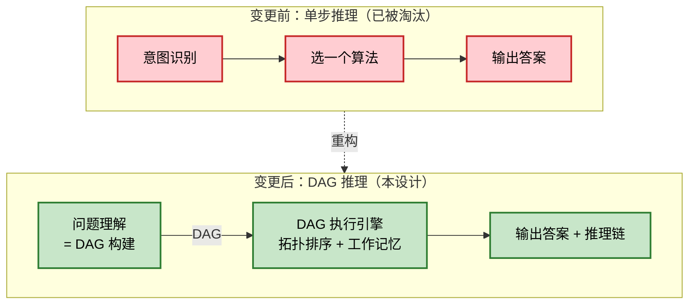

三大目标对应的设计承诺：

| 目标 | 设计承诺 | 落地位置 |
|------|---------|---------|
| DAG 推理 | 问题先变 DAG，再执行 DAG | 第 2 节（构建）、第 3 节（执行） |
| 通用引擎 | 引擎只懂原子操作 + 图结构 | 第 3 节（引擎）、第 4 节（原子操作） |
| 构建成功 = 理解成功 | 构建失败要明确"缺什么" | 第 2.4 节 |

## 2. 问题理解（DAG 构建）

问题理解的本质是：**把一段自然语言问题，翻译成一张可在通用引擎上跑的 DAG**。这张图构建出来了，就等于理解了；构建不出来，就等于没理解。

### 2.1 输入：分词结果 + 模式匹配结果

DAG 构建器的输入由上游两个无状态模块提供，二者都从知识图谱取知识，自身不存任何状态：

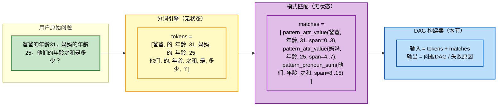

输入数据的契约：

| 输入项 | 来源 | 内容 | 作用 |
|--------|------|------|------|
| `tokens` | 分词引擎 | 有序词素序列 + 每个词素引用的实体 id | 提供原始语料与实体绑定 |
| `matches` | 模式匹配 | 命中的模式列表，每条含 `pattern_name`、`captured`（槽位填充）、`span`（在 tokens 中的区间） | 提供结构化片段，每个片段对应一个语义动作 |

### 2.2 根据匹配的模式，组装 DAG 节点和边

构建器逐条遍历 `matches`，把每条匹配结果翻译为**一个或多个 DAG 节点**，再依据数据依赖连边。组装规则遵循三条原则：

1. **模式 → 节点**：每条匹配的模式对应一个语义动作（action），动作类型由模式名决定（见 2.3）。
2. **数据依赖 → 边**：若节点 B 的输入引用了节点 A 的输出（实体、属性、集合），则连一条 A→B 的边。
3. **去重与合并**：对同一实体同一属性的多次写入只保留最后一次；对同一实体的多次读取复用同一来源节点。

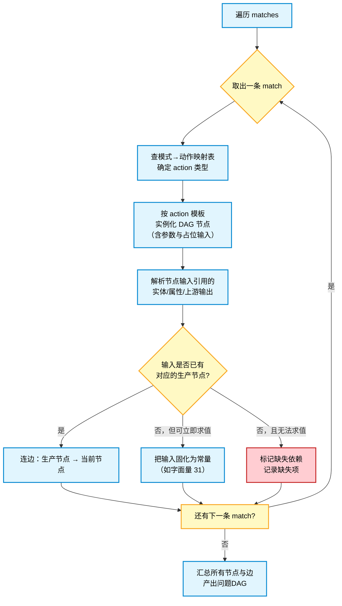

### 2.3 每个模式对应一个 DAG 节点（action）

模式与 DAG 动作的对应关系存于程序性记忆（见第 6 节的模板），构建器只查表不臆断。常见映射：

| 模式名（pattern_name） | 槽位（captured） | 对应 action | 生成的 DAG 节点 |
|------------------------|------------------|------------|-----------------|
| `pattern_attr_value` | entity, attr, value | `write_memory` | 写入 `entity.attr = value` 到工作记忆 |
| `pattern_pronoun_ref` | pronoun, attr | `search_context` + `read_memory` | 先消解代词→实体集，再读属性 |
| `pattern_pronoun_sum` | pronoun, attr, op | `search_context` + 多个 `read_memory` + `call_algorithm` | 消解代词→读各属性→聚合运算 |
| `pattern_binary_op_question` | left, op, right | `call_algorithm` + `return_value` | 直接调用算法并返回 |
| `pattern_compare` | left, cmp, right | `call_algorithm(compare)` + `return_value` | 比较运算并返回 |

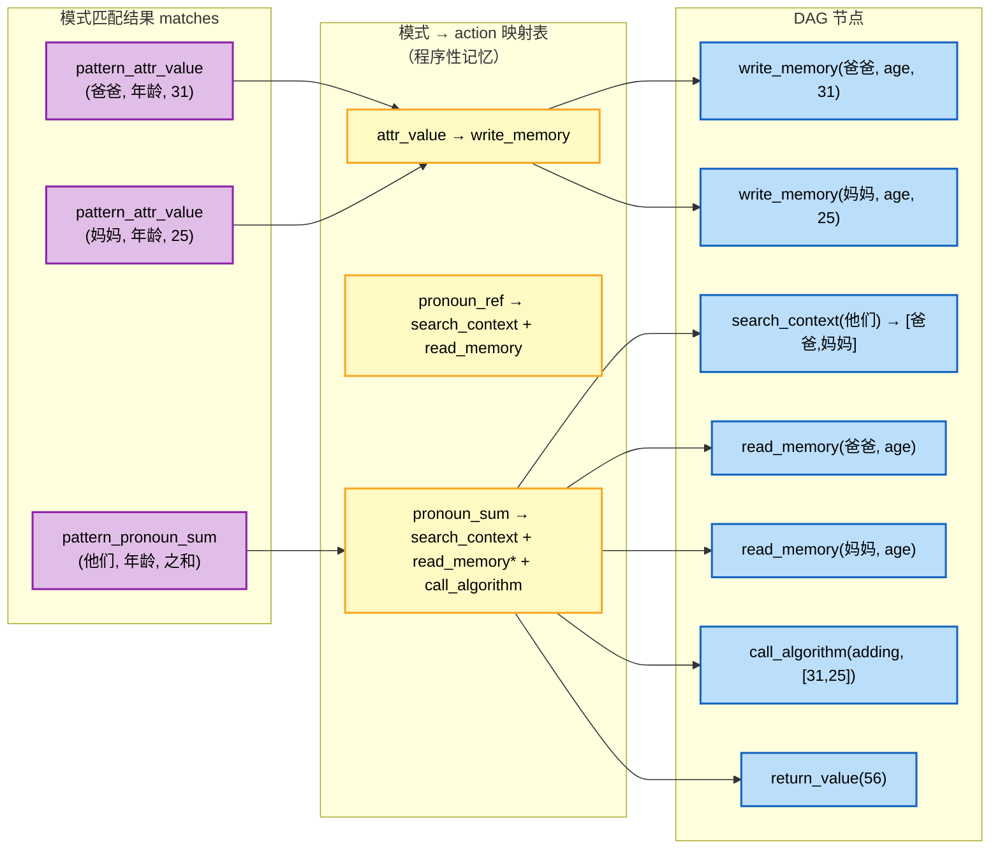

### 2.4 DAG 构建成功 / 失败的判断

构建不是"能凑几张图就算成功"，而是必须同时满足三道闸门，任何一道不过即判定"不理解"，并向上游返回结构化的缺失清单。

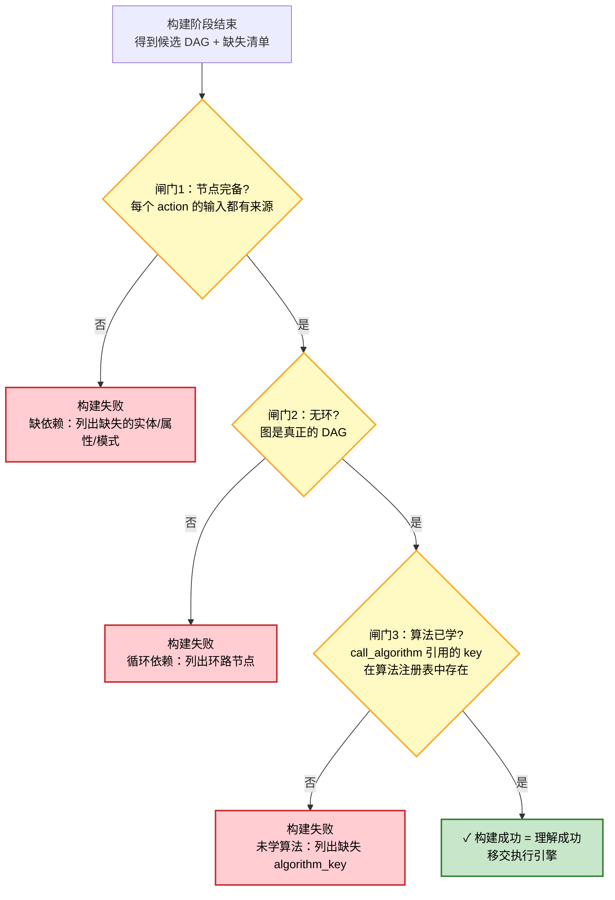

三道闸门对应三类"不理解"，每类都要回答用户"缺什么"：

| 失败类型 | 触发条件 | 给用户的提示样例 |
|---------|---------|-----------------|
| 缺依赖 | 节点输入引用了未提供、且无法立即求值的实体/属性 | "我还不认识'爷爷'这个实体" |
| 循环依赖 | 图中存在环 | "问题自相矛盾，无法排定执行顺序" |
| 未学算法 | `call_algorithm` 引用的 algorithm_key 不在注册表 | "我还没学过'乘法'这个算法" |

### 2.5 构建流程图

把 2.1～2.4 串成一张完整的构建流程：

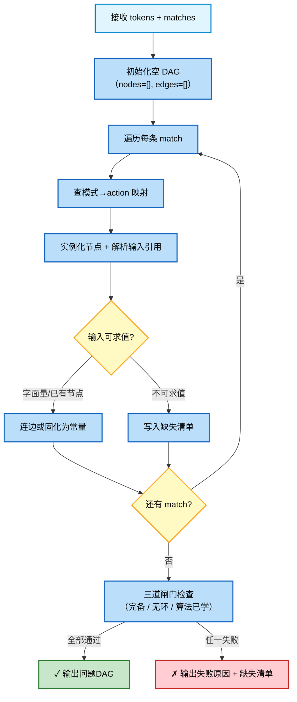

### 2.6 示例：年龄之和问题的 DAG 构建

以贯穿全文的示例 "爸爸的年龄31，妈妈的年龄25，他们的年龄之和是多少？" 演示一次完整构建。

**Step 1**：分词 + 模式匹配得到三条 match。

**Step 2**：逐条翻译。

- match1 `pattern_attr_value(爸爸, 年龄, 31)` → 节点 `n1: write_memory(爸爸, age, 31)`，输入 31 为字面量。
- match2 `pattern_attr_value(妈妈, 年龄, 25)` → 节点 `n2: write_memory(妈妈, age, 25)`。
- match3 `pattern_pronoun_sum(他们, 年龄, 之和)` 展开为：
  - `n3: search_context(他们)` —— 需要消解代词，依赖 n1、n2 已写入的上下文；
  - `n4: read_memory(爸爸, age)` —— 依赖 n1（写入）与 n3（消解出爸爸）；
  - `n5: read_memory(妈妈, age)` —— 依赖 n2 与 n3；
  - `n6: call_algorithm(adding, [n4.out, n5.out])` —— 依赖 n4、n5；
  - `n7: return_value(n6.out)` —— 依赖 n6。

**Step 3**：三道闸门检查通过 → 构建成功。

```mermaid
flowchart TD
    n1["n1 · write_memory<br/>(爸爸, age, 31)"]
    n2["n2 · write_memory<br/>(妈妈, age, 25)"]
    n3["n3 · search_context<br/>(他们) → [爸爸, 妈妈]"]
    n4["n4 · read_memory<br/>(爸爸, age) → 31"]
    n5["n5 · read_memory<br/>(妈妈, age) → 25"]
    n6["n6 · call_algorithm<br/>(adding, [31, 25]) → 56"]
    n7["n7 · return_value<br/>(56)"]

    n1 --> n3
    n2 --> n3
    n3 --> n4
    n3 --> n5
    n1 --> n4
    n2 --> n5
    n4 --> n6
    n5 --> n6
    n6 --> n7

    classDef write fill:#ffe0b2,stroke:#ef6c00,stroke-width:2px,color:#000
    classDef search fill:#e1bee7,stroke:#8e24aa,stroke-width:2px,color:#000
    classDef read fill:#bbdefb,stroke:#1565c0,stroke-width:2px,color:#000
    classDef call fill:#c8e6c9,stroke:#2e7d32,stroke-width:2px,color:#000
    classDef ret fill:#f8bbd0,stroke:#c2185b,stroke-width:2px,color:#000
    class n1,n2 write
    class n3 search
    class n4,n5 read
    class n6 call
    class n7 ret
```

构建产出的 DAG 节点摘要：

| 节点 | action | 参数 | 依赖（上游节点） |
|------|--------|------|-----------------|
| n1 | write_memory | (爸爸, age, 31) | — |
| n2 | write_memory | (妈妈, age, 25) | — |
| n3 | search_context | (他们) | n1, n2 |
| n4 | read_memory | (爸爸, age) | n1, n3 |
| n5 | read_memory | (妈妈, age) | n2, n3 |
| n6 | call_algorithm | (adding, [n4.out, n5.out]) | n4, n5 |
| n7 | return_value | (n6.out) | n6 |

## 3. DAG 执行引擎

执行引擎是"通用虚拟机"：输入一张 DAG，按拓扑序逐节点跑，节点之间通过工作记忆传数据，引擎本身不认识任何业务语义。

### 3.1 拓扑排序

引擎首先对 DAG 做拓扑排序，得到一个可执行序列。拓扑序保证：**任一节点的所有上游节点都先于它执行**。若排序失败（存在环），直接退回构建阶段（实际上构建闸门已拦截，此为双重保险）。

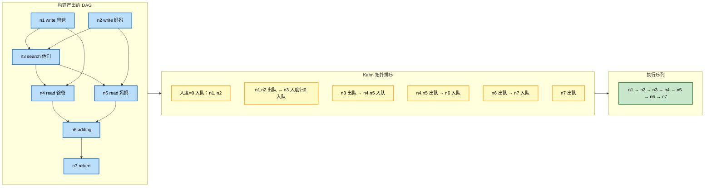

排序策略要点：

- **同层可并行**：入度同时归 0 的节点（如 n1、n2）逻辑上互不依赖，可并行调度；MVP 阶段顺序执行即可，并行留作扩展。
- **确定性**：同层多个就绪节点按"节点编号" tie-break，保证同一张图多次执行得到完全一致的推理链（满足可解释性要求）。
- **环检测**：若排序结束后已出队节点数 < 总节点数，判定有环，回退失败。

### 3.2 逐节点执行

按拓扑序依次取出节点，根据 `action` 字段分发到对应的原子操作处理器（见第 4 节）。每个节点执行后产出一个结果值，写入工作记忆中该节点的输出槽，供下游节点读取。

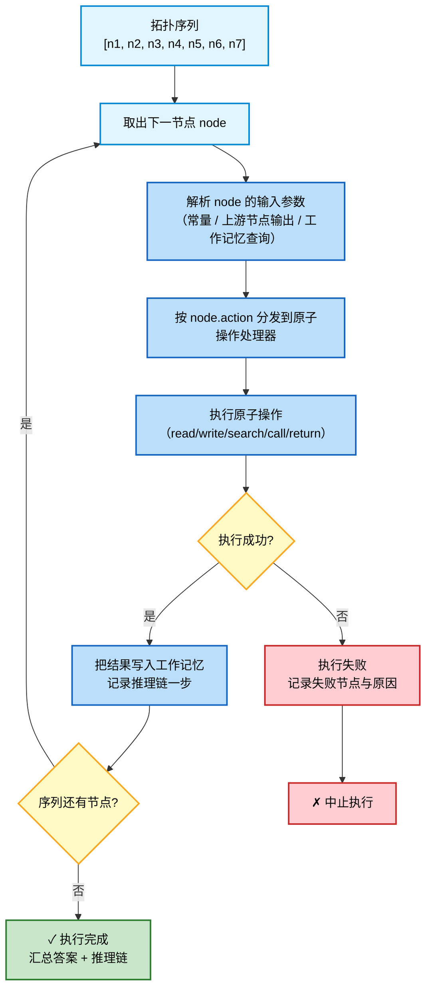

### 3.3 数据通过工作记忆传递

节点之间**不直接传参**，所有中间数据都经"工作记忆"中转。这一设计有三个好处：

1. **解耦**：节点只与工作记忆打交道，不需要知道上游具体是谁，便于同层并行与复用。
2. **可解释**：工作记忆是推理过程的"白板"，每一步读写都留痕，天然形成推理链。
3. **代词消解天然落地**：`search_context` 把代词消解结果写入工作记忆，后续 `read_memory` 直接读，无需特殊通道。

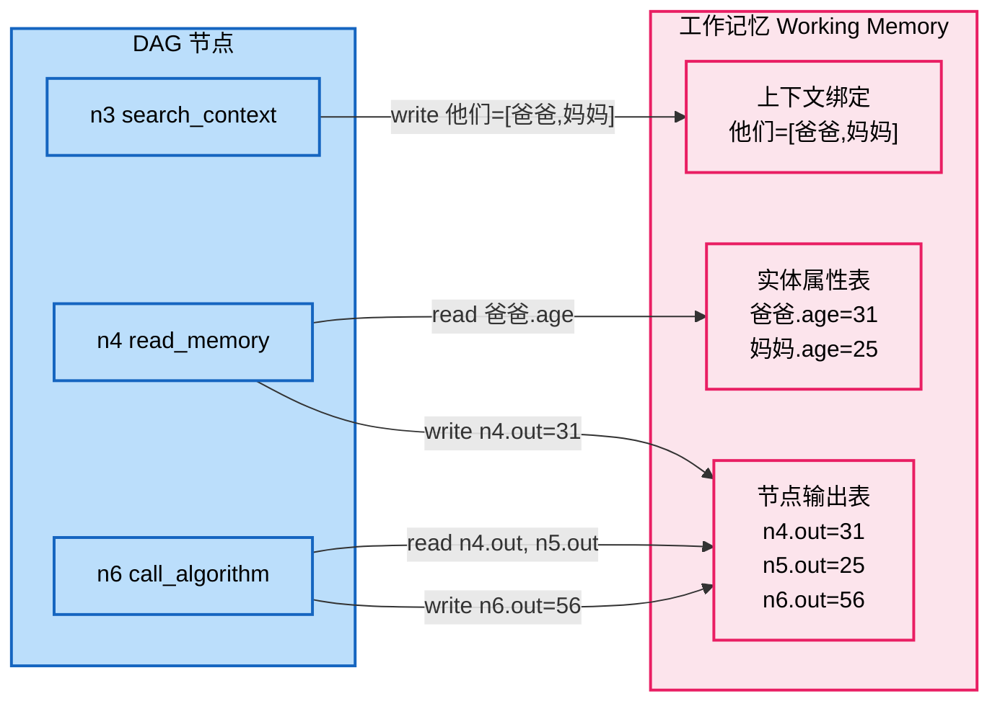

工作记忆的数据组织：

| 区域 | 存什么 | 谁写 | 谁读 |
|------|--------|------|------|
| 实体属性表 | `entity.attr = value`（如 爸爸.age=31） | write_memory | read_memory |
| 上下文绑定 | 代词 → 实体集（如 他们=[爸爸,妈妈]） | search_context | read_memory / call_algorithm |
| 节点输出表 | `node_id.out = value` | 每个执行完的节点 | 下游节点解析参数时 |

> 工作记忆的生命周期由工作区管理：任务开始时创建，任务结束（输出或失败）后清空，不污染长期记忆。详见 [工作区设计](工作区设计.md)。

### 3.4 执行流程图

把 3.1～3.3 合并成执行引擎的全景：

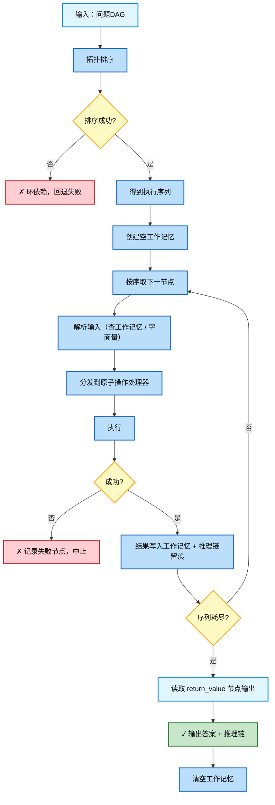

## 4. 原子操作集

原子操作是执行引擎认识的"指令集"，类似 CPU 指令。**它们是先天的"硬件"**：什么时候用、怎么组合是学来的（体现在 DAG 模板和算法注册表里），但操作本身的语义是固定的、不通过学习获得。

### 4.1 read_memory(entity, attr) → value

从工作记忆读取某实体的某属性。若该属性尚未写入，则触发失败并提示"缺属性"。

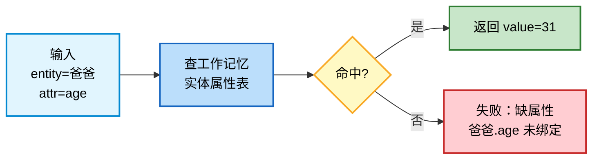

- **语义**：读工作记忆的"实体属性表"。
- **入参**：`entity`（实体名/id）、`attr`（属性名）。
- **返回**：`value`（属性值）。
- **失败条件**：属性未绑定（上游 write 未执行或实体不存在）。

### 4.2 write_memory(entity, attr, value)

把一个属性值写入工作记忆，供后续节点读取。

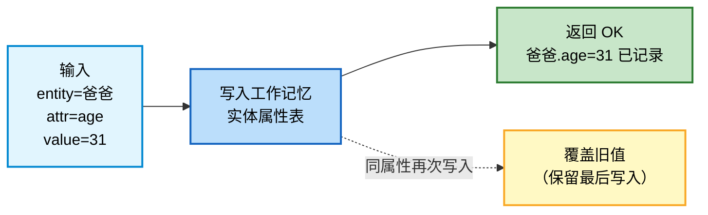

- **语义**：写工作记忆的"实体属性表"。
- **入参**：`entity`、`attr`、`value`。
- **返回**：成功标志。
- **覆盖策略**：同一 `entity.attr` 多次写入，后写覆盖先写，仅保留最后值。

### 4.3 search_context(keyword) → entities

在工作记忆的上下文中查找与关键词匹配的实体集合，主要用于**代词消解**（把"他们"解析为具体实体列表）。

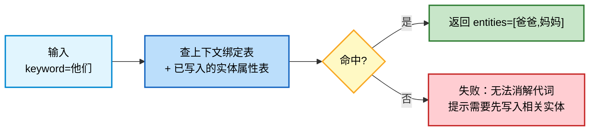

- **语义**：依据上下文把代词/关键词解析为实体集。
- **入参**：`keyword`（代词或关键词，如"他们""它""这些"）。
- **返回**：`entities`（实体列表）。
- **解析依据**：复数代词→最近写入的全部实体；单数代词→最近写入的单个实体；具体名词→该实体本身。具体规则通过模板学习（见第 6 节）。

### 4.4 call_algorithm(key, args) → result

按 `algorithm_key` 调用算法注册表中已学习的算法，传入参数，返回结果。算法本身是原子操作的组合（见第 5 节）。

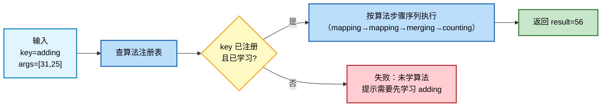

- **语义**：执行一个习得算法（程序性记忆）。
- **入参**：`key`（算法名，如 adding/subtracting/counting）、`args`（参数列表，元素可来自上游节点输出）。
- **返回**：`result`。
- **门控**：`key` 必须在算法注册表中存在且已通过知识包学习，否则拒执（与"没学过就不会"原则一致）。

### 4.5 return_value(value)

把最终结果交给输出缓冲区，结束本次推理。一个 DAG 恰有一个 return_value 节点（多返回值场景由模板聚合成单值后再 return）。

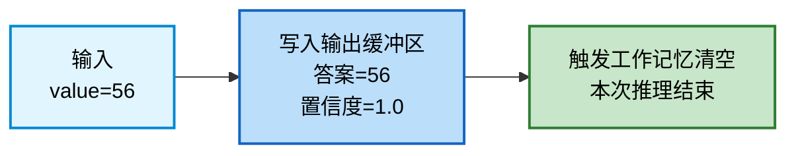

- **语义**：终止推理并输出答案。
- **入参**：`value`（最终结果，通常来自某个 call_algorithm 节点的输出）。
- **返回**：无；触发工作记忆清空与输出缓冲区封口。

### 4.6 原子操作表（指令集类比）

把 5 个原子操作与 CPU 指令集类比，凸显"精简、正交、可组合"的设计取向：

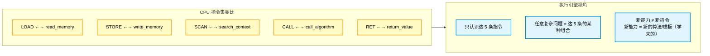

原子操作一览表：

| 助记符 | 原子操作 | 签名 | 语义 | 失败条件 |
|--------|---------|------|------|---------|
| `READ` | read_memory | (entity, attr) → value | 读工作记忆属性 | 属性未绑定 |
| `WRITE` | write_memory | (entity, attr, value) → ok | 写工作记忆属性 | — |
| `SEARCH` | search_context | (keyword) → entities | 代词/关键词消解 | 无法消解 |
| `CALL` | call_algorithm | (key, args) → result | 调用习得算法 | 算法未注册/未学 |
| `RET` | return_value | (value) → ∅ | 输出答案并结束 | — |

设计约束：

- **不增设业务指令**：不为"加法""比较"等单独设指令，它们都是 `CALL` 的不同 `key`。
- **操作只与工作记忆交互**：除 `RET` 外，所有操作不直接对外输出，保证可解释与可重放。
- **新增操作需架构决策**：原子操作是"硬件"，新增等同类脑长出新脑区，不通过学习获得。

## 5. 算法注册表（原子操作的组合）

算法 = 原子操作的有序组合。算法本身不写代码，而是把"步骤序列"作为程序性记忆存进知识图谱，执行时由 `call_algorithm` 取出步骤序列、按序调用更底层的原子操作或更基础的算法。

### 5.1 adding = [mapping, mapping, merging, counting]

加法被学为四个步骤：把两个数分别映射为集合、合并集合、计数。这与人类儿童"左手几根手指、右手几根手指、合到一起、数一数"的学习路径一致。

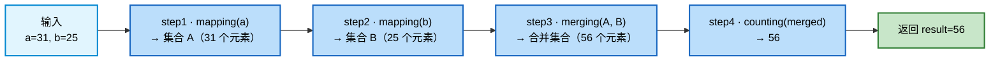

每个步骤对应一次原子操作或更基础算法的调用：

| 步骤 | 调用 | 输入 | 输出 |
|------|------|------|------|
| 1 | mapping | a=31 | 集合 A |
| 2 | mapping | b=25 | 集合 B |
| 3 | merging | A, B | 合并集合 |
| 4 | counting | 合并集合 | 56 |

### 5.2 subtracting = [mapping, mapping, removing, counting]

减法的步骤序列与加法对称：先映射被减数与减数，再从被减集合中"移除"减数对应元素，最后对剩余集合计数。

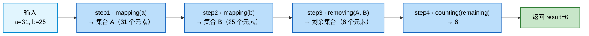

| 步骤 | 调用 | 输入 | 输出 |
|------|------|------|------|
| 1 | mapping | a=31 | 集合 A |
| 2 | mapping | b=25 | 集合 B |
| 3 | removing | A, B | 剩余集合 |
| 4 | counting | 剩余集合 | 6 |

> `mapping`、`merging`、`removing`、`counting` 是比 `adding`/`subtracting` 更基础的算法，本身也以步骤序列形式存于知识图谱，直到递归到底层原子操作为止。

### 5.3 算法步骤存知识图谱，通过学习获得

算法不是代码，而是知识图谱中的程序性记忆节点。每个算法节点存储：`algorithm_key`、`steps`（步骤序列）、`dependencies`（依赖的更基础算法）、`trigger`（何时用）。这些内容**全部通过知识包学习写入**，不存在第二份硬编码拷贝。

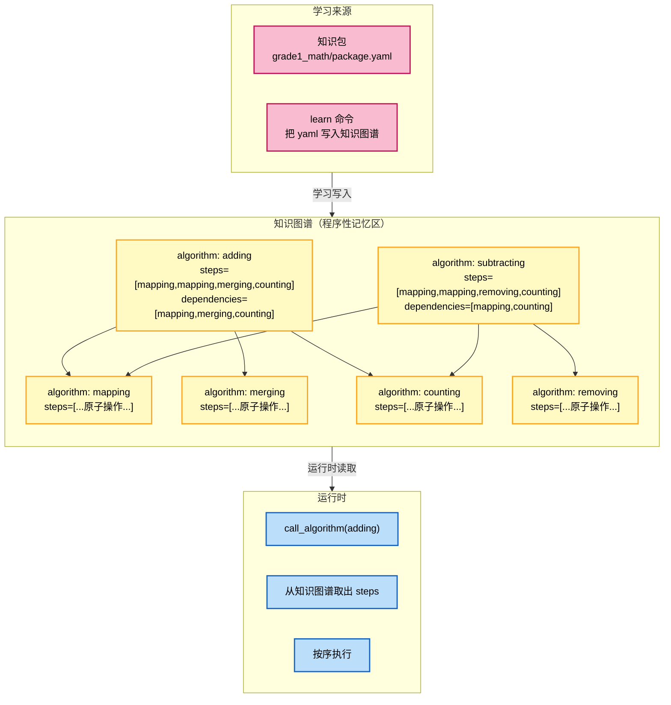

学习与运行的关系：

- **学习时**：`learn grade1_math` 把 package.yaml 中的 `procedures` 段落写入知识图谱，包括每个算法的 `algorithm_key`、`steps`、`dependencies`。
- **运行时**：`call_algorithm(key)` 从知识图谱取步骤序列，按序执行；执行前先校验 `dependencies` 中的基础算法都已学习（与构建闸门"算法已学"呼应）。
- **未学习 = 不会**：若 `call_algorithm` 引用的 key 在图谱中找不到，直接判失败，绝不"猜"。

### 5.4 算法层级图

算法按"组合深度"形成层级，越底层越接近原子操作，越顶层越接近业务概念。新算法通过组合已有算法习得，体现"能力生长"。

```mermaid
flowchart TD
    L0["L0 · 原子操作（硬件，不学习）<br/>read_memory / write_memory / search_context / call_algorithm / return_value"]

    L1["L1 · 基础算法（最早习得）<br/>mapping / merging / removing / counting"]

    L2["L2 · 运算算法（组合 L1）<br/>adding / subtracting"]

    L3["L3 · 应用题算法（组合 L2）<br/>age_sum（年龄之和）<br/>count_total（总数）"]

    L4["L4 · 复杂策略（组合 L3）<br/>多步应用题 / 比较推理"]

    L0 --> L1 --> L2 --> L3 --> L4

    classDef l0 fill:#ffcdd2,stroke:#c62828,stroke-width:2px,color:#000
    classDef l1 fill:#ffe0b2,stroke:#ef6c00,stroke-width:2px,color:#000
    classDef l2 fill:#fff9c4,stroke:#f9a825,stroke-width:2px,color:#000
    classDef l3 fill:#bbdefb,stroke:#1565c0,stroke-width:2px,color:#000
    classDef l4 fill:#c8e6c9,stroke:#2e7d32,stroke-width:2px,color:#000
    class L0 l0
    class L1 l1
    class L2 l2
    class L3 l3
    class L4 l4
```

层级说明：

| 层级 | 内容 | 获得方式 | 示例 |
|------|------|---------|------|
| L0 | 原子操作 | 先天硬件（不学习） | read_memory、write_memory |
| L1 | 基础算法 | 经验归纳学习 | mapping、merging、counting |
| L2 | 运算算法 | 组合 L1 习得 | adding、subtracting |
| L3 | 应用题算法 | 组合 L2 + DAG 模板习得 | 年龄之和 |
| L4 | 复杂策略 | 组合 L3 习得 | 多步应用题 |

> 关键约束：**上层只能组合下层，不能跳层**。adding 不能直接调原子操作，必须经过 mapping/merging/counting。这保证每一层的能力都可被下层完整解释，是可解释性的根基。

## 6. DAG 推理模板

DAG 构建器并不是"凭空造图"，而是按模板填空。模板描述了"某一类问题该长成什么样的 DAG"，本身存于程序性记忆，通过知识包学习。

### 6.1 模板存储在程序性记忆中

模板是一种特殊的程序性记忆，记录三件事：`触发模式`（什么模式组合触发该模板）、`节点骨架`（DAG 的节点与边结构，含占位符）、`参数绑定`（占位符如何从 match 的槽位取值）。

```mermaid
flowchart LR
    subgraph KG["知识图谱（程序性记忆区）"]
        TPL["DAG 模板节点<br/>name: age_sum_template<br/>trigger_patterns: [attr_value*, pronoun_sum]<br/>skeleton: [write*, search, read*, call, return]<br/>bindings: {entity←captured.entity, ...}"]
    end

    subgraph BUILD["DAG 构建器"]
        B1["收到 matches"]
        B2["查模板：哪些模板的<br/>trigger_patterns 被满足?"]
        B3["选最优模板<br/>（覆盖 match 最多）"]
        B4["按 skeleton + bindings<br/>实例化 DAG 节点"]
    end

    subgraph OUT["产出"]
        O1["问题DAG"]
    end

    KG --> B2
    B1 --> B2 --> B3 --> B4 --> O1

    classDef kg fill:#fff9c4,stroke:#f9a825,stroke-width:2px,color:#000
    classDef build fill:#bbdefb,stroke:#1565c0,stroke-width:2px,color:#000
    classDef out fill:#c8e6c9,stroke:#2e7d32,stroke-width:2px,color:#000
    class TPL kg
    class B1,B2,B3,B4 build
    class O1 out
```

模板与算法的区别：

| 维度 | 算法（L1～L4） | DAG 模板 |
|------|---------------|----------|
| 描述什么 | 单个运算怎么做 | 整个问题的 DAG 怎么搭 |
| 触发 | 被 `call_algorithm` 调用 | 被 `matches` 模式组合触发 |
| 产出 | 一个结果值 | 一张问题DAG |
| 存储位置 | 程序性记忆 | 程序性记忆 |

### 6.2 模板示例：年龄之和问题

年龄之和问题的 DAG 模板骨架如下。`*` 表示"按 match 数量展开若干个"。

```mermaid
flowchart TD
    subgraph TPL["模板：age_sum_template"]
        direction TB
        t1["write_memory*<br/>(entity←attr_value.entity,<br/> attr←attr_value.attr,<br/> value←attr_value.value)"]
        t2["search_context<br/>(keyword←pronoun_sum.pronoun)"]
        t3["read_memory*<br/>(entity←search.out[i],<br/> attr←pronoun_sum.attr)"]
        t4["call_algorithm<br/>(key←pronoun_sum.op → adding,<br/> args←read*.out)"]
        t5["return_value<br/>(value←call.out)"]

        t1 --> t2
        t2 --> t3
        t3 --> t4
        t4 --> t5
    end

    subgraph BIND["参数绑定规则"]
        b1["entity ← 各 attr_value 模式的 entity 槽"]
        b2["pronoun ← pronoun_sum 模式的 pronoun 槽"]
        b3["op ← pronoun_sum 模式的 op 槽（之和→adding）"]
        b4["read* 的数量 = search.out 的实体数"]
    end

    TPL -.-> BIND

    classDef tpl fill:#bbdefb,stroke:#1565c0,stroke-width:2px,color:#000
    classDef bind fill:#fff9c4,stroke:#f9a825,stroke-width:2px,color:#000
    class t1,t2,t3,t4,t5 tpl
    class b1,b2,b3,b4 bind
```

模板字段说明：

| 字段 | 含义 | 本例取值 |
|------|------|---------|
| trigger_patterns | 触发该模板需要的模式组合 | `[attr_value+, pronoun_sum]` |
| skeleton | DAG 节点骨架（带占位符） | `write*, search, read*, call, return` |
| bindings | 占位符←槽位的映射规则 | entity←attr_value.entity 等 |
| op_mapping | 运算词到 algorithm_key 的映射 | 之和→adding、之差→subtracting |

### 6.3 模板通过知识包学习

模板不是预置的，而是通过知识包学习写入知识图谱。知识包的 `templates` 段落声明模板的触发模式与骨架，`learn` 命令把它固化到程序性记忆。

```mermaid
flowchart LR
    subgraph PKG["知识包 package.yaml"]
        direction TB
        P1["templates 段落<br/>name: age_sum_template<br/>trigger_patterns: ...<br/>skeleton: ...<br/>bindings: ..."]
    end

    subgraph LEARN["learn 命令"]
        L1["读取 templates"]
        L2["写入知识图谱<br/>程序性记忆区"]
        L3["固化到硬盘"]
    end

    subgraph RUN["运行时"]
        R1["DAG 构建器<br/>查模板"]
        R2["实例化问题DAG"]
    end

    subgraph VERIFY["学习后自测"]
        V1["用样例问题验证<br/>构建成功 + 答案正确"]
        V2{"通过?"}
        V2 -->|是| V3["模板可用"]
        V2 -->|否| V4["模板不达标<br/>拒绝注册"]
    end

    PKG --> LEARN --> RUN
    LEARN --> VERIFY

    classDef pkg fill:#f8bbd0,stroke:#c2185b,stroke-width:2px,color:#000
    classDef learn fill:#fff9c4,stroke:#f9a825,stroke-width:2px,color:#000
    classDef run fill:#bbdefb,stroke:#1565c0,stroke-width:2px,color:#000
    classDef verify fill:#c8e6c9,stroke:#2e7d32,stroke-width:2px,color:#000
    classDef fail fill:#ffcdd2,stroke:#c62828,stroke-width:2px,color:#000
    class P1 pkg
    class L1,L2,L3 learn
    class R1,R2 run
    class V1,V2,V3 verify
    class V4 fail
```

学习闭环的关键约束：

- **未学模板 = 不理解该类问题**：若问题命中的模式组合没有对应已学模板，DAG 构建失败，提示"没学过这类问题"。
- **学习即固化**：模板写入知识图谱后立即固化到硬盘，重启不丢。
- **学习即自测**：知识包可附带样例问题，学习后自动验证"构建成功 + 答案正确"，不达标的模板拒绝注册。

## 7. 完整推理链示例

把前 6 节的能力全部串起来，演示 "爸爸的年龄31，妈妈的年龄25，他们的年龄之和是多少？" 从输入到输出的完整 DAG 推理链。

```mermaid
flowchart TD
    subgraph S1["Step 1 · 输入"]
        Q["爸爸的年龄31，妈妈的年龄25，他们的年龄之和是多少？"]
    end

    subgraph S2["Step 2 · 分词（从知识图谱查词素）"]
        T["[爸爸, 的, 年龄, 31, 妈妈, 的, 年龄, 25,<br/>他们, 的, 年龄, 之和, 是, 多少, ？]"]
    end

    subgraph S3["Step 3 · 模式匹配（从知识图谱加载模式）"]
        P1["m1: pattern_attr_value(爸爸, 年龄, 31)"]
        P2["m2: pattern_attr_value(妈妈, 年龄, 25)"]
        P3["m3: pattern_pronoun_sum(他们, 年龄, 之和)"]
    end

    subgraph S4["Step 4 · DAG 构建（= 理解）"]
        direction TB
        D1["查模板 → age_sum_template 命中"]
        D2["按骨架实例化 7 个节点"]
        D3["三道闸门检查通过 ✓"]
        D4["输出问题DAG"]
        D1 --> D2 --> D3 --> D4
    end

    subgraph S5["Step 5 · DAG 执行（拓扑序 + 工作记忆）"]
        direction TB
        E1["n1 write_memory(爸爸, age, 31) → 工作记忆: 爸爸.age=31"]
        E2["n2 write_memory(妈妈, age, 25) → 工作记忆: 妈妈.age=25"]
        E3["n3 search_context(他们) → 工作记忆: 他们=[爸爸,妈妈]"]
        E4["n4 read_memory(爸爸, age) → 31"]
        E5["n5 read_memory(妈妈, age) → 25"]
        E6["n6 call_algorithm(adding, [31,25])<br/>　└ mapping(31)→A<br/>　└ mapping(25)→B<br/>　└ merging(A,B)→AB<br/>　└ counting(AB)→56"]
        E7["n7 return_value(56)"]
        E1 --> E2 --> E3 --> E4 --> E5 --> E6 --> E7
    end

    subgraph S6["Step 6 · 输出"]
        O1["答案: 56"]
        O2["推理链: write→write→search→read→read→adding→return"]
        O3["置信度: 100%"]
    end

    subgraph S7["Step 7 · 收尾"]
        C1["清空工作记忆"]
        C2["（若有新知识）固化到硬盘"]
    end

    S1 --> S2 --> S3 --> S4 --> S5 --> S6 --> S7

    classDef s1 fill:#c8e6c9,stroke:#2e7d32,stroke-width:2px,color:#000
    classDef s2 fill:#fff9c4,stroke:#f9a825,stroke-width:2px,color:#000
    classDef s3 fill:#e1bee7,stroke:#8e24aa,stroke-width:2px,color:#000
    classDef s4 fill:#bbdefb,stroke:#1565c0,stroke-width:2px,color:#000
    classDef s5 fill:#ffe0b2,stroke:#ef6c00,stroke-width:2px,color:#000
    classDef s6 fill:#c8e6c9,stroke:#2e7d32,stroke-width:2px,color:#000
    classDef s7 fill:#f8bbd0,stroke:#c2185b,stroke-width:2px,color:#000
    class S1,Q s1
    class S2,T s2
    class S3,P1,P2,P3 s3
    class S4,D1,D2,D3,D4 s4
    class S5,E1,E2,E3,E4,E5,E6,E7 s5
    class S6,O1,O2,O3 s6
    class S7,C1,C2 s7
```

每一步对应的设计落点：

| 步骤 | 行为 | 本设计章节 |
|------|------|-----------|
| 1 输入 | 接收原始问题 | 上游：交互层 |
| 2 分词 | 无状态分词，从知识图谱查词素 | 上游：[分词引擎设计](分词引擎设计.md) |
| 3 模式匹配 | 从知识图谱加载模式并匹配 | 上游：[模式匹配设计](模式匹配设计.md) |
| 4 DAG 构建 | 查模板→实例化→闸门检查 | 第 2 节 + 第 6 节 |
| 5 DAG 执行 | 拓扑排序→逐节点→工作记忆 | 第 3 节 |
| 5.n 原子操作 | read/write/search/call/return | 第 4 节 |
| 5.n 算法调用 | adding = mapping+mapping+merging+counting | 第 5 节 |
| 6 输出 | 答案 + 推理链 + 置信度 | 本层 + [工作区设计](工作区设计.md) |
| 7 收尾 | 清空工作记忆 + 固化新知识 | [工作区设计](工作区设计.md) + [记忆系统设计](记忆系统设计.md) |

---

**设计小结**：本设计把推理执行拆成"理解（DAG 构建）"与"执行（DAG 引擎）"两段。理解段的产物是一张问题DAG，构建成功即理解成功，失败则结构化提示"缺什么"；执行段是问题无关的通用虚拟机，只认识 5 条原子操作，通过工作记忆在节点间传数据。算法与模板都是知识图谱中的程序性记忆，通过知识包学习获得，不存在第二份硬编码拷贝——这与架构设计"知识图谱是唯一知识来源""执行引擎通用化""所有能力都是学习的结果"三大原则完全一致。
