# 教学框架与知识包详细设计

> 所属架构：[数字大脑架构设计](../架构设计.md)
> 模块定位：知识图谱层（知识来源） + 交互层（学习入口）
> 设计基线：知识图谱是唯一记忆来源；所有能力（字词、数字、操作符、算法步骤、模式、分词）均通过学习获得，不存在第二份知识拷贝。

---

## 1. 设计目标

数字大脑「初始没有任何领域能力」，启动即为空白脑。一切知识通过"人工教学"获得——教学的基本单位是**知识包**，教学的基本动作是 `learn` 命令。

### 1.1 三条核心目标

| # | 目标 | 含义 | 对应实现 |
|---|------|------|---------|
| 1 | 知识包是人类可读的 YAML 文件 | 老师/课程编者可直接阅读、编辑、审校，无需读代码 | `data/knowledge_packages/<包名>/package.yaml` |
| 2 | 人工触发学习 | 启动后是空白脑，必须由人执行 `learn <包名>` 才会学习；不存在自动注入知识 | `SymbolicInterface(auto_build=False)` |
| 3 | 不学就不会 | 没学过的词、没学过的算法、没学过的模式，一律无法识别、无法回答 | PatternMatcher/IntentRecognizer 全部从知识图谱查，查不到即"未知" |

### 1.2 设计哲学

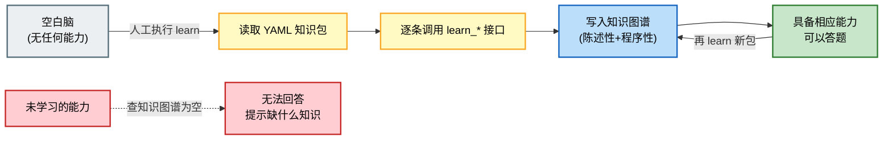

### 1.3 与架构总原则的对应

| 架构总原则 | 教学框架的体现 |
|-----------|---------------|
| 知识图谱是唯一知识来源 | `learn_*` 接口只往知识图谱写，不维护第二份知识 |
| 所有能力都是学习的结果 | 分词、模式、算法步骤全部来自知识包 |
| 执行引擎通用化 | `learn_*` 不绑定具体问题，只写"词/数/符/程序/模式"五类知识 |
| 能力可叠加 | 多个知识包可依次学习，知识累积，不覆盖 |

---

## 2. 知识包格式

### 2.1 文件结构

知识包以**目录**为单位，每个目录下一个 `package.yaml`：

```
digital_brain/data/knowledge_packages/
├── 1plus1/                  # 最小知识包：只教 1+1=?
│   └── package.yaml
├── grade1_math/             # 学科知识包：一年级数学
│   └── package.yaml
├── grade1_chinese/          # 学科知识包：一年级语文
│   └── package.yaml
├── tokenizer_skill/         # 技能知识包：分词技能
│   └── package.yaml
└── coreference_skill/       # 技能知识包：指代消解
    └── package.yaml
```

**约定**：

- 包名 = 目录名（`list_packages` 扫描所有含 `package.yaml` 的子目录）
- 一个包 = 一堂/一类课，内容自洽可独立学习
- 资源文件（如图、音频）如有，放在同目录下，YAML 中以相对路径引用

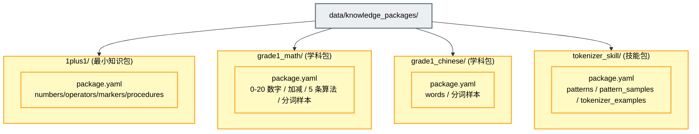

### 2.2 YAML 段落说明

一个 `package.yaml` 由元信息 + 八个知识段落组成：

| 段落 | 写入记忆类型 | 含义 | 学习接口 | 是否必填 |
|------|-------------|------|---------|---------|
| `words` | 陈述性 | 普通字词：含拼音、释义、词性 | `learn_word` | 否 |
| `numbers` | 陈述性 | 数字单词：含数值、别名 | `learn_number_word` | 否 |
| `operators` | 陈述性 | 操作符：含 op_type（add/sub/...） | `learn_operator_word` | 否 |
| `markers` | 陈述性 | 标记符号：等号、问号、比较号 | `learn_marker_word` | 否 |
| `procedures` | 程序性 | 程序性记忆：算法步骤、DAG 模板 | `learn_procedure` | 否 |
| `patterns` | 陈述性 | 模式定义：token 类型模板、槽位、意图（**新增**） | `learn_pattern` | 否 |
| `pattern_samples` | 陈述性 | 模式样本：输入→匹配的模式→捕获的槽位（**新增**） | `learn_pattern_sample` | 否 |
| `tokenizer_examples` | — | 分词样本：输入→期望词素序列 | `learn_tokenizer_example` | 否 |

> 元信息段：`name`（包名）、`description`（一句话描述），仅用于展示，不写入知识图谱。

#### 2.2.1 段落间的依赖与协作

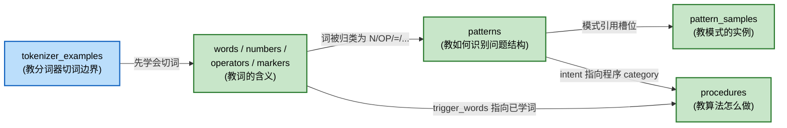

#### 2.2.2 各段落字段定义

**words**（普通字词）

| 字段 | 类型 | 必填 | 说明 |
|------|------|------|------|
| `symbol` | str | 是 | 字词本体，如 `"天"`、`"学校"` |
| `meaning` | str | 否 | 释义，如 `"天空"` |
| `pinyin` | str | 否 | 拼音，如 `"tiān"` |
| `word_type` | str | 否 | 词性：名词/动词/形容词/代词/方位词/量词/称谓/时间词 |
| `aliases` | list[str] | 否 | 别名，如 `["爸爸"]` |

**numbers**（数字单词）

| 字段 | 类型 | 必填 | 说明 |
|------|------|------|------|
| `symbol` | str | 是 | 数字符号，如 `"1"`、`"10"` |
| `value` | int | 是 | 数值，如 `1` |
| `aliases` | list[str] | 否 | 别名，如 `["一", "壹"]`；`"两"` 是 `2` 的别名 |
| `embodied_tag` | str | 否 | 具身映射标签，如 `"finger_5"` |

**operators**（操作符）

| 字段 | 类型 | 必填 | 说明 |
|------|------|------|------|
| `symbol` | str | 是 | 操作符，如 `"+"` |
| `op_type` | str | 是 | 运算类型：`add`/`sub`/`mul`/`div` |
| `aliases` | list[str] | 否 | 别名，如 `["加", "加上", "＋"]` |

**markers**（标记符号）

| 字段 | 类型 | 必填 | 说明 |
|------|------|------|------|
| `symbol` | str | 是 | 标记，如 `"="`、`"?"` |
| `marker_kind` | str | 是 | 种类：`equality`(等号)/`question`(问号)/`compare_gt`/`compare_lt` |
| `aliases` | list[str] | 否 | 别名，如 `["等于", "＝", "是"]` |

**procedures**（程序性记忆）

| 字段 | 类型 | 必填 | 说明 |
|------|------|------|------|
| `name` | str | 是 | 程序名，如 `"adding"` |
| `algorithm_key` | str | 是 | 对应原子算法注册表键：`counting`/`mapping`/`merging`/`adding`/`subtracting` |
| `trigger_words` | list[str] | 是 | 触发词，看到这些词激活该程序 |
| `description` | str | 否 | 描述 |
| `steps` | list[step] | 否 | 算法步骤（DAG 节点），不填则用 algorithm_key 默认步骤 |
| `dependencies` | list[str] | 否 | 依赖的其他程序名 |

`step` 结构：

| 字段 | 类型 | 说明 |
|------|------|------|
| `action` | str | 动作名，如 `mapping`/`merging`/`counting` |
| `parameters` | dict | 参数，如 `{operand: "a"}` |
| `description` | str | 该步说明 |

**patterns**（模式定义，新增）

| 字段 | 类型 | 必填 | 说明 |
|------|------|------|------|
| `name` | str | 是 | 模式名，如 `"binary_op_question"` |
| `template` | list[str] | 是 | token 类型序列，如 `["N", "OP", "N", "=", "?"]` |
| `slots` | dict | 否 | 槽位名 → 类型位置，如 `{left: "N#0", op: "OP", right: "N#1"}` |
| `intent` | str | 否 | 匹配后产生的意图，如 `"compute_binary"` |
| `description` | str | 否 | 描述 |

> `template` 中的占位符：`N`=数字、`OP`=操作符、`=`=等号、`?`=问号、`CMP`=比较号、`W`=已学字词、`X`=未知。占位符含义由 `numbers/operators/markers` 段落学习后产生。

**pattern_samples**（模式样本，新增）

| 字段 | 类型 | 必填 | 说明 |
|------|------|------|------|
| `input` | str | 是 | 原始输入，如 `"1+1=?"` |
| `tokens` | list[str] | 是 | 分词后的词素序列 |
| `pattern` | str | 是 | 匹配上的模式名 |
| `captured` | dict | 否 | 捕获的槽位值，如 `{left: "1", op: "+", right: "1"}` |

**tokenizer_examples**（分词样本）

| 字段 | 类型 | 必填 | 说明 |
|------|------|------|------|
| `input` | str | 是 | 原始输入 |
| `expected_tokens` | list[str] | 是 | 期望的分词结果 |

### 2.3 完整 YAML 示例

下面给出一个**包含全部八段**的完整知识包示例（`1plus1_full`），展示新增的 `patterns` 与 `pattern_samples` 段：

```yaml
# ============================================================
# 知识包：1+1=? 基础加法（完整示例，含模式）
# ============================================================
name: "1plus1基础加法(完整)"
description: "解决 1+1=? 所需的最小知识集合：数字 0-2、加号、等号、问号、加法算法、二元运算模式"

# ---- 普通字词（本包无，语文包才有）----
# words: []

# ---- 数字单词 ----
numbers:
  - {symbol: "0", value: 0, aliases: ["零"]}
  - {symbol: "1", value: 1, aliases: ["一"]}
  - {symbol: "2", value: 2, aliases: ["二", "两"]}

# ---- 操作符单词 ----
operators:
  - {symbol: "+", op_type: "add", aliases: ["加", "加上", "＋"]}

# ---- 标记符号 ----
markers:
  - {symbol: "=", marker_kind: "equality", aliases: ["等于", "＝", "是"]}
  - {symbol: "?", marker_kind: "question", aliases: ["？", "多少", "几"]}

# ---- 程序性记忆 ----
procedures:
  - name: "counting"
    algorithm_key: "counting"
    trigger_words: ["多少", "几", "数"]
    description: "计数：对集合逐个数出总数"

  - name: "mapping"
    algorithm_key: "mapping"
    trigger_words: ["映射", "map"]
    description: "把数字映射为对应数量的元素集合"

  - name: "merging"
    algorithm_key: "merging"
    trigger_words: ["合并", "merge"]
    description: "把两个集合合并成一个集合"

  - name: "adding"
    algorithm_key: "adding"
    trigger_words: ["+", "加", "加上"]
    description: "加法：映射两个数→合并集合→计数"
    steps:
      - {action: "mapping", parameters: {operand: "a"}, description: "把 a 映射为集合 A"}
      - {action: "mapping", parameters: {operand: "b"}, description: "把 b 映射为集合 B"}
      - {action: "merging", parameters: {sets: ["A", "B"]}, description: "把 A、B 合并成一个集合"}
      - {action: "counting", parameters: {set: "merged"}, description: "数合并后集合的个数 = a+b"}
    dependencies: ["mapping", "merging", "counting"]

# ---- 模式定义（新增：教大脑识别"二元运算提问"这种问题结构）----
patterns:
  - name: "binary_op_question"
    template: ["N", "OP", "N", "=", "?"]
    slots: {left: "N#0", op: "OP", right: "N#1"}
    intent: "compute_binary"
    description: "二元运算提问式：A + B = ?"

  - name: "binary_op_question_cn"
    template: ["N", "OP", "N", "=", "?"]
    slots: {left: "N#0", op: "OP", right: "N#1"}
    intent: "compute_binary"
    description: "中文二元运算提问：一 加 一 等于 多少"

# ---- 模式样本（新增：用实例教模式如何匹配具体输入）----
pattern_samples:
  - input: "1+1=?"
    tokens: ["1", "+", "1", "=", "?"]
    pattern: "binary_op_question"
    captured: {left: "1", op: "+", right: "1"}

  - input: "一加一等于多少"
    tokens: ["一", "加", "一", "等于", "多少"]
    pattern: "binary_op_question_cn"
    captured: {left: "一", op: "加", right: "一"}

# ---- 分词样本 ----
tokenizer_examples:
  - {input: "1+1=?",         expected_tokens: ["1", "+", "1", "=", "?"]}
  - {input: "一加一等于多少", expected_tokens: ["一", "加", "一", "等于", "多少"]}
```

**最小知识包**示例（仅含解题必需段落，无 patterns）见仓库 `data/knowledge_packages/1plus1/package.yaml`。

---

## 3. 学习接口

学习接口是教学框架的核心 API，所有 `learn_*` 接口只往知识图谱写，不维护第二份知识。接口按"教什么"分五类。

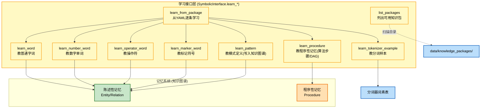

### 3.1 learn_word / learn_number_word / learn_operator_word / learn_marker_word

四个陈述性记忆学习接口，分别教四类"词及其含义"。它们共同的行为：先把 symbol + aliases 教给分词器（加入已知词素表），再在知识图谱创建/更新 Entity。

| 接口 | 教的内容 | 关键属性 | 写入实体 attributes.kind |
|------|---------|---------|------------------------|
| `learn_word(symbol, meaning, pinyin, word_type, aliases)` | 普通字词 | meaning / pinyin / word_type | `word` |
| `learn_number_word(symbol, value, aliases, embodied_tag)` | 数字单词 | value / numeric_value / embodied_mapping | `number` |
| `learn_operator_word(symbol, op_type, aliases)` | 操作符 | op_type | `operator` |
| `learn_marker_word(symbol, marker_kind, aliases)` | 标记符号 | marker_kind | `marker` |

**统一行为流程**：

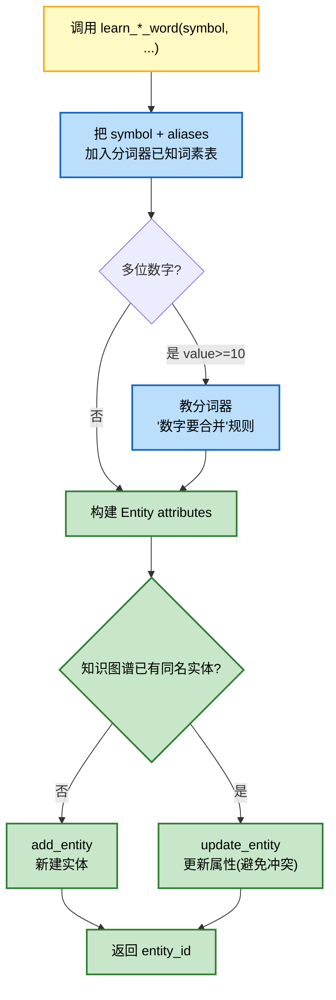

**接口契约示例**（业务语义，非代码）：

```
learn_number_word(symbol="1", value=1, aliases=["一"])
  → 教会："1" 和 "一" 都是数字 1
  → 分词器：known_morphemes += {"1", "一"}
  → 知识图谱：Entity(name="1", kind=number, value=1, numeric_value=1, aliases=["一"])

learn_operator_word(symbol="+", op_type="add", aliases=["加","加上","＋"])
  → 教会："+" 是加法运算
  → 知识图谱：Entity(name="+", kind=operator, op_type="add")

learn_marker_word(symbol="=", marker_kind="equality", aliases=["等于","＝","是"])
  → 教会："=" 是等号
  → 知识图谱：Entity(name="=", kind=marker, marker_kind="equality")

learn_word(symbol="天", meaning="天空", pinyin="tiān", word_type="名词")
  → 教会："天" 是名词，意思是天空，读 tiān
  → 知识图谱：Entity(name="天", kind=word, meaning=..., pinyin=..., word_type=...)
```

### 3.2 learn_procedure（算法步骤写入程序性记忆）

教"怎么做"——把算法步骤组合（DAG 模板）写入程序性记忆。

**接口契约**：

| 参数 | 类型 | 说明 |
|------|------|------|
| `name` | str | 程序名，如 `"adding"` |
| `algorithm_key` | str | 原子算法注册表键（必须是注册表中已有的算法） |
| `trigger_words` | list[str] | 触发词，看到这些词激活该程序 |
| `steps` | list[step] | 算法步骤（DAG 节点序列），可选 |
| `dependencies` | list[str] | 依赖的其他程序名 |
| `description` | str | 描述 |
| `category` | str | 类别：`algorithm`/`skill`/`strategy` |

**写入流程**：

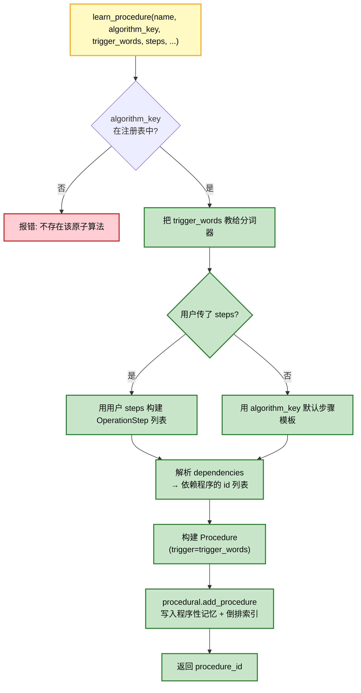

**步骤组合示例（加法 = 映射→合并→计数）**：

```
learn_procedure(
  name="adding",
  algorithm_key="adding",
  trigger_words=["+", "加", "加上"],
  steps=[
    {action: "mapping", parameters: {operand: "a"}, description: "把 a 映射为集合 A"},
    {action: "mapping", parameters: {operand: "b"}, description: "把 b 映射为集合 B"},
    {action: "merging", parameters: {sets: ["A","B"]}, description: "合并 A、B"},
    {action: "counting", parameters: {set: "merged"}, description: "数合并后集合 = a+b"},
  ],
  dependencies=["mapping", "merging", "counting"],
)
```

其步骤 DAG：

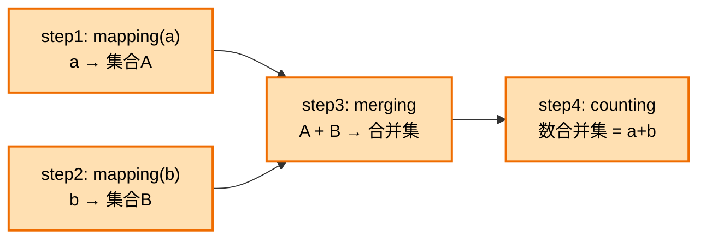

### 3.3 learn_pattern（模式写入知识图谱）

**新增接口**。教"如何识别问题结构"——把模式定义作为陈述性记忆写入知识图谱，使 PatternMatcher 从知识图谱加载模式（替代硬编码）。

**接口契约**：

| 参数 | 类型 | 说明 |
|------|------|------|
| `name` | str | 模式名，如 `"binary_op_question"` |
| `template` | list[str] | token 类型序列，如 `["N","OP","N","=","?"]` |
| `slots` | dict | 槽位定义：槽名 → 类型占位（带序号区分同类型），如 `{left:"N#0", op:"OP", right:"N#1"}` |
| `intent` | str | 匹配后产生的意图，如 `"compute_binary"` |
| `description` | str | 描述 |

**写入与使用流程**：

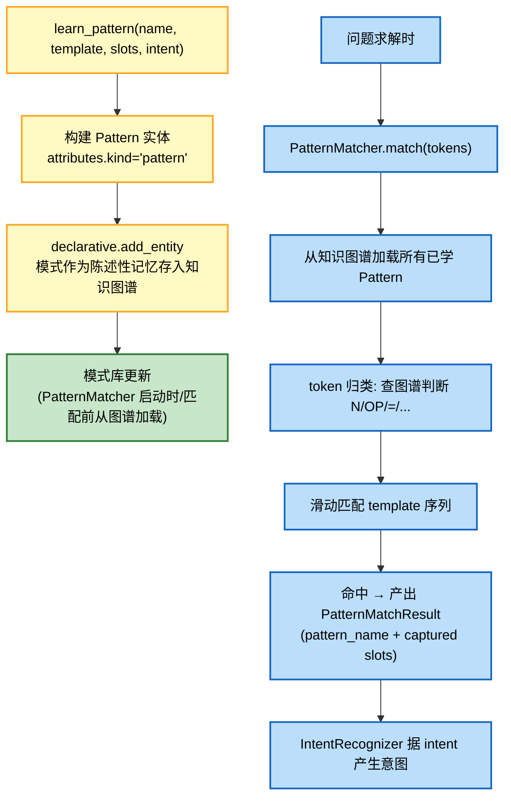

**模式样本（learn_pattern_sample）**：模式定义之外，可用 `pattern_samples` 段提供实例，帮助验证/归纳模式。每个样本是一组 `(input, tokens, pattern, captured)`，学习时写入知识图谱作为"模式-实例"关系，用于后续模式校验与归纳。

**模式与 token 归类的协作**：

| template 占位符 | 归类依据（查知识图谱） | 说明 |
|----------------|---------------------|------|
| `N` | Entity.attributes.kind == `"number"` | 数字 |
| `OP` | Entity.attributes.kind == `"operator"` | 操作符 |
| `=` | marker_kind == `"equality"` | 等号 |
| `?` | marker_kind == `"question"` | 问号 |
| `CMP` | marker_kind 以 `"compare"` 开头 | 比较号 |
| `W` | Entity.attributes.kind == `"word"` | 已学字词 |
| `X` | 知识图谱查不到 | 未知（不学就不认） |

### 3.4 learn_from_package（从 YAML 文件逐条学习）

从知识包 YAML 文件逐条读取并调用上述 `learn_*` 接口，是 `learn <包名>` 命令的底层实现。

**接口契约**：

| 参数 | 类型 | 说明 |
|------|------|------|
| `package_name_or_path` | str | 包名（如 `"1plus1"`）或 package.yaml 完整路径 |
| 返回 | dict | 学习统计：`{package, numbers, operators, markers, words, procedures, patterns, pattern_samples, tokenizer_samples}` |

**段落→接口映射**：

| YAML 段落 | 调用接口 | 统计键 |
|-----------|---------|--------|
| `numbers` | `learn_number_word` | `numbers` |
| `operators` | `learn_operator_word` | `operators` |
| `markers` | `learn_marker_word` | `markers` |
| `words` | `learn_word` | `words` |
| `procedures` | `learn_procedure` | `procedures` |
| `patterns` | `learn_pattern` | `patterns` |
| `pattern_samples` | `learn_pattern_sample` | `pattern_samples` |
| `tokenizer_examples` | `learn_tokenizer_dataset` | `tokenizer_samples` |

**学习顺序**（保证依赖正确）：

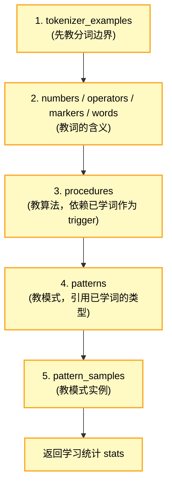

> 顺序理由：分词样本先学，后续词才能正确切分；词先于程序（程序 trigger_words 指向已学词）；词先于模式（模式 template 占位符依赖词的归类）；模式先于模式样本（样本引用已定义模式）。

### 3.5 list_packages（列出可用知识包）

扫描 `data/knowledge_packages/` 目录，返回所有含 `package.yaml` 的子目录名。

**接口契约**：

| 参数 | 类型 | 说明 |
|------|------|------|
| `packages_dir` | str (可选) | 自定义目录，默认 `data/knowledge_packages/` |
| 返回 | list[str] | 排序后的包名列表，如 `["1plus1", "grade1_chinese", "grade1_math"]` |

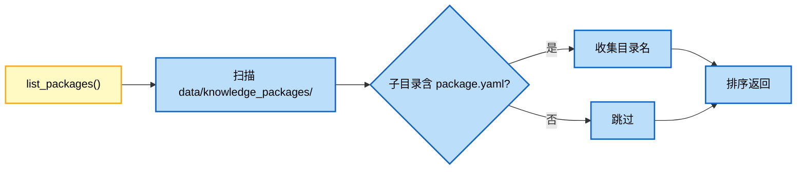

---

## 4. 学习流程

### 4.1 启动：空白脑

系统启动时构建一个**真正空白**的大脑：不自动构建任何知识、不自动加载分词样本。

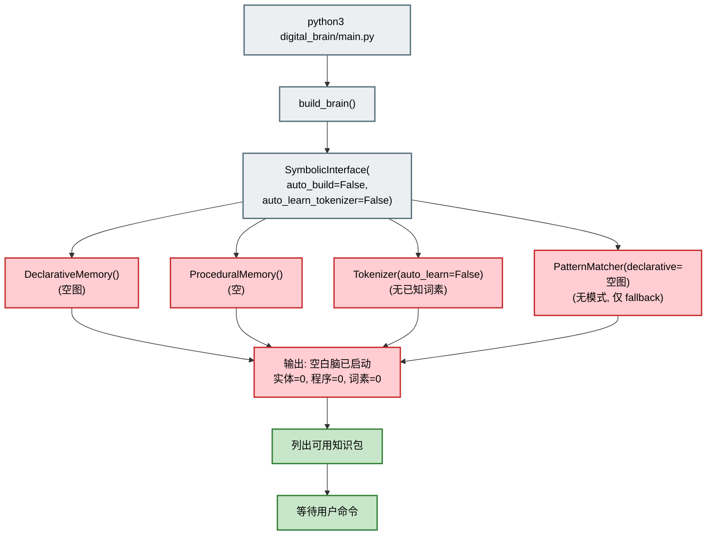

**空白脑状态表**：

| 组件 | 初始状态 | 后果 |
|------|---------|------|
| 陈述性记忆 | 0 实体, 0 关系 | 任何词都查不到含义 |
| 程序性记忆 | 0 程序 | 任何算法都不会 |
| 分词器 | 0 已知词素 | 任何输入都按单字切分 |
| 模式匹配器 | 仅 fallback 内置模式 | 严格模式下任何输入都"未知" |

### 4.2 人工执行 learn <包名>

用户在交互界面输入 `learn <包名>`，触发知识包学习。

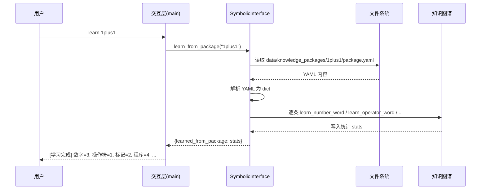

### 4.3 逐条读取 YAML → 调用 learn_* 接口

`learn_from_package` 内部按固定顺序遍历 YAML 各段，逐条调用对应 `learn_*` 接口。

**逐条学习示例**（以 `1plus1` 包为例）：

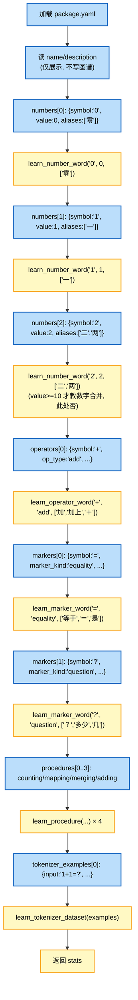

### 4.4 知识写入知识图谱

每条 `learn_*` 调用都把知识写入知识图谱（陈述性或程序性记忆），不产生第二份拷贝。

**写入映射表**：

| YAML 条目 | 写入位置 | 存储形式 |
|-----------|---------|---------|
| `numbers[i]` | 陈述性记忆 | Entity(name=symbol, kind=number, value, aliases) |
| `operators[i]` | 陈述性记忆 | Entity(name=symbol, kind=operator, op_type, aliases) |
| `markers[i]` | 陈述性记忆 | Entity(name=symbol, kind=marker, marker_kind, aliases) |
| `words[i]` | 陈述性记忆 | Entity(name=symbol, kind=word, meaning, pinyin, word_type, aliases) |
| `procedures[i]` | 程序性记忆 | Procedure(name, algorithm_key, trigger, steps, dependencies) |
| `patterns[i]` | 陈述性记忆 | Entity(name, kind=pattern, template, slots, intent) |
| `pattern_samples[i]` | 陈述性记忆 | Relation(模式实体 → 样本实体, relation_type=sample_of) |
| `tokenizer_examples[i]` | 分词器 | known_morphemes + 结构规则(数字合并等) |

**知识图谱写入示意**（学习 `1plus1` 后）：

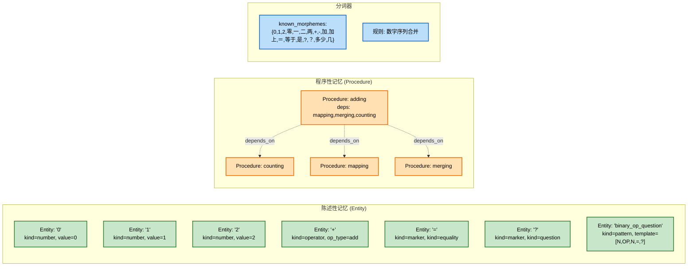

### 4.5 学习完成，可以答题

学习完成后，大脑具备该包覆盖的能力，可回答相关问题。未学的方面仍无法回答。

**答题流程**（学习 `1plus1` 后输入 `1+1=?`）：

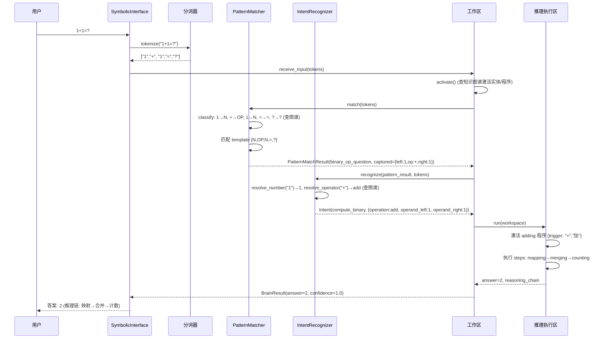

**未学知识的失败路径**：

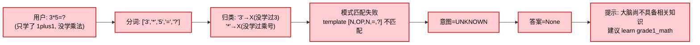

### 4.6 流程图

完整的"启动→学习→答题"全流程：

```mermaid
flowchart TD
    START([程序启动]) --> BLANK[构建空白脑<br/>auto_build=False]
    BLANK --> LIST[list_packages<br/>列出可用知识包]
    LIST --> WAIT{等待用户输入}

    WAIT -->|learn 包名| LOAD[读取 package.yaml]
    LOAD --> PARSE[解析 YAML]
    PARSE --> LOOP{逐条遍历各段}
    LOOP -->|numbers/operators/markers/words| LEARN_WORD[learn_*_word<br/>写入陈述性记忆]
    LOOP -->|procedures| LEARN_PROC[learn_procedure<br/>写入程序性记忆]
    LOOP -->|patterns| LEARN_PAT[learn_pattern<br/>写入陈述性记忆]
    LOOP -->|pattern_samples| LEARN_PS[learn_pattern_sample<br/>写入陈述性记忆]
    LOOP -->|tokenizer_examples| LEARN_TOK[learn_tokenizer_dataset<br/>更新分词器]
    LEARN_WORD & LEARN_PROC & LEARN_PAT & LEARN_PS & LEARN_TOK --> LOOP
    LOOP -->|遍历完| STATS[汇总 stats]
    STATS --> WAIT

    WAIT -->|packages| LIST
    WAIT -->|status| SHOW[显示实体/关系/程序/词素计数]
    SHOW --> WAIT

    WAIT -->|问题| SOLVE[solve(text)]
    SOLVE --> TOK[tokenize]
    TOK --> ACT[激活记忆]
    ACT --> MATCH[模式匹配<br/>从图谱加载模式]
    MATCH --> MATCH_OK{匹配成功?}
    MATCH_OK -->|否| CANT[无法回答<br/>提示缺知识]
    CANT --> WAIT
    MATCH_OK -->|是| INTENT[意图识别<br/>从图谱解析数值/运算]
    INTENT --> INTENT_OK{解析完整?}
    INTENT_OK -->|否| CANT
    INTENT_OK -->|是| EXEC[执行程序步骤 DAG]
    EXEC --> OUT[输出答案+推理链]
    OUT --> WAIT

    WAIT -->|q| EXIT([退出])

    classDef start fill:#eceff1,stroke:#546e7a,stroke-width:2px,color:#000
    classDef learn fill:#fff9c4,stroke:#f9a825,stroke-width:2px,color:#000
    classDef mem fill:#bbdefb,stroke:#1565c0,stroke-width:2px,color:#000
    classDef ok fill:#c8e6c9,stroke:#2e7d32,stroke-width:2px,color:#000
    classDef fail fill:#ffcdd2,stroke:#c62828,stroke-width:2px,color:#000
    class START,EXIT start
    class BLANK,LIST,LOAD,PARSE,LOOP,LEARN_WORD,LEARN_PROC,LEARN_PAT,LEARN_PS,LEARN_TOK,STATS learn
    class TOK,ACT,MATCH,INTENT,EXEC mem
    class OUT,SHOW ok
    class CANT fail
    class WAIT,MATCH_OK,INTENT_OK start
```

---

## 5. 知识包设计原则

### 5.1 最小知识包

只教**解一个具体问题所需的最小知识集合**。优点：学习快、易调试、能精确验证"学了这个就能解这类题"。

**示例：`1plus1` 包**——只为解 `1+1=?`：

| 段落 | 内容 | 条数 |
|------|------|------|
| numbers | 0, 1, 2 | 3 |
| operators | + | 1 |
| markers | =, ? | 2 |
| procedures | counting, mapping, merging, adding | 4 |
| tokenizer_examples | `1+1=?` | 1 |

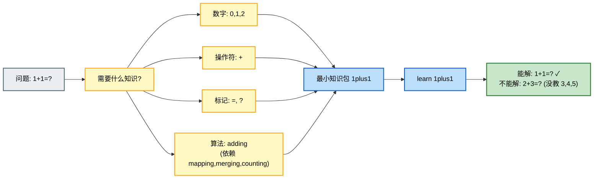

### 5.2 学科知识包

按学科/教材编排，覆盖一类问题的完整知识。适合"系统学完一学期"场景。

**示例**：

| 包名 | 内容 | 依据 |
|------|------|------|
| `grade1_math` | 0-20 数字、加减运算、等号问号、5 条算法 | 部编版一年级数学 |
| `grade1_chinese` | 天地人、自然、方位、人称、动作、形容词、常用词 | 部编版一年级语文 |

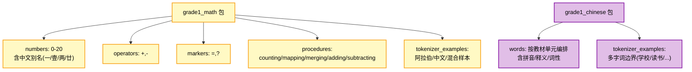

### 5.3 技能知识包

教"通用技能"而非学科知识，可被多个学科包复用。技能包侧重 `patterns`、`pattern_samples`、`procedures`（DAG 模板）段。

| 包名 | 教的技能 | 主要段落 |
|------|---------|---------|
| `tokenizer_skill` | 多字词切分、数字合并规则 | `tokenizer_examples` |
| `coreference_skill` | 指代消解（"他们"→上文实体） | `patterns` + `procedures`(DAG 模板) |
| `attr_value_skill` | "爸爸的年龄31"→属性绑定 | `patterns` + `pattern_samples` |

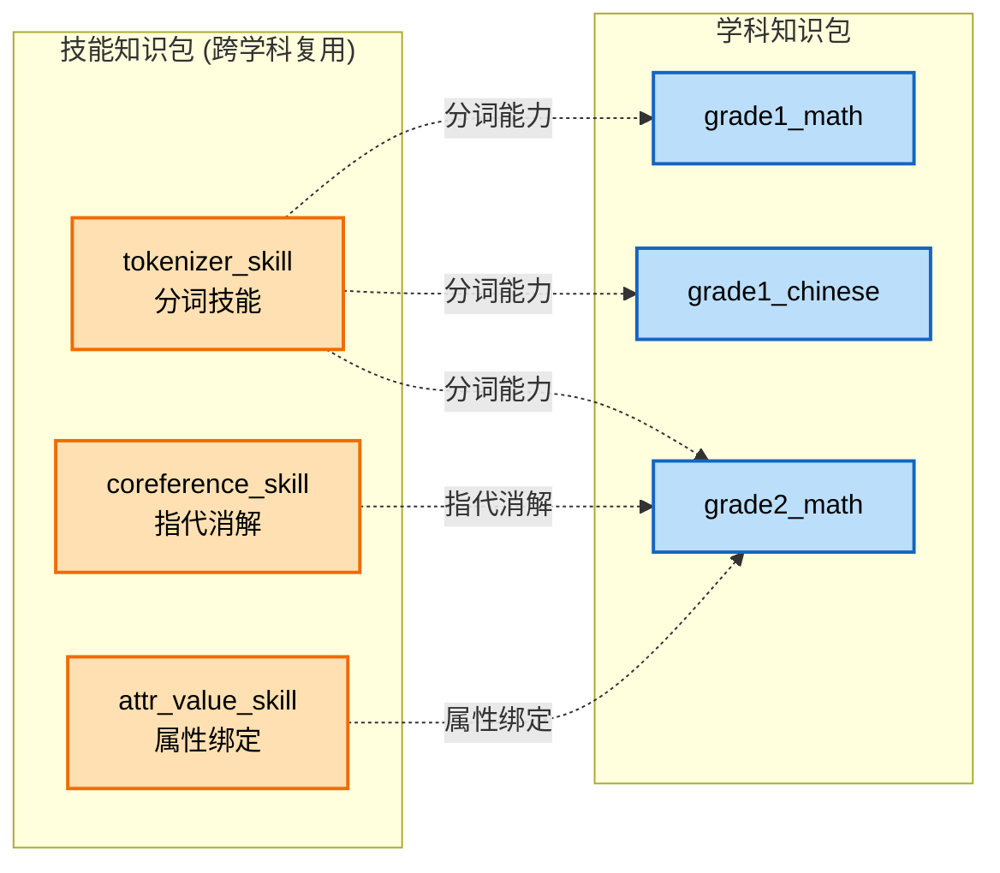

### 5.4 知识包可叠加

多个知识包可依次学习，知识**累积**而不覆盖（同名实体走 update 合并属性，同名程序保留）。这是"渐进式学习"的基础。

```mermaid
sequenceDiagram
    participant U as 用户
    participant B as 大脑(知识图谱)
    participant FS as 文件系统

    Note over B: 状态: 空白 (实体=0, 程序=0)
    U->>B: learn 1plus1
    B->>FS: 读 1plus1/package.yaml
    FS-->>B: YAML
    B->>B: 学入: 数字0-2, +, =, ?, adding...
    Note over B: 状态: 实体=7, 程序=4 (能解 1+1=?)

    U->>B: learn grade1_math
    B->>FS: 读 grade1_math/package.yaml
    FS-->>B: YAML
    B->>B: 增量学入: 数字3-20, -, subtracting...
    Note over B: 状态: 实体=25, 程序=5 (能解 0-20 加减)

    U->>B: learn grade1_chinese
    B->>FS: 读 grade1_chinese/package.yaml
    FS-->>B: YAML
    B->>B: 增量学入: 字词(天/地/人/...)
    Note over B: 状态: 实体=80+, 程序=5 (能识字+算术)

    U->>B: learn tokenizer_skill
    B->>FS: 读 tokenizer_skill/package.yaml
    FS-->>B: YAML
    B->>B: 增量学入: 更多分词样本
    Note over B: 分词能力增强
```

**叠加规则表**：

| 场景 | 行为 |
|------|------|
| 新包教已存在的同名数字 | update_entity：合并 aliases，保留 value |
| 新包教已存在的同名操作符 | update_entity：合并 aliases，保留 op_type |
| 新包教已存在的同名程序 | 跳过（已学过）或按策略更新 |
| 新包教新模式 | 新增 Pattern 实体 |
| 新包教新分词样本 | 追加到分词器已知词素/规则 |

---

## 6. 交互模式

交互层提供以下命令，对应 `main.py` 的 REPL 循环。

### 6.1 命令一览

| 命令 | 功能 | 示例 | 底层接口 |
|------|------|------|---------|
| `learn <包名>` | 学习一个知识包 | `learn 1plus1` | `learn_from_package` |
| `packages` | 列出可用知识包 | `packages` | `list_packages` |
| `status` | 查看大脑当前知识状态 | `status` | 读取记忆计数 |
| `<问题>` | 直接输入问题求解 | `1+1=?` | `solve` |
| `q` / `quit` / `exit` | 退出 | `q` | — |

### 6.2 交互流程

```mermaid
sequenceDiagram
    participant U as 用户
    participant CLI as 交互层

    CLI->>U: 显示 banner + 可用知识包 + 命令帮助
    loop REPL 循环
        U->>CLI: 输入命令
        alt learn <包名>
            CLI->>CLI: brain.learn_from_package(包名)
            CLI->>U: [学习完成] 数字=N, 操作符=N, ...
        else packages
            CLI->>CLI: SymbolicInterface.list_packages()
            CLI->>U: 可用知识包: 1plus1, grade1_math, ...
        else status
            CLI->>CLI: 读取 declarative/procedural/tokenizer 计数
            CLI->>U: 实体=N, 关系=N, 程序=N, 词素=N
        else <问题>
            CLI->>CLI: brain.solve(问题)
            alt 有答案
                CLI->>U: 输入/词素/推理链/答案/置信度
            else 无知识
                CLI->>U: [无法回答] 建议 learn <包名>
            end
        else q/quit/exit
            CLI->>U: 再见
            Note over CLI: 退出循环
        end
    end
```

### 6.3 典型会话示例

```
============================================================
     数字大脑 MVP
     初始空白，通过学习知识包获得能力
============================================================

[空白脑已启动] 实体=0, 程序=0, 词素=0

可用知识包:
  - 1plus1
  - grade1_chinese
  - grade1_math

命令:
  learn <包名>     学习知识包
  packages         列出可用知识包
  status           查看大脑当前知识状态
  <问题>           直接输入问题求解
  q                退出

> 1+1=?
[无法回答] 大脑尚不具备相关知识。
  当前: 实体=0, 程序=0
  提示: 使用 'learn <知识包名>' 学习后再试

> learn 1plus1
[学习完成] 知识包 '1plus1基础加法' 已加载
  数字=3, 操作符=1, 标记=2, 程序=4, 分词样本=1
  当前: 实体=7, 程序=4, 词素=12

> status
实体=7, 关系=0, 程序=4, 词素=12

> 1+1=?
输入: 1+1=?
词素: ['1', '+', '1', '=', '?']
激活知识数: 6
--- 推理链 ---
  1. [mapping] 把 a 映射为集合 A
  2. [mapping] 把 b 映射为集合 B
  3. [merging] 把 A、B 合并成一个集合
  4. [counting] 数合并后集合的个数 = a+b => 2
--- 最终答案: 2 (置信度 1.00) ---

> 3+5=?
[无法回答] 大脑尚不具备相关知识。
  当前: 实体=7, 程序=4
  提示: 使用 'learn <知识包名>' 学习后再试

> learn grade1_math
[学习完成] 知识包 '小学一年级数学' 已加载
  数字=21, 操作符=2, 标记=2, 程序=5, 分词样本=10
  当前: 实体=28, 程序=5, 词素=60

> 3+5=?
输入: 3+5=?
词素: ['3', '+', '5', '=', '?']
...
--- 最终答案: 8 (置信度 1.00) ---

> q
再见。
```

### 6.4 交互层与学习接口的关系

```mermaid
flowchart TD
    subgraph CLI["交互层 (main.py REPL)"]
        CMD1["learn <包名>"]
        CMD2["packages"]
        CMD3["status"]
        CMD4["<问题>"]
        CMD5["q"]
    end

    subgraph IF["SymbolicInterface"]
        F1["learn_from_package"]
        F2["list_packages"]
        F3["declarative/procedural 计数"]
        F4["solve"]
    end

    CMD1 --> F1
    CMD2 --> F2
    CMD3 --> F3
    CMD4 --> F4
    CMD5 --> EXIT["退出循环"]

    F1 --> LEARN["learn_word / learn_number_word /<br/>learn_operator_word / learn_marker_word /<br/>learn_procedure / learn_pattern /<br/>learn_tokenizer_dataset"]
    LEARN --> KG["知识图谱<br/>(陈述性+程序性记忆)"]
    F4 --> PIPE["分词→激活→模式匹配→意图→执行DAG→输出"]

    classDef cli fill:#eceff1,stroke:#546e7a,stroke-width:2px,color:#000
    classDef iface fill:#fff9c4,stroke:#f9a825,stroke-width:2px,color:#000
    classDef mem fill:#c8e6c9,stroke:#2e7d32,stroke-width:2px,color:#000
    class CMD1,CMD2,CMD3,CMD4,CMD5,EXIT cli
    class F1,F2,F3,F4,LEARN,PIPE iface
    class KG mem
```

---

## 附录：与架构其他模块的关系

| 关联模块 | 关系 | 说明 |
|---------|------|------|
| [记忆系统设计](记忆系统设计.md) | 写入目标 | `learn_*` 把知识写入陈述性/程序性记忆 |
| [分词引擎设计](分词引擎设计.md) | 协作 | `learn_*_word` 同时教分词器词素；`tokenizer_examples` 段教分词边界 |
| [模式匹配设计](模式匹配设计.md) | 协作 | `patterns`/`pattern_samples` 段教模式，PatternMatcher 从图谱加载 |
| [推理执行设计](推理执行设计.md) | 协作 | `procedures` 段教算法步骤/DAG 模板，推理区执行 |
| [工作区设计](工作区设计.md) | 消费 | 工作区从知识图谱激活已学知识用于当前问题 |
