# 模式匹配详细设计

> 数字大脑详细设计文档 · 模式匹配模块
> 上游文档：[架构设计.md](../架构设计.md) §4 设计变更 v2
> 关联模块：[记忆系统设计.md](记忆系统设计.md)、[分词引擎设计.md](分词引擎设计.md)、[推理执行设计.md](推理执行设计.md)

---

## 1. 设计目标

模式匹配是数字大脑"理解问题"的入口环节：将分词后的 token 序列映射为结构化的模式匹配结果，供推理执行层构建问题 DAG。

本模块在 v2 架构变更中由"硬编码模式"重构为"通用匹配引擎"，达成以下三大目标：

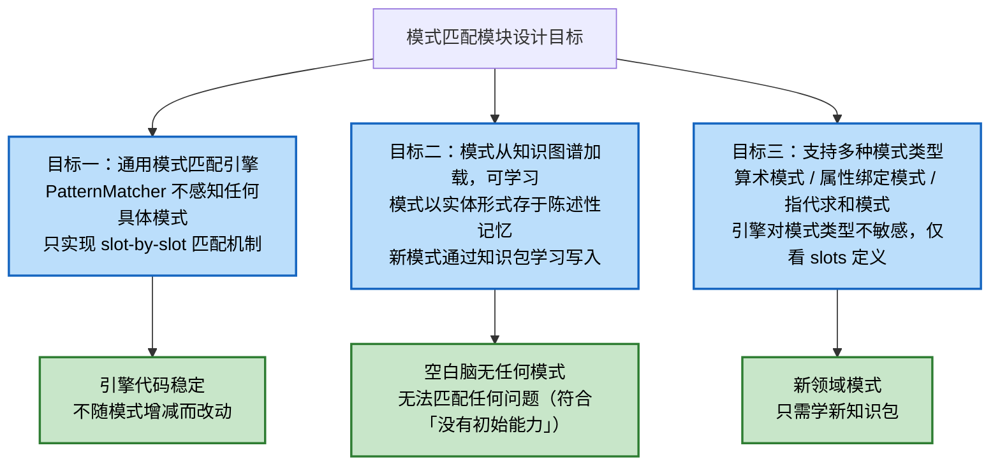

### 设计约束

| 约束 | 说明 |
|------|------|
| 唯一知识来源 | 模式只从陈述性记忆（知识图谱）读取，不存在第二份模式拷贝 |
| 不学则无 | 空白知识图谱中不存在任何模式实体，PatternMatcher 加载结果为空，匹配任何输入都返回空结果 |
| 通用引擎 | 引擎只实现"加载模式 → 词性标注 → slot 匹配 → 输出结果"四步通用流程，不针对特定模式名硬编码 |
| 可学习扩展 | 新模式通过知识包中的 `pattern_samples` 或人工定义的模式实体写入知识图谱，无需改代码 |

---

## 2. 模式在知识图谱中的表示

模式在知识图谱中以**实体节点**形式存储，属于陈述性记忆。一个模式 = 一个 `kind=pattern` 的实体，其 `attributes` 携带 slots、action、priority 等元数据。

### 2.1 模式实体结构

模式实体复用通用 `Entity` 数据模型，通过 `attributes.kind="pattern"` 标识为模式实体，并在 `attributes` 内嵌套模式专属字段。

| 字段 | 类型 | 说明 | 示例 |
|------|------|------|------|
| `id` | string | 实体唯一 ID（由记忆系统分配） | `pat_0001` |
| `name` | string | 模式名（匹配结果的 `pattern_name`） | `binary_op` |
| `entity_type` | EntityType | 实体类型，固定 `ABSTRACT` | `abstract` |
| `attributes.kind` | string | 实体种类标识，固定 `"pattern"` | `"pattern"` |
| `attributes.slots` | array | slot 定义列表（顺序敏感） | 见 2.2 |
| `attributes.action` | string | 匹配成功后触发的动作（DAG 构建器路由键） | `"build_dag:binary_op"` |
| `attributes.priority` | float | 优先级，多个模式同时命中时排序用，数值越大越优先 | `1.0` |
| `attributes.description` | string | 模式的人类可读说明 | `"二元运算提问式"` |
| `aliases` | array | 模式别名（可选，便于检索） | `["二元运算"]` |

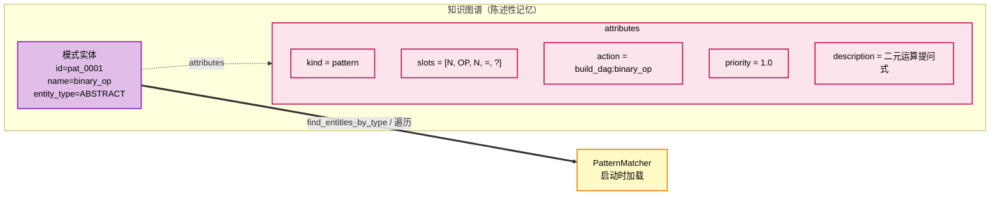

#### slot 定义结构

`slots` 数组中每个元素是一个 slot 描述对象。slot 是模式的最小匹配单位，对应 token 序列中的一个位置。

| slot 字段 | 类型 | 说明 | 示例 |
|-----------|------|------|------|
| `type` | string | 期望的词性标签（来自 §4 词性分类） | `"N"`、`"OP"`、`"="`、`"word"` |
| `literal` | string \| null | 期望的字面值（type=`word` 时必填，其他为 null） | `"的"`、`"之和"` |
| `capture` | string \| null | 捕获变量名（将该 slot 的 token 绑定到该变量） | `"left"`、`"op"` |
| `optional` | bool | 是否可选（默认 false） | `false` |

> 匹配规则：`type` 为词性约束，`literal` 为字面值约束。`type != "word"` 时只比对词性；`type == "word"` 时必须字面值相等。`capture` 非空的 slot 会把对应 token 写入匹配结果的 `captured` 字典。

### 2.2 算术模式示例（binary_op）

**模式名**：`binary_op`
**用途**：识别算术运算提问式，如 `1+1=?`、`三加二等于多少`
**触发动作**：构建"二元运算"DAG（读取两个操作数 → 调用对应算法）

| slot 序号 | type | literal | capture | 说明 |
|-----------|------|---------|---------|------|
| 0 | `N` | null | `left` | 左操作数 |
| 1 | `OP` | null | `op` | 运算符 |
| 2 | `N` | null | `right` | 右操作数 |
| 3 | `=` | null | null | 等号（固定词性） |
| 4 | `?` | null | null | 问号（固定词性） |

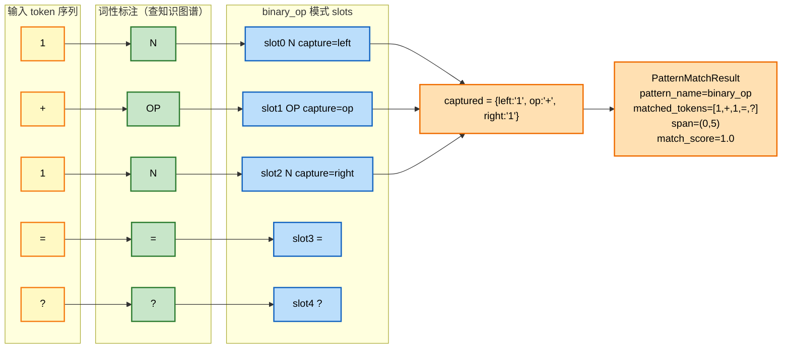

**变体模式 `binary_op_bare`**：slots 为 `[N, OP, N]`（无等号问号），用于识别陈述式算式如 `1+1`，priority 设为 `0.8` 低于 `binary_op`，避免在完整算式上抢占。

### 2.3 属性绑定模式示例（attr_value）

**模式名**：`attr_value`
**用途**：识别"实体 + 的 + 属性 + 数值"结构，如 `爸爸的年龄31`、`妈妈的高度160`
**触发动作**：构建"写工作记忆"DAG（`write_memory: entity.attr = number`）

| slot 序号 | type | literal | capture | 说明 |
|-----------|------|---------|---------|------|
| 0 | `word` | — | `entity` | 实体名（任意词，按字面捕获） |
| 1 | `word` | `的` | null | 结构助词"的" |
| 2 | `word` | — | `attr` | 属性名（任意词，按字面捕获） |
| 3 | `N` | null | `value` | 属性数值 |

> slot 0、2 的 `type=word` 但 `literal=null`：表示"任意词均接受，作为变量捕获"。匹配时这两个 slot 会对当前 token 做最宽匹配（只要非空即可），把 token 字面值绑定到 `capture` 指定的变量上。

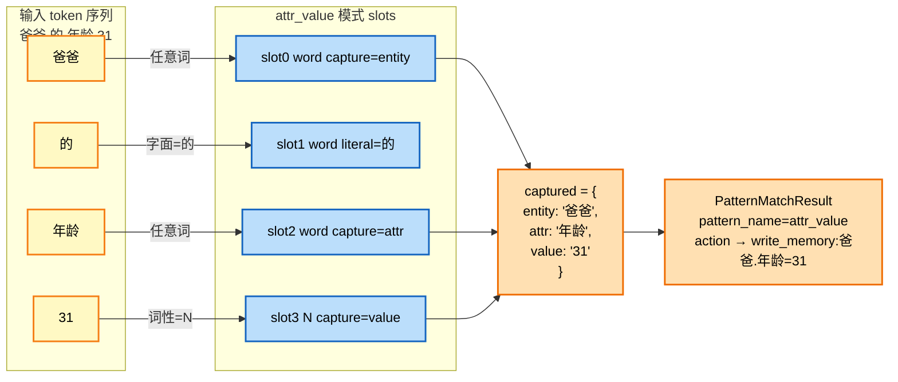

**应用题场景中的连续匹配**：输入 `爸爸的年龄31，妈妈的年龄25` 经过分词与多模式匹配后，应产出两个 `attr_value` 匹配结果，分别写入 `爸爸.年龄=31` 与 `妈妈.年龄=25` 到工作记忆。

### 2.4 指代求和模式示例（pronoun_sum）

**模式名**：`pronoun_sum`
**用途**：识别"代词 + 的 + 属性 + 之和 + 是 + 多少"结构，如 `他们的年龄之和是多少`
**触发动作**：构建"指代消解 + 多值读取 + 求和"DAG（`search_context → read_memory × N → adding`）

| slot 序号 | type | literal | capture | 说明 |
|-----------|------|---------|---------|------|
| 0 | `word` | — | `pronoun` | 代词（他们/她们/它们） |
| 1 | `word` | `的` | null | 结构助词 |
| 2 | `word` | — | `attr` | 求和属性名 |
| 3 | `word` | `之和` | null | 聚合关键词 |
| 4 | `=` | null | null | 等号（可省略，见 optional） |
| 5 | `?` | null | null | 问号 |

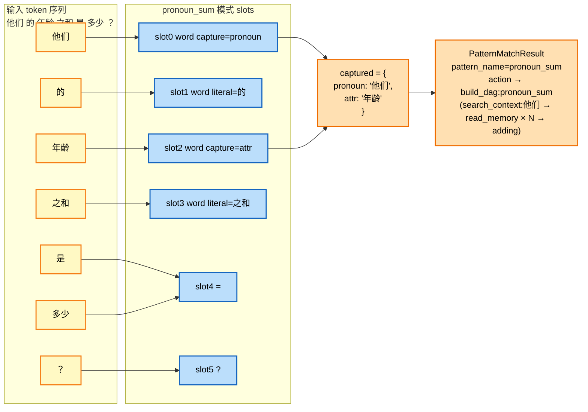

> **"是"与"多少"合并等价于 "=?"**：在词性标注阶段，"是"归类为 `=`、`多少`归类为 `?`（详见 §4.3），因此 `是 多少 ？` 在 tag 序列上等价于 `= ? ?`，slot 4、5 仍能命中。引擎只看 tag 不看字面，保证模式对自然语言变体鲁棒。

---

## 3. 模式匹配流程

### 3.1 从知识图谱加载所有模式

PatternMatcher 在初始化（或每次 `match()` 调用前按需）时，从陈述性记忆查询所有 `attributes.kind == "pattern"` 的实体，加载为内存中的模式表。

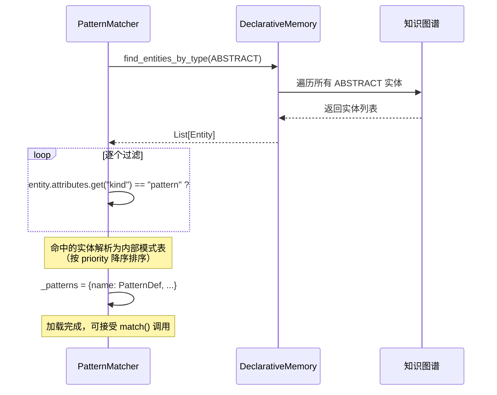

**加载策略表**：

| 策略 | 触发时机 | 优点 | 缺点 |
|------|---------|------|------|
| 启动时全量加载 | PatternMatcher 构造时 | 匹配阶段零查询延迟 | 学习新模式后需手动 reload |
| 每次 match 前刷新 | 每次 `match()` 调用前 | 总能用上最新学到的模式 | 每次匹配都查记忆，开销大 |
| 启动加载 + 学习后失效 | 默认 + 监听学习事件 | 兼顾性能与新鲜度（推荐） | 需记忆系统支持变更通知 |

> 推荐采用"启动加载 + 学习后失效"策略：PatternMatcher 持有模式表的内存缓存，记忆系统在写入新 `pattern` 实体后通过回调通知 PatternMatcher 失效缓存，下次 `match()` 时惰性重载。

### 3.2 对分词结果做词性标注（查知识图谱实体 kind）

对分词器输出的 token 序列，逐个查询知识图谱判断其词性，输出等长的 tag 序列。详见 §4 词性分类。

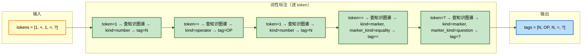

**标注结果表样例**：

| token | 知识图谱查询结果 | kind | marker_kind | tag |
|-------|-----------------|------|-------------|-----|
| `1` | 命中数字实体 | `number` | — | `N` |
| `+` | 命中操作符实体 | `operator` | — | `OP` |
| `=` | 命中标记实体 | `marker` | `equality` | `=` |
| `?` | 命中标记实体 | `marker` | `question` | `?` |
| `>` | 命中标记实体 | `marker` | `compare_gt` | `CMP` |
| `爸爸` | 未命中任何实体 | — | — | `X` |
| `的` | 未命中任何实体 | — | — | `X` |

> 未学过的词一律标为 `X`（未知）。`X` 不会被任何 `type=N/OP/=/...` 的 slot 命中，但会被 `type=word` 且 `literal=null` 的 slot 接受（作为捕获变量值）。

### 3.3 逐模式匹配（slot by slot）

对加载到的每个模式，在 tag 序列上滑动尝试匹配。匹配算法：

1. 模式按 `priority` 降序排列。
2. 对每个模式，在 tag 序列上从位置 `i=0` 开始滑动：
   - 对模式 slots 数组与 `tags[i : i+len(slots)]` 做逐 slot 比对。
   - 每个 slot 比对规则：
     - 若 `slot.type == "word"`：要求 `slot.literal == tokens[i+j]`（字面相等），否则失败。
     - 否则：要求 `tags[i+j] == slot.type`（词性相等），否则失败。
     - `slot.optional == true` 时，当前 slot 不匹配则跳过（不前进 token 指针）。
   - 全部 slot 命中 → 记录一次匹配，收集 `captured` 变量。
3. 同一模式可能匹配多次（如应用题中两个 `attr_value`），全部保留。

```mermaid
flowchart TD
    START["开始 match(tokens)"]
    LOAD["加载模式表<br/>（按 priority 降序）"]
    TAG["对 tokens 做词性标注<br/>→ tags"]
    INIT["patterns_matched = []<br/>i = 0"]

    LOOP_P{还有未处理的<br/>模式?}
    LOOP_I{i ≤ len(tokens) -<br/>len(pattern.slots)?}

    CMP["对 pattern.slots 与<br/>tags[i : i+len(slots)]<br/>逐 slot 比对"]

    MATCH_OK{全部 slot 命中?}
    CAP["收集 captured 变量<br/>构造 PatternMatchResult<br/>append 到 patterns_matched"]
    NEXT_I["i += 1"]

    NEXT_P["切换下一个模式"]
    DONE["按 match_score 排序<br/>返回 patterns_matched"]

    START --> LOAD --> TAG --> INIT --> LOOP_P
    LOOP_P -->|是| LOOP_I
    LOOP_P -->|否| DONE
    LOOP_I -->|是| CMP
    LOOP_I -->|否| NEXT_P
    CMP --> MATCH_OK
    MATCH_OK -->|是| CAP
    MATCH_OK -->|否| NEXT_I
    CAP --> NEXT_I
    NEXT_I --> LOOP_I
    NEXT_P --> LOOP_P

    classDef start fill:#c8e6c9,stroke:#2e7d32,stroke-width:2px,color:#000
    classDef loop fill:#bbdefb,stroke:#1565c0,stroke-width:2px,color:#000
    classDef decision fill:#fff9c4,stroke:#f57f17,stroke-width:2px,color:#000
    classDef action fill:#ffe0b2,stroke:#ef6c00,stroke-width:2px,color:#000
    classDef done fill:#e1bee7,stroke:#8e24aa,stroke-width:2px,color:#000
    class START start
    class LOAD,TAG,INIT,CMP,CAP,NEXT_I,NEXT_P action
    class LOOP_P,LOOP_I,MATCH_OK decision
    class DONE done
```

#### slot 匹配规则详表

| slot.type | slot.literal | 命中条件 | 是否捕获 |
|-----------|--------------|---------|----------|
| `word` | 非空 | `tokens[j] == literal` | 若 `capture` 非空，捕获 `tokens[j]` |
| `word` | null | 任意 token（包括 `X`） | 若 `capture` 非空，捕获 `tokens[j]` |
| `N` | 忽略 | `tags[j] == "N"` | 若 `capture` 非空，捕获 `tokens[j]` |
| `OP` | 忽略 | `tags[j] == "OP"` | 若 `capture` 非空，捕获 `tokens[j]` |
| `=` | 忽略 | `tags[j] == "="` | 一般不捕获 |
| `?` | 忽略 | `tags[j] == "?"` | 一般不捕获 |
| `CMP` | 忽略 | `tags[j] == "CMP"` | 若 `capture` 非空，捕获比较运算符 |

### 3.4 输出匹配结果（模式名 + 绑定变量 + 置信度）

每次成功匹配产出一条 `PatternMatchResult`，字段如下：

| 字段 | 类型 | 说明 | 示例 |
|------|------|------|------|
| `pattern_name` | string | 命中的模式名（来自模式实体 `name`） | `"binary_op"` |
| `match_score` | float | 置信度（0~1），用于多模式排序 | `1.0` |
| `matched_tokens` | array | 实际匹配到的 token 子序列 | `["1","+","1","=","?"]` |
| `captured` | dict | 命中 slot 的变量绑定（`capture` 名 → token 值） | `{"left":"1","op":"+","right":"1"}` |
| `span` | tuple | token 序列中的起止区间 `[start, end)` | `(0, 5)` |
| `action` | string | 来自模式实体的 `attributes.action`，供 DAG 构建器路由 | `"build_dag:binary_op"` |

#### 置信度计算规则

| 命中情况 | match_score |
|---------|-------------|
| 所有非 optional slot 命中 | `0.8` 基础分 |
| + 命中 optional slot（如 `=`、`?`）每多一个 | `+ 0.1` |
| + 模式 `priority` 加成 | `+ priority × 0.1` |
| 上限 | `1.0` |

> 示例：`binary_op`（slots 全为必填）命中 → `0.8 + 0 + 0.1×1 = 0.9`；`binary_op_bare`（slots=[N,OP,N]）命中 → `0.8 + 0 + 0.1×0.8 = 0.88`。两者同时命中时 `binary_op` 排在前。

#### 多模式输出示例

输入：`爸爸的年龄31，妈妈的年龄25，他们的年龄之和是多少？`

| # | pattern_name | span | captured | action |
|---|--------------|------|----------|--------|
| 1 | `attr_value` | (0,4) | `{entity:"爸爸", attr:"年龄", value:"31"}` | `build_dag:attr_value` |
| 2 | `attr_value` | (5,9) | `{entity:"妈妈", attr:"年龄", value:"25"}` | `build_dag:attr_value` |
| 3 | `pronoun_sum` | (10,17) | `{pronoun:"他们", attr:"年龄"}` | `build_dag:pronoun_sum` |

推理执行层依据这些匹配结果构建问题 DAG（详见推理执行设计文档）。

### 3.5 流程图

完整模式匹配流程一览：

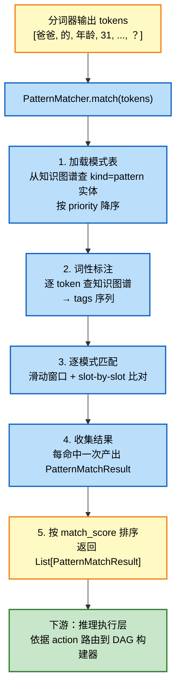

---

## 4. 词性分类

词性标注是模式匹配的前置步骤，其正确性完全依赖知识图谱中实体的 `kind` 属性。

### 4.1 从知识图谱查实体 kind（number / operator / marker / word）

对每个 token，调用陈述性记忆的 `find_entity_by_name(token)` 查询。查到的实体的 `attributes.kind` 决定其词性：

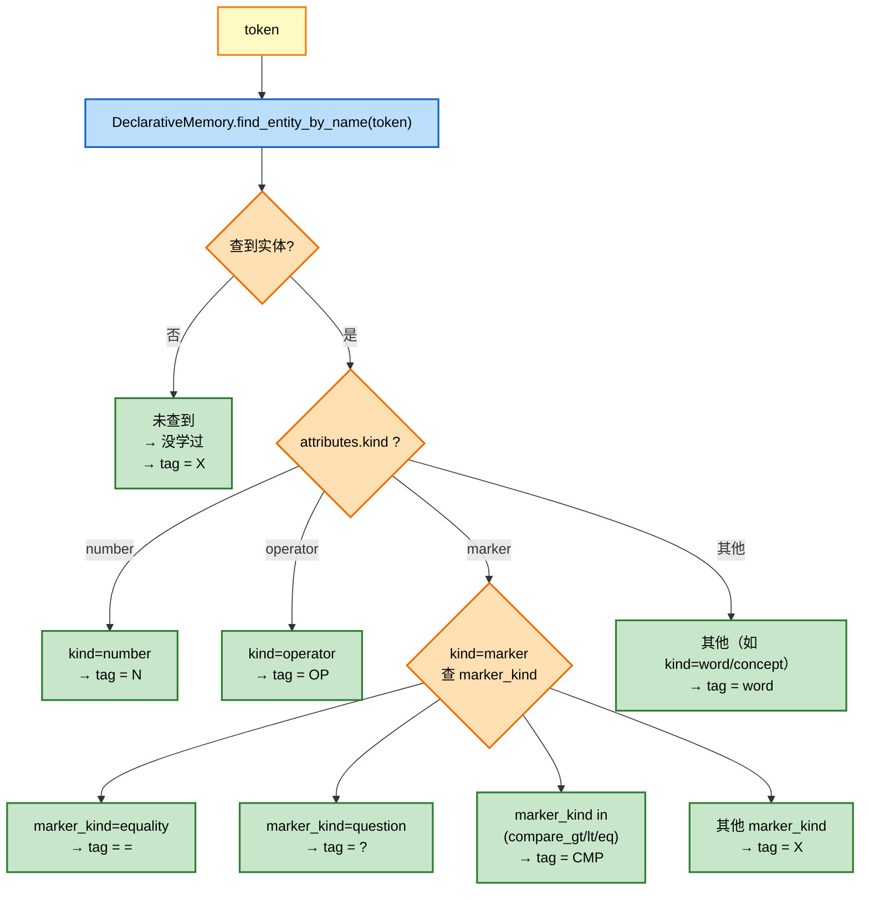

### 4.2 未学过的词 → X（未知）

**核心原则**：不学就没有能力。词性标注完全以知识图谱为准，未在知识图谱中学过的 token 一律标记为 `X`。

| token 是否学过 | 处理方式 | tag |
|---------------|---------|-----|
| 已学为数字实体（`kind=number`） | 查到 → 用 kind 判定 | `N` |
| 已学为操作符实体（`kind=operator`） | 查到 → 用 kind 判定 | `OP` |
| 已学为标记实体（`kind=marker`） | 查到 → 用 marker_kind 细分 | `=` / `?` / `CMP` |
| 已学为概念实体（`kind=concept`、`word` 等） | 查到但不属于上述类别 | `word` |
| 未学过（查无此实体） | 没学过 → 一律视为未知 | `X` |

**`X` 在匹配中的行为**：

- `X` 不会被任何 `type=N/OP/=/...` 的 slot 命中（因为 tag 不匹配）。
- `X` 会被 `type=word` 且 `literal=null` 的 slot 接受（按字面捕获，作为变量值）。
- 因此"爸爸""的""年龄"等应用题自然语言词虽然未学过（tag=X），仍可被 `attr_value` 模式的 word slot 接受并捕获。

> 这保证空白脑虽然不识别自然语言词的"含义"，但仍能在学了 `attr_value` 模式后，把"未知词"作为变量捕获下来交给下游处理。模式本身是"教大脑如何对待未知词"的能力。

### 4.3 分类规则表

完整词性分类规则（取代旧版 `_register_defaults` 中的硬编码字符集）：

| kind | 子分类 marker_kind | tag | 学过的实体示例 | 在模式 slot 中的典型用途 |
|------|-------------------|-----|--------------|----------------------|
| `number` | — | `N` | `1`、`2`、`一`、`十`（含 aliases） | 算术模式操作数、属性值 |
| `operator` | — | `OP` | `+`、`-`、`加`、`减` | 算术模式运算符 |
| `marker` | `equality` | `=` | `=`、`等于`、`是`、`＝` | 等号 slot |
| `marker` | `question` | `?` | `?`、`？`、`多少`、`几`、`什么` | 问号 slot |
| `marker` | `compare_gt` | `CMP` | `>`、`大于` | 比较模式 |
| `marker` | `compare_lt` | `CMP` | `<`、`小于` | 比较模式 |
| `marker` | `compare_eq` | `CMP` | `=等于`、`相同` | 比较模式 |
| `concept` | — | `word` | （未来扩展：已学概念词） | 词面 slot |
| （查无实体） | — | `X` | 未学过的任意词 | 被 `type=word` slot 接受并捕获 |

> **学习驱动**：上表中"学过的实体示例"必须通过知识包学习写入知识图谱后才会被分类为对应 tag。例如只有学过 `1plus1` 知识包中的 numbers/operators/markers 后，`1`、`+`、`=`、`?` 才能被正确标注为 `N`、`OP`、`=`、`?`。

---

## 5. 模式样本学习

模式的来源有两条路径：人工定义模式实体（当前主用）与从样本归纳模式（未来扩展）。两者最终都通过"写入知识图谱的 pattern 实体"统一为引擎可加载的形式。

### 5.1 知识包中的 pattern_samples

知识包（YAML 格式）中新增 `pattern_samples` 段，描述"输入样本 → 期望命中的模式 + 捕获变量"的对应关系。学习引擎读取这些样本，将其中定义的模式写入知识图谱为 `pattern` 实体。

**知识包 YAML 片段示例**：

```yaml
# ---- 模式样本（教大脑认识问题结构）----
pattern_samples:
  - pattern_name: "binary_op"
    description: "二元运算提问式：A op B = ?"
    action: "build_dag:binary_op"
    priority: 1.0
    slots:
      - {type: "N",  capture: "left"}
      - {type: "OP", capture: "op"}
      - {type: "N",  capture: "right"}
      - {type: "=",  capture: null}
      - {type: "?",  capture: null}
    examples:
      - input: "1+1=?"
        expected_captured: {left: "1", op: "+", right: "1"}
      - input: "三加二等于多少"
        expected_captured: {left: "三", op: "加", right: "二"}

  - pattern_name: "attr_value"
    description: "属性绑定：entity 的 attr number"
    action: "build_dag:attr_value"
    priority: 0.9
    slots:
      - {type: "word", literal: null, capture: "entity"}
      - {type: "word", literal: "的", capture: null}
      - {type: "word", literal: null, capture: "attr"}
      - {type: "N",    capture: "value"}
    examples:
      - input: "爸爸的年龄31"
        expected_captured: {entity: "爸爸", attr: "年龄", value: "31"}
```

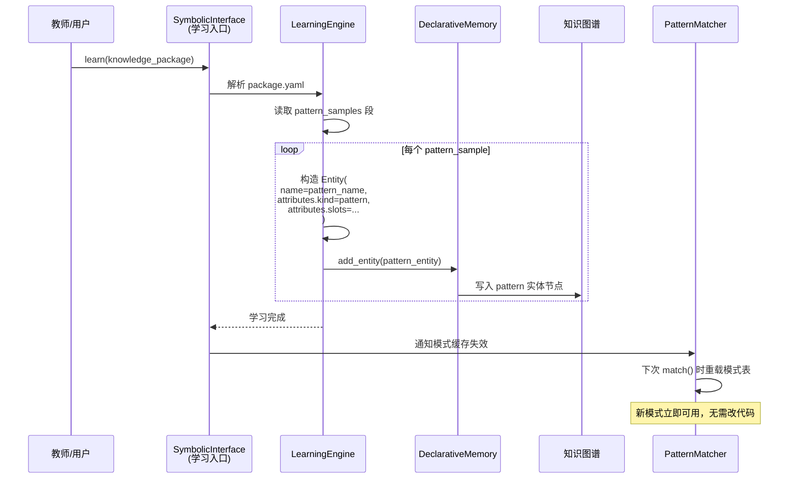

### 5.2 从样本中归纳模式（未来扩展）

当前模式仍由人工在知识包中显式定义 slots。未来可扩展为：只给大量样本（input + expected_captured），由学习引擎自动归纳出 slot 结构。

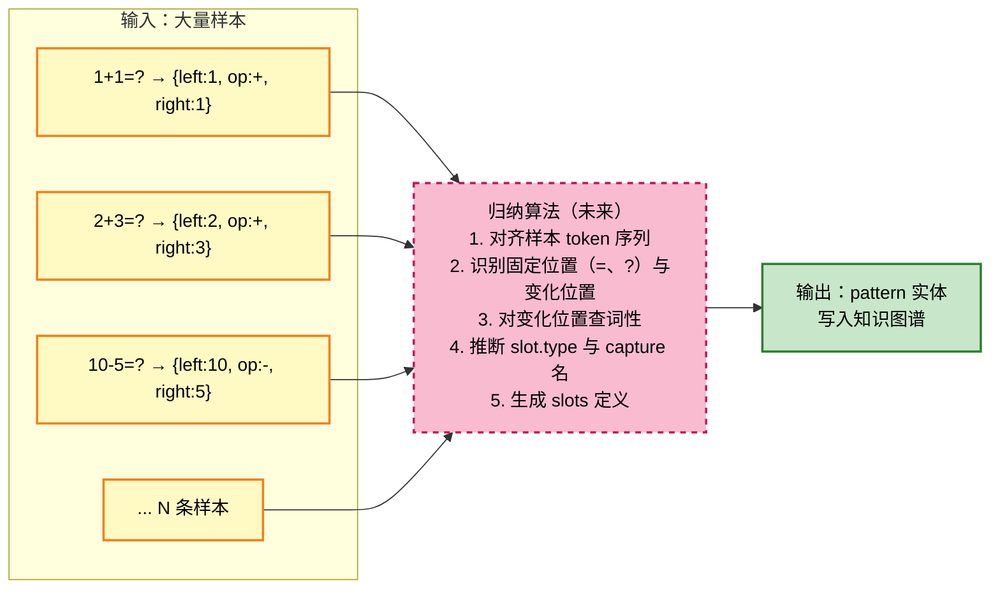

| 归纳子任务 | 方法（候选） | 状态 |
|-----------|-------------|------|
| 样本对齐 | 多序列对齐（类 LCS） | 未实现 |
| 固定位置识别 | 出现频次阈值过滤 | 未实现 |
| 变化位置词性推断 | 查知识图谱 + 默认 `word` 兜底 | 未实现 |
| capture 变量名推断 | 从 expected_captured 反推 | 未实现 |

> 当前架构已为自动归纳预留接口：只要能产出符合 §2.1 实体结构的 pattern 实体，引擎即可加载使用，无需修改 PatternMatcher。归纳算法的复杂度被隔离在学习引擎内部。

### 5.3 人工定义模式（当前方式）

当前主用方式：由知识包作者在 YAML 中显式写 `pattern_samples`（含完整 slots 定义），学习引擎将其原样写入知识图谱。

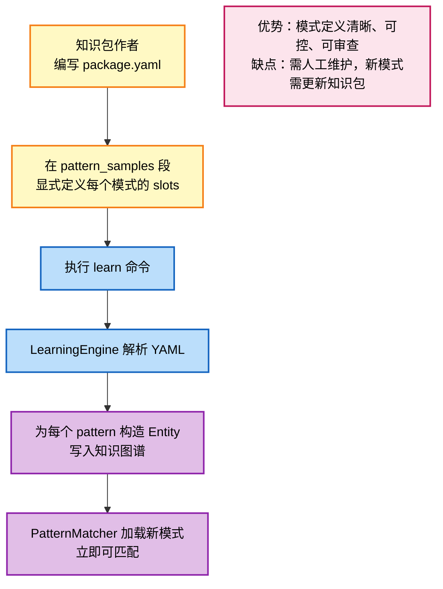

**与自动归纳的对比表**：

| 维度 | 人工定义模式（当前） | 样本归纳模式（未来） |
|------|--------------------|---------------------|
| 知识包内容 | 显式 slots + 少量样本 | 仅大量样本 + 捕获期望 |
| 准确性 | 高（作者意图明确） | 依赖归纳算法质量 |
| 维护成本 | 中（需写 YAML） | 低（只给样本） |
| 适用阶段 | MVP / 已知领域 | 大规模扩展 / 新领域探索 |
| 引擎影响 | 无 | 无（产出相同 pattern 实体） |

---

## 6. 与旧设计的对比

### 6.1 旧设计：`_register_defaults()` 硬编码

旧版 `PatternMatcher` 在构造函数中调用 `_register_defaults()`，将模式名与 token 模板硬编码在 Python 代码中：

| 旧设计要素 | 旧实现 | 问题 |
|-----------|--------|------|
| 模式注册 | `_register_defaults()` 写死 3 个模式 | 增删模式需改源码并重启 |
| 模式定义 | `MathPattern(name, tokens_template=["N","OP","N","=","?"], description)` | 缺少 action/priority/捕获变量 |
| 词性分类 | `classify_token()` 用 `NUMBER_TOKENS_FALLBACK` 等内置字符集 | 违反"没有初始能力"原则 |
| 模式存储 | `self._patterns: Dict[str, MathPattern]`（内存） | 不在知识图谱中，不可学习、不可固化 |
| 模式扩展 | 改代码 → 测试 → 部署 | 学习无法获得新模式 |

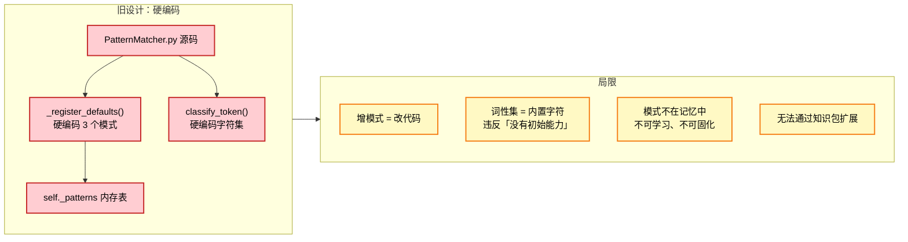

### 6.2 新设计：从知识图谱加载

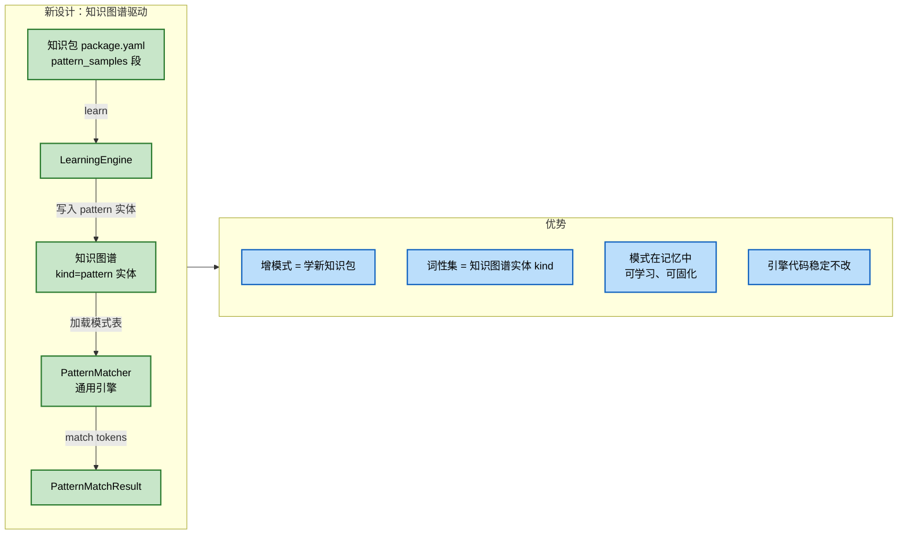

### 6.3 优势总结

| # | 对比维度 | 旧（硬编码） | 新（知识图谱驱动） |
|---|---------|------------|-------------------|
| 1 | 模式存储位置 | PatternMatcher.py 源码 | 知识图谱 `pattern` 实体 |
| 2 | 新模式获取方式 | 改代码、重新部署 | 学习知识包，写入知识图谱 |
| 3 | 词性分类依据 | 内置字符集（`NUMBER_TOKENS_FALLBACK` 等） | 知识图谱实体 `attributes.kind` |
| 4 | 空白脑行为 | 仍有 3 个硬编码模式可用 | 无任何模式，匹配返回空（符合「没有初始能力」） |
| 5 | 模式持久化 | 无（重启后从代码恢复） | 随知识图谱固化到硬盘 |
| 6 | 模式可解释性 | 隐式（需读代码） | 显式（查知识图谱即可见 slots/action/priority） |
| 7 | 模式优先级 | 隐式（代码顺序） | 显式（`priority` 字段，可调） |
| 8 | 多模式类型支持 | 仅算术（N/OP/=/） | 通用（任意 slot 类型：N/OP/=/CMP/word/...） |
| 9 | 引擎代码稳定性 | 每加模式必改 | 稳定（只实现通用加载+匹配） |
| 10 | 与下游耦合 | 模式名直接驱动 `_try_match_*` 方法 | 通过 `action` 字段解耦到 DAG 构建器路由 |

### 6.4 迁移要点

| 迁移项 | 处理方式 |
|--------|---------|
| 删除 `_register_defaults()` | 直接移除，模式改为启动时从知识图谱加载 |
| 删除 `MathPattern` 内置类 | 用从知识图谱实体解析得到的通用 `PatternDef` 替代 |
| 删除 `OP_TOKENS_FALLBACK` 等字符集 | 词性分类一律走知识图谱查询，无 fallback |
| 保留 `declarative_memory=None` 兼容路径 | 仅用于老测试场景，生产环境必须传入记忆系统 |
| 旧测试用例（`test_pattern.py`） | 改造为先 `learn` 基础知识包再断言匹配结果 |
| 模式实体 EntityType | 复用 `ABSTRACT` + `attributes.kind="pattern"`，无需扩展枚举 |

> 迁移完成后，"空白脑 → learn 1plus1 → 能匹配 1+1=?"将作为模式匹配模块的标准验收路径。学习前对 `1+1=?` 调用 `match()` 必须返回空列表，学习后必须返回 `binary_op` 匹配结果。
