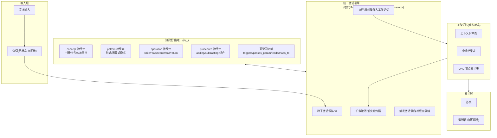
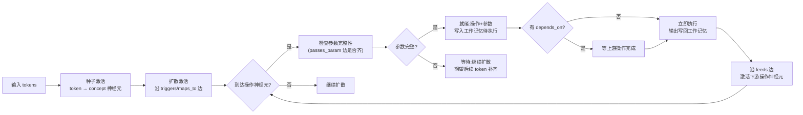
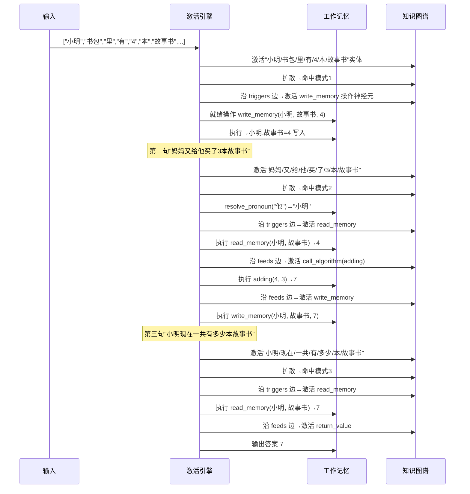

# 统一激活引擎设计

> 本文为架构演进设计稿。业务逻辑导向,不含代码级实现细节。

## 一、设计动因

### 1.1 从一道小学应用题说起

```
小明书包里有 4 本故事书,妈妈又给他买了 3 本故事书。
小明现在一共有多少本故事书?
```

当前架构执行结果:激活数 10,意图无法识别,fallback 到 `counting` 算法对最后激活的数字 `[3]` 计数,错误返回 `3`。

经过反复推演,我们发现:**这不是知识包缺失的问题,而是架构范式的根本性问题**。

### 1.2 当前架构的真实形态

当前系统由多个领域特定的解释器类串联而成:

| 类 | 职责 | 范式 |
|----|------|------|
| `PatternMatcher` | 模板滑动匹配 | 内部 `if token in OP_TOKENS_FALLBACK` 等字符集分发 |
| `DAGBuilder` | 把模式命中翻译成 DAG 节点 | `_build_template` 内部 `elif template == "binary_op"` 链 |
| `DAGExecutor` | 执行 DAG | `_execute_node` 内部 `if action == OP_WRITE_MEMORY` 分发 |
| `AlgorithmRegistry` | 算法注册表 | 类初始化时 `self.adding = AddingAlgorithm(...)` 硬编码 |

知识图谱在这些类眼里只是**查表数据库**,真正"解题"的是这 4 个 Python 类的 if/elif 分发逻辑。

### 1.3 与脑科学范式的偏差

参考 [自由神经网络.txt](../../自由神经网络.txt) 和 [总述.txt](../总述.txt):

> *单个神经元主要会存储一定量的信息,每个神经元表示一个物理对象的抽象。而神经元之间的连接,边上可以存储一定量的信息。*
>
> *神经元结构,轴突(输入),树突(输出),神经元主体(计算&存储)。*

脑皮层只有三类基础元件:
1. **神经元**(统一的计算+存储单元)
2. **突触连接**(可学习权重,带方向/关系类型/边信息)
3. **激活扩散**(spreading activation)

**脑皮层不存在"模式匹配脑区"、"DAG构建脑区"、"算法执行脑区"这种领域特定的解释器**。所谓"理解一道应用题",在脑科学层面只是相关神经元集群按学到的连接模式激活到稳定态。

当前架构在脑科学隐喻层面有如下偏差:

| 当前模块 | 对应脑科学隐喻 | 实际实现范式 |
|---------|-------------|------------|
| `PatternMatcher` | 皮层柱 + 注意网络 | 字符集/词性 if 分发 |
| `DAGBuilder` | 前额叶(任务设置) | elif 模板分发(硬编码 4 种) |
| `DAGExecutor` | 运动皮层(动作执行) | if action 分发 |
| `AlgorithmRegistry` | 基底神经节(程序性记忆) | 类初始化硬编码 5 个算法类 |

### 1.4 设计目标

**消除所有领域特定解释器类**,将模式匹配、DAG构建、算法执行统一为**单一机制:激活扩散 + 程序性记忆触发**。

## 二、脑科学基础

### 2.1 神经元与突触

依据《自由神经网络.txt》,神经元与突触是统一的物理基础:

| 元件 | 在系统中的对应 | 性质 |
|------|--------------|------|
| 神经元 | 图谱节点(Entity) | 同时承载"计算"与"存储",可抽象表示物理对象 |
| 突触 | 图谱边(Relation) | 有方向性、关系类型、边权重,可学习 |
| 激活 | 节点激活强度(activation_strength) | 沿突触扩散,按权重衰减 |

### 2.2 激活扩散(spreading activation)

参考《物理世界的学习规则.md》:

> *记忆规则:记忆编码后的数据,存储在神经元中*
> *学习规则:神经发生,联结两个神经元*

激活扩散的核心:
- 输入激活若干种子节点
- 激活沿学到的突触扩散到邻居
- 扩散强度按"边权重 × 衰减因子"递减
- 当激活到达"操作神经元"时,触发对应的动作

### 2.3 程序性记忆作为可激活实体

依据《总述.txt》:

> *程序及固定的计算方法,计数是最基本的,儿童时期就要习得的基本能力。*
> *算法其中应该也有一个图结构来存储,同样可以找到。*

算法不是某个 Python 类的实例,而是图谱中的程序性记忆实体。当输入激活到该实体,触发对应操作。算法的"步骤组合"是图谱中的边序列,不是 Python 代码的 `def execute(self, ...)`。

### 2.4 学习与执行的统一

依据《物理世界的学习规则.md》:

> *学习规则:神经发生,联结两个神经元*

学习 = 建立新突触(图谱加边)。执行 = 激活扩散走已建立的突触。

二者共享同一套物理机制,无需"学习引擎"与"执行引擎"两套独立系统。

## 三、核心设计

### 3.1 统一原则

1. **图谱是唯一存在**:神经元(实体)和突触(关系)统一存储陈述性 + 程序性记忆。
2. **激活扩散是唯一机制**:没有 PatternMatcher/DAGBuilder/DAGExecutor 三类解释器,只有激活扩散。
3. **操作神经元作为图谱节点**:`write_memory/read_memory/search_context/call_algorithm/return_value` 是图谱中的特殊节点,不是 Python 类方法。
4. **学习 = 建突触**:教一道题解法 = 在图谱中加若干条边,把"问题词实体"连接到"操作神经元"。

### 3.2 三类神经元

依据脑科学中"神经元统一性"原则,所有节点都是图谱实体,但按 `kind` 属性区分:

| kind | 含义 | 例子 |
|------|------|------|
| `concept` | 概念实体 | 小明、书包、4、故事书 |
| `pattern` | 模式实体 | 二元运算式、拥有陈述句式 |
| `operation` | 操作神经元 | write_memory、read_memory、call_algorithm、return_value |
| `procedure` | 程序性记忆 | adding(由 L0 操作组合)、subtracting |

操作神经元是先天的"硬件指令集",但其触发条件、参数来源、依赖关系**全部是学来的边**(对应"什么时候用、怎么用是学来的")。

### 3.3 突触关系类型

依据《自由神经网络.txt》中"边有方向性、关系类型、边信息":

| 关系类型 | 含义 | 方向 |
|---------|------|------|
| `triggers` | 激活触发 | 模式 → 操作神经元 |
| `passes_param` | 参数传递 | 词实体 → 操作神经元(带参数名) |
| `feeds` | 数据流 | 操作神经元A → 操作神经元B |
| `requires` | 依赖 | 操作神经元B → 操作神经元A |
| `maps_to` | 实体映射 | 概念 → 操作神经元(如"有"→ write_memory) |
| `resolves_to` | 指代消解 | 代词 → 上下文实体(动态边) |

### 3.4 整体架构



### 3.5 激活扩散流程



### 3.6 关键:无 elif 分发

| 当前实现 | 新设计 |
|---------|--------|
| `if action == OP_WRITE_MEMORY: ...` | 操作神经元 `kind=operation, op_type=write_memory`,激活就绪后由**统一调度器**调用对应硬件原语 |
| `elif template == "binary_op": ...` | 无 template 概念,模式的 `dag_template` 描述要激活的操作神经元和边关系,学习时即建立突触 |
| `AlgorithmRegistry` 5 个类 | `adding/subtracting/...` 是图谱中 `kind=procedure` 实体,激活时按其 steps 边序列触发操作神经元链 |

## 四、应用题解法

### 4.1 题目

```
小明书包里有 4 本故事书,妈妈又给他买了 3 本故事书。
小明现在一共有多少本故事书?
```

### 4.2 学习内容(仅知识,无代码改动)

要让系统理解此题,只需教以下知识(全部为图谱实体和边):

#### 4.2.1 词实体

| symbol | kind | attributes |
|--------|------|------------|
| 小明 | concept | {pos: person_name} |
| 书包 | concept | {pos: noun, container: true} |
| 里 | concept | {pos: prep_locative} |
| 有 | concept | {pos: verb_possess} |
| 4 | concept | {kind: number, value: 4} |
| 本 | concept | {pos: classifier} |
| 故事书 | concept | {pos: noun} |
| 妈妈 | concept | {pos: person_name} |
| 又 | concept | {pos: adv_accumulate} |
| 给 | concept | {pos: prep_dative} |
| 他 | concept | {pos: pron_person} |
| 买 | concept | {pos: verb_acquire} |
| 了 | concept | {pos: part_aspect} |
| 现在 | concept | {pos: adv_temporal} |
| 一共 | concept | {pos: adv_total} |
| 多少 | concept | {kind: marker, marker_kind: question} |

#### 4.2.2 句式模式实体(可跨题复用)

**模式 1:拥有陈述句**(覆盖"小明书包里有4本故事书")
- slots: `[person_name, noun?, prep_locative?, verb_possess, N, classifier?, noun]`
- 捕获:`{holder, container?, _, _, count, _, object}`
- DAG 模板:激活 `write_memory(entity=${holder}, attr=${object}, value=${count})`

**模式 2:获取事件句**(覆盖"妈妈又给他买了3本故事书")
- slots: `[person_name?, adv_accumulate, prep_dative?, pron_person, verb_acquire, N, classifier?, noun]`
- 捕获:`{giver?, _, _, recipient, _, count, _, object}`
- DAG 模板:激活 `read_memory(entity=${recipient|resolve_pronoun}, attr=${object})` → `call_algorithm(key=adding, args=[${read|output}, ${count|attr:value}])` → `write_memory(entity=${recipient|resolve_pronoun}, attr=${object}, value=${call|output})`

**模式 3:总量提问句**(覆盖"小明现在一共有多少本故事书")
- slots: `[person_name, adv_temporal?, adv_total, verb_possess, q_word, classifier?, noun]`
- 捕获:`{subject, _, _, _, _, _, object}`
- DAG 模板:激活 `read_memory(entity=${subject}, attr=${object})` → `return_value(value=${read|output})`

#### 4.2.3 词到操作神经元的连接

学习时建立如下边:

| 起点 | 边类型 | 终点 | 参数名 |
|------|--------|------|--------|
| 模式1.dag_template | triggers | write_memory 神经元 | — |
| 捕获槽 holder | passes_param | write_memory 神经元 | entity |
| 捕获槽 object | passes_param | write_memory 神经元 | attr |
| 捕获槽 count | passes_param | write_memory 神经元 | value |
| 模式2.dag_template | triggers | read_memory 神经元 | — |
| 捕获槽 recipient | passes_param | read_memory 神经元 | entity (经 resolve_pronoun) |
| ... | ... | ... | ... |

### 4.3 执行轨迹



### 4.4 与"应用题结构知识包"的根本差异

| 维度 | 应用题结构方案(已否决) | 本方案 |
|------|---------------------|--------|
| 教什么 | 教"故事书应用题"这一种结构 | 教词 + 教通用句式(拥有陈述/获取事件/总量提问) + 教词到操作神经元的连接 |
| 复用性 | 仅能解这一道题 | "X 有 N Clf Y"可覆盖无数拥有陈述句 |
| 解释器 | DAGBuilder 仍是 elif 链,需要加 `elif template == "possessive_state"` | DAGBuilder 消失,统一激活扩散 |
| 知识 vs 代码 | 模板是知识,但模板执行还是代码 | 模板及其执行轨迹都是图谱中的边和节点 |
| 是否符合人脑 | 否(人脑不学"故事题结构") | 是(人脑学词、学动词语义、学句式连接) |

## 五、与现有架构的关系

### 5.1 保留的模块

| 模块 | 保留原因 |
|------|---------|
| `DeclarativeMemory` | 图谱存储基础,符合"神经元+突触"范式 |
| `ProceduralMemory` | 程序性记忆作为图谱节点的子集,保留 |
| `MemoryActivation` | 已有激活扩散雏形,需扩展 |
| `WorkingMemory` | 动态状态区,符合前额叶隐喻 |
| `Tokenizer`(无状态) | 从图谱查词素,已是正确范式 |

### 5.2 需重构的模块

| 当前模块 | 命运 | 重构为 |
|---------|------|--------|
| `PatternMatcher` | 消除 | 模式作为可激活 pattern 神经元,激活扩散自然命中 |
| `DAGBuilder` | 消除 | DAG 构建变为"激活到达 operation 神经元后自动建立工作记忆条目" |
| `DAGExecutor` | 消除 | 统一调度器:就绪的操作神经元入队执行 |
| `AlgorithmRegistry` | 消除 | 算法作为 `kind=procedure` 神经元,激活时按其 steps 边序列触发 |
| `IntentRecognizer` | 消除 | 意图识别等价于"哪个 pattern 神经元被激活",无需独立模块 |

### 5.3 新增的能力

| 能力 | 说明 |
|------|------|
| 操作神经元类型 | `kind=operation` 实体,`op_type` 属性区分 write/read/search/call/return |
| 词到操作神经元的可学习边 | `maps_to` 关系,如"有"→ write_memory |
| 模式到操作神经元的可学习边 | `triggers` 关系,模式命中即激活操作神经元 |
| 跨句实体追踪 | 工作记忆维护"最近提及人名表",`resolve_pronoun` 查询 |
| 激活轨迹可解释 | 每个被激活的节点和经过的边都入 `reasoning_chain`,可追溯 |

## 六、约束与硬性原则

依据 [project_memory.md](../../../../.trae-cn/memory/projects/-Users-weidong-ai-small-world--p2-8187bc3c33fe772938d3/project_memory.md):

1. **架构设计仅关注业务逻辑**:本文不含 Python 代码片段、类签名、方法实现。
2. **知识图谱是唯一记忆系统**:所有陈述性 + 程序性记忆在图谱。
3. **所有算法作为程序性记忆学习**:无固定算法库(消除 `AlgorithmRegistry`)。
4. **模式匹配/意图识别/算法执行严格查询记忆**:无硬编码知识绕过记忆。
5. **图必须使用 Mermaid**:本文全部使用 Mermaid。

## 七、影响范围

### 7.1 设计文档影响

| 文档 | 影响 |
|------|------|
| [架构设计.md](../架构设计.md) | 需补充"统一激活引擎"章节,作为 v3 变更 |
| [模式匹配设计.md](模式匹配设计.md) | 大改:消除 PatternMatcher 类,模式作为可激活实体 |
| [推理执行设计.md](推理执行设计.md) | 大改:消除 DAGBuilder/DAGExecutor,统一为激活引擎 |
| [工作区设计.md](工作区设计.md) | 中改:工作记忆增加跨句实体追踪 |
| [记忆系统设计.md](记忆系统设计.md) | 小改:新增 operation/pattern 神经元类型说明 |
| [分词引擎设计.md](分词引擎设计.md) | 不变 |
| [教学框架设计.md](教学框架设计.md) | 中改:教学即建边,需描述如何教"词到操作神经元的连接" |

### 7.2 代码影响

代码改动在本文档范围外,将在后续 [变更开发计划.md](../变更开发计划.md) Phase 5 中详细规划。

### 7.3 知识包影响

`base_curriculum` 需要补充:
- 词的词性(`pos` 属性)
- 句式模式实体(拥有陈述/获取事件/总量提问)
- 词到操作神经元的 `maps_to` 连接

新增 `app_storybook_sum` 知识包**不再必要**(因模式本身已通用,不再需要"故事书题"这种特定结构)。

## 八、实施可行性

### 8.1 技术可行性

- 知识图谱已有 `find_entities_by_attr` / `get_neighbors` 等查询接口,激活扩散基础设施具备
- `MemoryActivation._spread_activation` 已实现 BFS 扩散,只需扩展为"到达 operation 节点即触发"
- 工作记忆已有 `write_attr/read_attr/resolve_pronoun`,可复用

### 8.2 风险

| 风险 | 应对 |
|------|------|
| 激活扩散可能产生噪声(无关节点也被激活) | 引入激活强度阈值 + 工作记忆就绪条件(参数齐才执行) |
| 多个操作神经元同时就绪时调度顺序 | 工作记忆维护就绪队列,按依赖关系(`requires` 边)拓扑排序 |
| 跨句实体追踪的正确性 | 工作记忆维护"最近 N 个 person_name"列表,代词消解按就近原则 |
| 学习成本(教连接比教词复杂) | 提供 `learn_semantic_link(word, op, param_name)` 接口,知识包 YAML 直接声明 |

### 8.3 渐进迁移策略

为避免一次性大改导致回归,建议分 4 个子阶段:

| 阶段 | 内容 | 验证 |
|------|------|------|
| 5a | 引入 operation 神经元类型,DAGExecutor 改为查图谱调度 | 原 105 个测试全过 |
| 5b | 引入 pattern 神经元的 `dag_template` 字段,激活到达即触发 | 原 105 个测试全过 |
| 5c | 消除 DAGBuilder,统一为激活扩散调度 | 原 105 个测试全过 + 应用题 |
| 5d | 消除 PatternMatcher,模式匹配变为激活到达 pattern 神经元 | 端到端应用题验证 |

## 九、结论

1. **当前架构确实需要基础架构更新**:现有 PatternMatcher/DAGBuilder/DAGExecutor/AlgorithmRegistry 四类解释器不符合"脑皮层只有神经元+突触+激活扩散"的范式。
2. **更新方向是"消除解释器,统一为激活引擎"**:不是再加新模块,而是删旧模块,把它们的职责统一归到"激活扩散 + 程序性记忆触发"。
3. **符合用户人脑范式要求**:教一道应用题不再需要"应用题结构知识包",只需教词、教通用句式模式、教词到操作神经元的连接。
4. **可行性中等偏高**:已有激活扩散基础设施,主要工作在"把硬编码 if/elif 改为查图谱边"。
5. **建议分 4 个子阶段(5a-5d)渐进迁移**,每阶段都保持 105 个测试全过,避免大爆炸式重构。

下一步:更新 [变更开发计划.md](../变更开发计划.md) 增加 Phase 5 详细任务分解。
