# 记忆系统详细设计

> 本文档是"数字大脑"项目的记忆系统架构详细设计，承接《架构设计.md》中的设计变更（v2）。
> 设计原则：知识图谱是**唯一知识来源**，不存在第二份拷贝；所有能力通过学习获得；执行能力（原子操作）是先天"硬件"。

---

## 1. 设计目标

记忆系统的核心目标是构建一个**统一的、可学习、可持久化**的知识存储与激活体系，承担"大脑皮层"的长期存储职责与"海马体"的记忆固化职责。

### 1.1 核心目标

| # | 目标 | 说明 |
|---|------|------|
| 1 | **统一存储** | 陈述性记忆与程序性记忆统一存储在同一知识图谱中，不存在第二份知识拷贝 |
| 2 | **可学习** | 所有知识（词素、模式、规则、算法步骤、DAG模板）均通过知识包学习获得，无硬编码 |
| 3 | **可激活** | 输入词素后能自动激活相关实体、关系、模式、程序，并扩散到邻居 |
| 4 | **可固化** | 学习得到的知识从内存固化到硬盘 JSON，重启后完整恢复 |
| 5 | **可解释** | 每条记忆有明确来源（学习包/激活/扩散），推理过程可追溯 |
| 6 | **类型完备** | 实体类型涵盖 word/number/operator/marker/pattern/rule，关系类型覆盖后继/同义/依赖等 |

### 1.2 设计原则

- **知识图谱即记忆**：所有陈述性知识与程序性知识均以节点/边/程序性条目的形式存入知识图谱
- **删除独立拷贝**：原 `LearnableTokenizer.known_morphemes` 不再作为独立知识库，分词器从知识图谱读取词素
- **模式与规则实体化**：模式（pattern）与规则（rule）不再是硬编码 JSON，而是作为实体存入知识图谱
- **程序性记忆扩展**：在原"算法步骤组合"之外，新增 DAG 推理模板与原子操作定义
- **海马体机制**：学习→写入知识图谱（内存）→固化到硬盘→启动时恢复

### 1.3 记忆系统总体架构

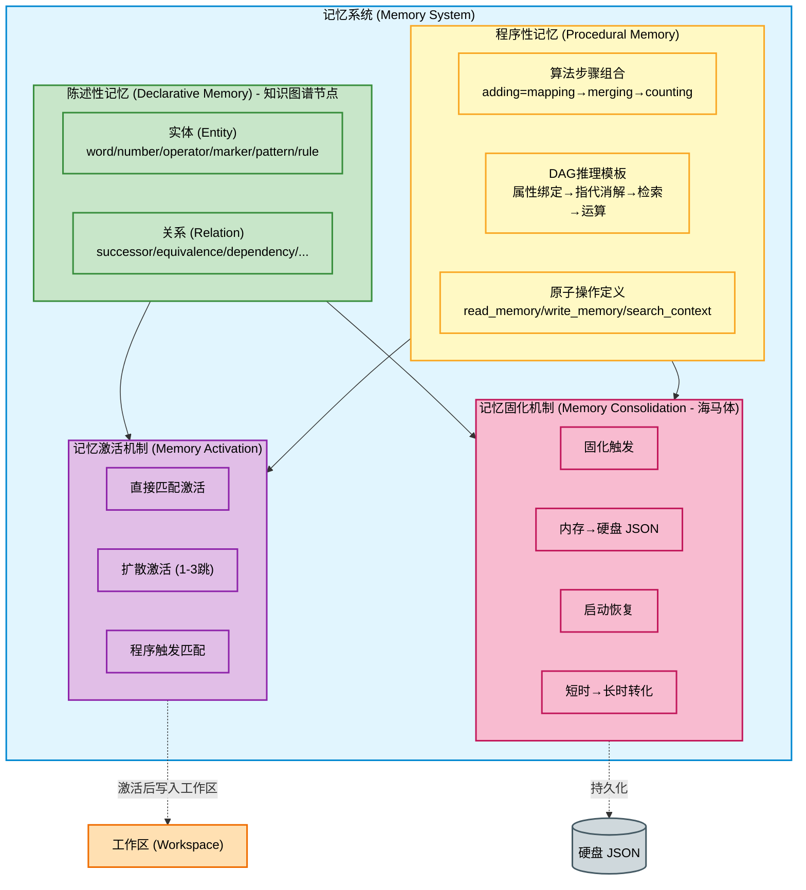

---

## 2. 陈述性记忆（知识图谱节点）

陈述性记忆存储"是什么"的知识，包括事实、概念、实体、关系、模式、规则。它以有向图（DiGraph）形式组织，节点为实体，边为关系。同时维护名称/别名索引以支持高效查找。

### 2.1 实体（word/number/operator/marker/pattern/rule）

实体是陈述性记忆的基本节点。每个实体具有唯一 ID、名称、别名、类型、属性集合。根据 `attributes.kind` 划分子类型。

#### 2.1.1 实体分类体系

| 实体类型 | kind 属性 | 说明 | 示例 |
|---------|-----------|------|------|
| word | `word` | 普通字词（语文识字） | "天"、"爸爸"、"学校" |
| number | `number` | 数字单词，含数值属性 | "1"(value=1)、"十"(value=10) |
| operator | `operator` | 运算符，含 op_type | "+"(add)、"-"(sub) |
| marker | `marker` | 标记符号，含 marker_kind | "="(equality)、"?"(question) |
| pattern | `pattern` | 模式实体，描述问题结构 | "binary_op_question"、"attr_value" |
| rule | `rule` | 规则实体，如数字合并规则 | "merge_digit_sequences" |

#### 2.1.2 实体数据模型

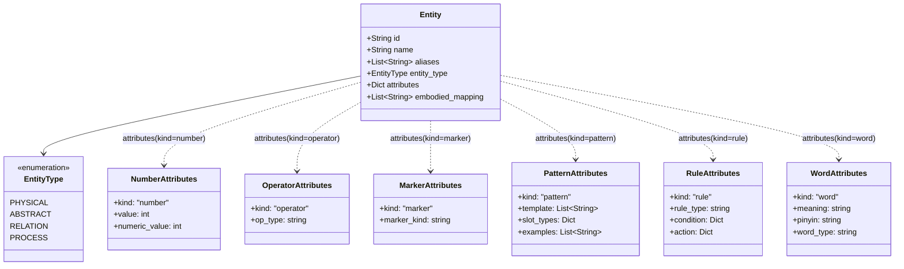

#### 2.1.3 实体存储与索引

```mermaid
flowchart LR
    subgraph INDEX["索引结构 (内存)"]
        I1["_entities: Dict~id, Entity~"]
        I2["_name_index: Dict~name, List~id~~"]
        I3["_alias_index: Dict~alias, List~id~~"]
        I4["_graph: NetworkX DiGraph"]
    end

    subgraph OPS["核心操作"]
        OP1["add_entity(entity) → id"]
        OP2["get_entity(id) → Entity"]
        OP3["find_entity_by_name(name) → List~Entity~<br/>查 name + alias 索引"]
        OP4["find_entities_by_type(type) → List~Entity~"]
        OP5["update_entity(entity)"]
        OP6["delete_entity(id) → 级联删关系"]
    end

    OPS --> INDEX

    classDef idx fill:#bbdefb,stroke:#1565c0,stroke-width:2px,color:#000
    classDef op fill:#c8e6c9,stroke:#2e7d32,stroke-width:2px,color:#000
    class I1,I2,I3,I4 idx
    class OP1,OP2,OP3,OP4,OP5,OP6 op
```

#### 2.1.4 实体类型分布图

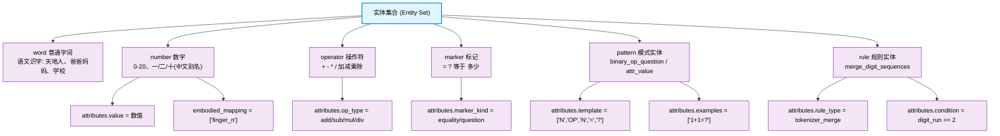

### 2.2 关系（后继、同义、依赖等）

关系是连接实体的有向边。每条关系有唯一 ID、源/目标实体、关系类型、权重、属性。

#### 2.2.1 关系类型体系

| 关系类型 | 含义 | 示例 |
|---------|------|------|
| `SUCCESSOR` | 后继：A 的后继是 B | 1 → 2，2 → 3 |
| `EQUIVALENCE` | 等价：A 等于 B | "1" ↔ "一" |
| `COMPOSITION` | 组成：A 是 B 的一部分 | "爸" → "爸爸" |
| `DEPENDENCY` | 依赖：A 需要 B | adding 依赖 mapping/merging/counting |
| `MAPPING` | 映射：A 映射到 B | 数字 ↔ 手指集合 |
| `CAUSAL` | 因果：A 导致 B | （预留） |
| `CONTAINMENT` | 包含：A 属于 B | （预留） |

#### 2.2.2 关系存储与查询

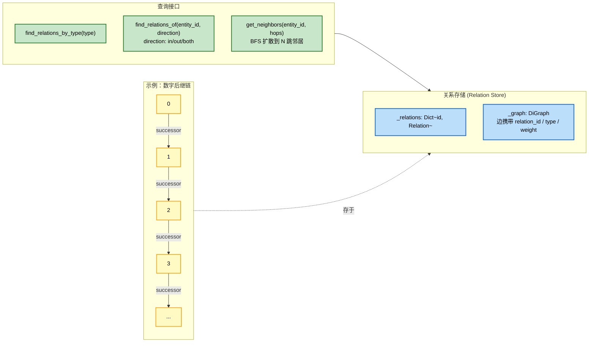

#### 2.2.3 关系在扩散激活中的作用

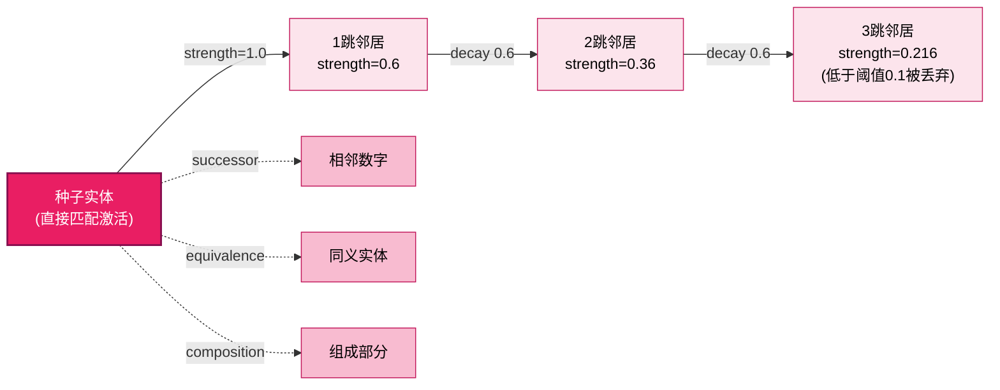

### 2.3 模式实体（如何识别问题结构）

模式实体（pattern entity）是 v2 变更的核心：将原硬编码的 `math_patterns.json` 提升为知识图谱中的可学习实体。模式实体描述"如何识别问题结构"，是 DAG 构建器匹配输入的依据。

#### 2.3.1 模式实体的数据结构

| 属性 | 类型 | 说明 |
|------|------|------|
| `kind` | string | 固定 `"pattern"` |
| `template` | List~string~ | 槽位序列，如 `["N","OP","N","=","?"]` |
| `slot_types` | Dict | 槽位类型映射，如 `{"N":"number","OP":"operator"}` |
| `examples` | List~string~ | 样本输入，如 `["1+1=?","3-2=?"]` |
| `dag_template` | string | 关联的 DAG 推理模板 ID |
| `pattern_kind` | string | 模式分类：`binary_op`/`attr_value`/`pronoun_sum` 等 |

#### 2.3.2 模式实体识别问题结构流程

```mermaid
flowchart TD
    IN["输入词素序列<br/>[1, +, 1, =, ?]"] --> MATCH["遍历 pattern 实体<br/>find_entities_by_type(pattern)"]

    MATCH --> TRY1{尝试 pattern.binary_op_question<br/>template=[N,OP,N,=,?]}

    TRY1 -->|槽位匹配| SLOT["槽位填充<br/>N1=1, OP=+, N2=1, ==, ?"]
    SLOT --> OK1["匹配成功 ✓<br/>输出结构化槽位"]
    OK1 --> DAGREF["读取 dag_template 字段<br/>获取对应 DAG 推理模板"]

    TRY1 -->|不匹配| TRY2{尝试其他 pattern}
    TRY2 -->|全部不匹配| FAIL["不理解<br/>提示缺少模式知识"]

    classDef in fill:#c8e6c9,stroke:#2e7d32,stroke-width:2px,color:#000
    classDef match fill:#fff9c4,stroke:#f9a825,stroke-width:2px,color:#000
    classDef slot fill:#bbdefb,stroke:#1565c0,stroke-width:2px,color:#000
    classDef ok fill:#c8e6c9,stroke:#2e7d32,stroke-width:2px,color:#000
    classDef fail fill:#ffcdd2,stroke:#c62828,stroke-width:2px,color:#000

    class IN in
    class MATCH,TRY1,TRY2 match
    class SLOT slot
    class OK1,DAGREF ok
    class FAIL fail
```

#### 2.3.3 典型模式实体示例

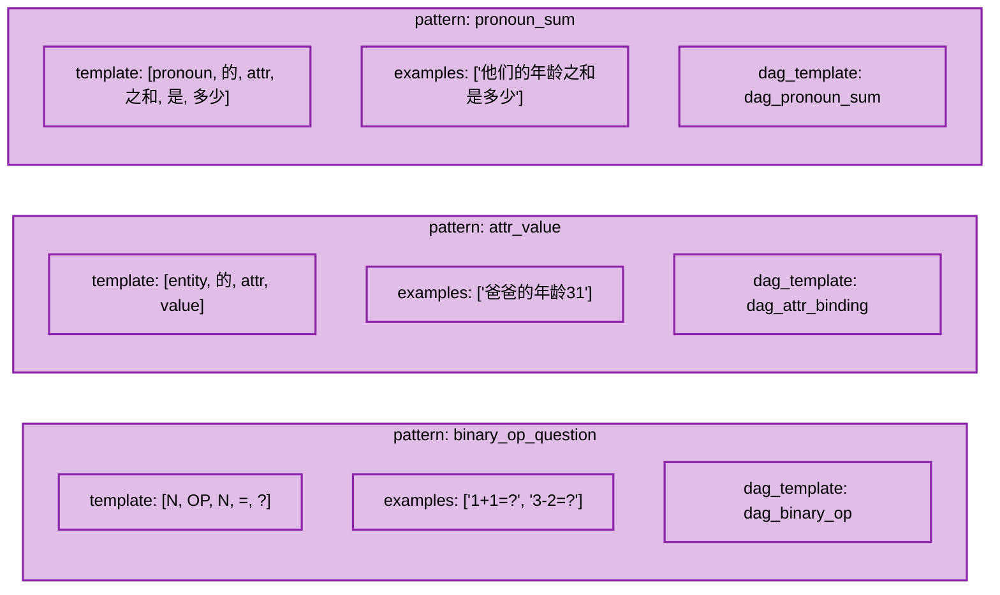

### 2.4 规则实体（如数字合并规则）

规则实体（rule entity）描述"在什么条件下执行什么动作"的元知识。最典型的例子是分词阶段的"数字合并规则"：当遇到 ≥2 位的连续数字串时，应作为一个整体 token 输出。

#### 2.4.1 规则实体的数据结构

| 属性 | 类型 | 说明 |
|------|------|------|
| `kind` | string | 固定 `"rule"` |
| `rule_type` | string | 规则分类：`tokenizer_merge`/`alias_expand`/... |
| `condition` | Dict | 触发条件，如 `{"digit_run": ">=2"}` |
| `action` | Dict | 执行动作，如 `{"merge": true, "as": "single_token"}` |
| `priority` | int | 规则优先级（多规则冲突时） |

#### 2.4.2 规则实体工作流程（以数字合并为例）

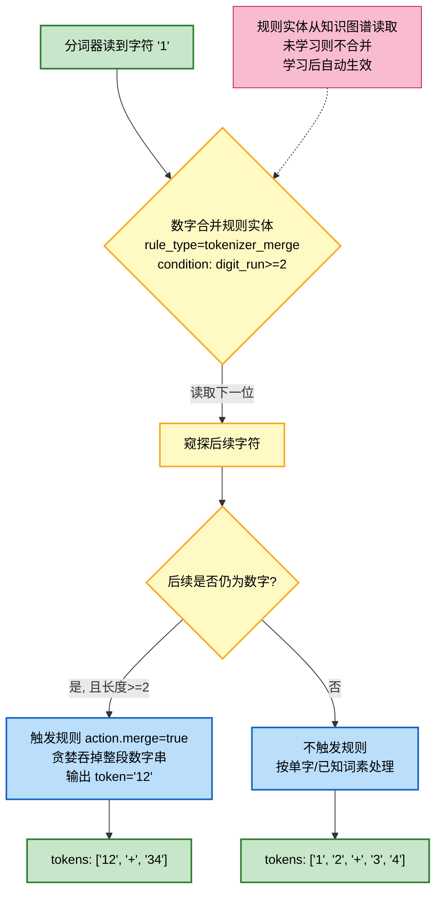

#### 2.4.3 陈述性记忆整体视图

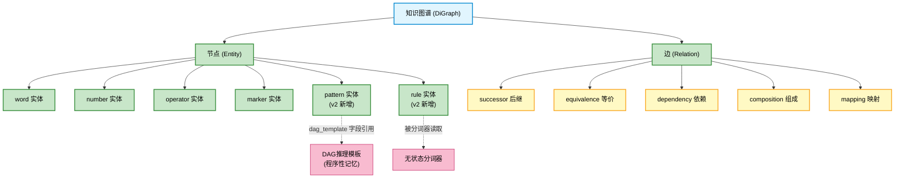

---

## 3. 程序性记忆

程序性记忆存储"怎么做"的知识，包括算法步骤组合、DAG 推理模板、原子操作定义。它以层次结构组织，支持父子关系（组合）与依赖关系（前置条件）。

### 3.1 算法步骤组合（adding=mapping→merging→counting）

算法步骤组合是程序性记忆的基础形态：一条程序由有序的步骤序列构成，每步引用一个原子动作（action）。复杂算法通过组合简单算法得到。

#### 3.1.1 算法步骤数据模型

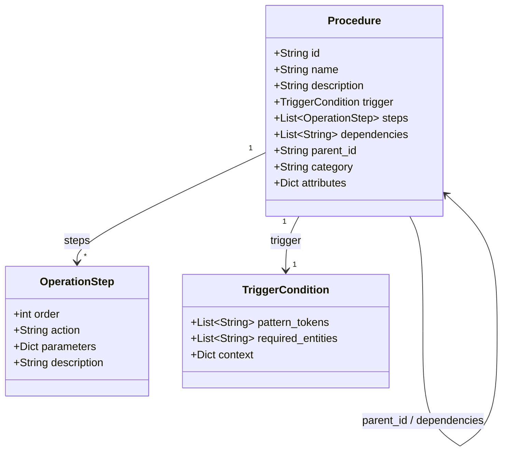

#### 3.1.2 加法算法的组合层次

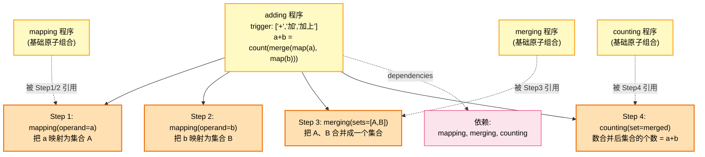

#### 3.1.3 程序性记忆的层次组合

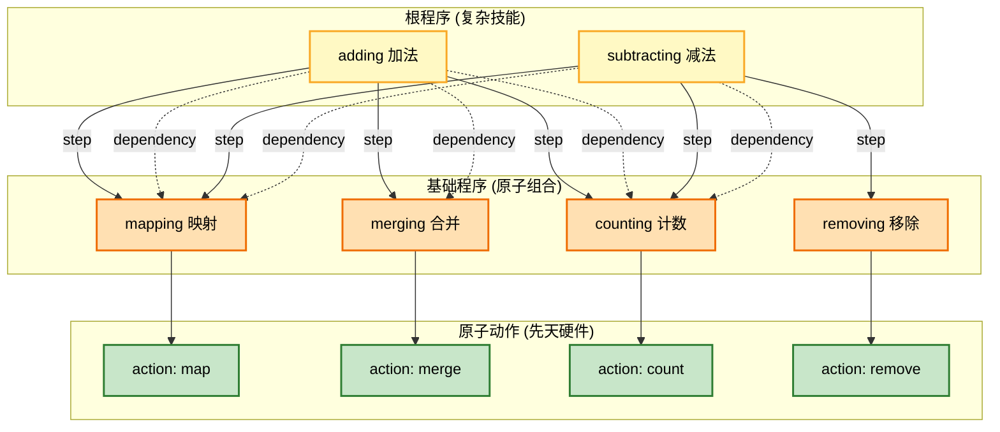

### 3.2 DAG推理模板（属性绑定→指代消解→检索→运算）

DAG 推理模板是 v2 变更的关键新增：将"问题求解"抽象为有向无环图（DAG）的构建与执行。模板描述了从输入到答案的推理链骨架，每个节点是一个原子操作调用。

#### 3.2.1 DAG 推理模板数据结构

| 字段 | 类型 | 说明 |
|------|------|------|
| `template_id` | string | 模板唯一标识，如 `dag_pronoun_sum` |
| `name` | string | 模板名称 |
| `slots` | Dict | 从模式实体填充的槽位变量 |
| `nodes` | List~DAGNode~ | DAG 节点列表 |
| `edges` | List~[from, to]~ | 节点间依赖边 |
| `trigger_pattern` | string | 关联的 pattern 实体 ID |

#### 3.2.2 典型 DAG 推理模板：代词求和

以"爸爸的年龄31，妈妈的年龄25，他们的年龄之和是多少？"为例：

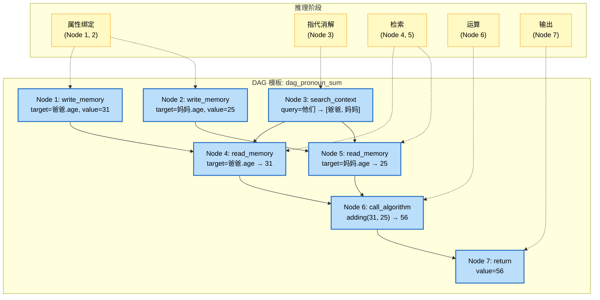

#### 3.2.3 DAG 模板从模式实体到执行的完整链路

```mermaid
flowchart LR
    subgraph A["1. 模式匹配"]
        A1["输入词素"]
        A2["pattern 实体匹配"]
        A3["槽位填充"]
    end

    subgraph B["2. 模板实例化"]
        B1["读取 pattern.dag_template"]
        B2["加载 DAG 推理模板"]
        B3["槽位变量代入"]
    end

    subgraph C["3. DAG 构建"]
        C1["创建节点"]
        C2["建立依赖边"]
        C3["拓扑排序"]
    end

    subgraph D["4. DAG 执行"]
        D1["按拓扑序执行节点"]
        D2["每节点调用原子操作"]
        D3["中间结果存工作记忆"]
    end

    subgraph E["5. 输出"]
        E1["return 节点结果"]
        E2["推理链"]
        E3["置信度"]
    end

    A --> B --> C --> D --> E

    classDef stage fill:#e1f5fe,stroke:#0288d1,stroke-width:2px,color:#000
    class A,B,C,D,E stage
```

#### 3.2.4 常见 DAG 推理模板库

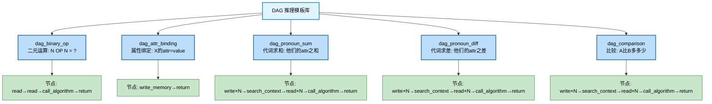

### 3.3 原子操作定义（read_memory/write_memory/search_context等）

原子操作是 DAG 节点执行的最小单位，类似 CPU 指令集。它们是**先天硬件**——什么时候用、怎么用是学来的（由 DAG 模板决定），但操作本身的实现是系统内置的。

#### 3.3.1 原子操作定义数据结构

原子操作定义作为程序性记忆的特殊条目存储（`category = "atomic_operation"`），但**其执行实现由执行引擎内置提供**，记忆中只存元信息（签名、参数说明、语义）。

| 字段 | 类型 | 说明 |
|------|------|------|
| `op_name` | string | 操作名，如 `read_memory` |
| `signature` | Dict | 参数签名 |
| `returns` | Dict | 返回值说明 |
| `side_effect` | string | 副作用类别：`read`/`write`/`search`/`compute`/`control` |
| `description` | string | 语义说明 |

#### 3.3.2 原子操作集

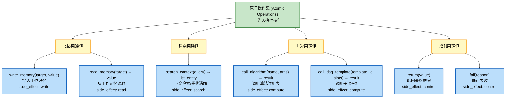

#### 3.3.3 原子操作在 DAG 执行中的调用

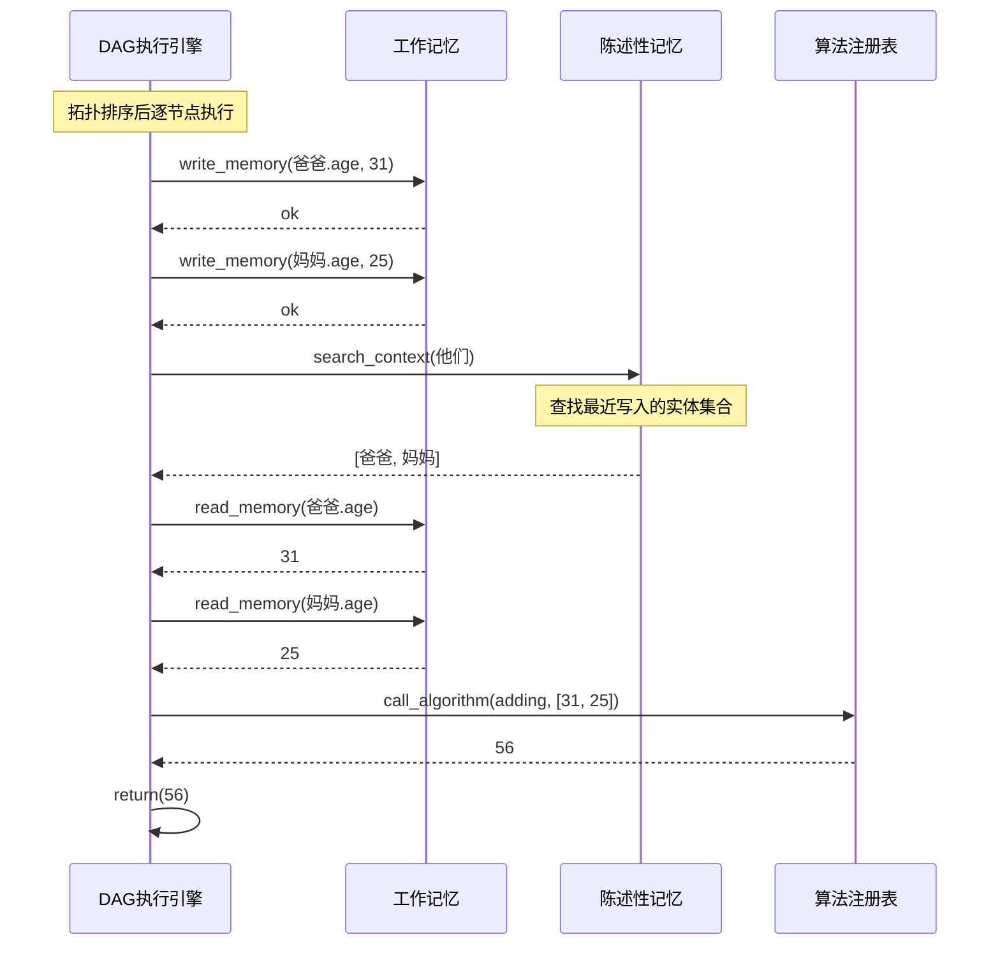

#### 3.3.4 程序性记忆整体视图

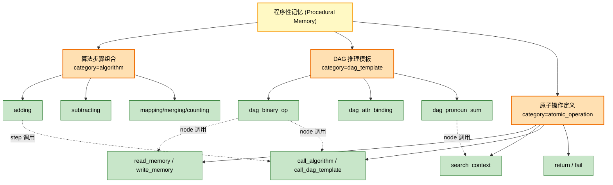

---

## 4. 记忆激活机制

记忆激活机制负责"从输入激活相关知识"。输入词素序列后，系统按"直接匹配 → 扩散激活 → 程序触发"三步激活相关实体与程序，并按激活强度排序、冲突解决后送入工作区。

### 4.1 激活流程总览

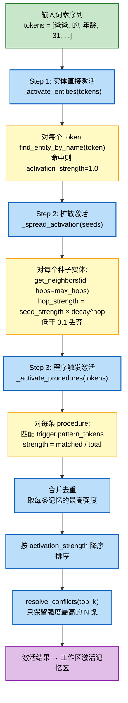

### 4.2 激活强度计算

```mermaid
flowchart LR
    subgraph DIRECT["直接匹配"]
        D1["token 命中实体 name/alias"]
        D2["strength = 1.0"]
        D1 --> D2
    end

    subgraph SPREAD["扩散激活"]
        SP1["种子 strength = S"]
        SP2["1跳: S × 0.6"]
        SP3["2跳: S × 0.6² = S × 0.36"]
        SP4["3跳: S × 0.6³ = S × 0.216"]
        SP5["阈值: < 0.1 丢弃"]
        SP1 --> SP2 --> SP3 --> SP4 --> SP5
    end

    subgraph TRIG["程序触发"]
        T1["trigger.pattern_tokens"]
        T2["matched = 命中 token 数"]
        T3["total = 触发词总数"]
        T4["strength = matched / total"]
        T1 --> T2 --> T3 --> T4
    end

    classDef direct fill:#c8e6c9,stroke:#2e7d32,stroke-width:2px,color:#000
    classDef spread fill:#bbdefb,stroke:#1565c0,stroke-width:2px,color:#000
    classDef trig fill:#fff9c4,stroke:#f9a825,stroke-width:2px,color:#000

    class D1,D2 direct
    class SP1,SP2,SP3,SP4,SP5 spread
    class T1,T2,T3,T4 trig
```

### 4.3 激活示例：以"爸爸的年龄31"为例

```mermaid
flowchart TD
    IN["tokens = [爸爸, 的, 年龄, 31]"]

    IN --> D1["直接激活"]
    D1 --> D1A["爸爸 (word 实体, strength=1.0)"]
    D1 --> D1B["的 (word 实体, strength=1.0)"]
    D1 --> D1C["年龄 (word 实体, strength=1.0)"]
    D1 --> D1D["31 (number 实体, strength=1.0)"]

    D1A --> SP1["扩散激活"]
    D1B --> SP1
    D1C --> SP1
    D1D --> SP1

    SP1 --> SP1A["爸爸的 composition 邻居: 爸 (strength=0.6)"]
    SP1 --> SP1B["31 的 successor 邻居: 32 (strength=0.6)"]
    SP1 --> SP1C["31 的 equivalence 邻居: 三十一 (strength=0.6)"]

    IN --> P1["程序触发激活"]
    P1 --> P1A["dag_attr_binding 模板<br/>(trigger 含 '的','年龄')<br/>strength = 2/4 = 0.5"]

    D1A & D1B & D1C & D1D & SP1A & SP1B & SP1C & P1A --> MERGE["合并排序 → top_k"]
    MERGE --> OUT["送入工作区激活记忆区"]

    classDef in fill:#c8e6c9,stroke:#2e7d32,stroke-width:2px,color:#000
    classDef direct fill:#bbdefb,stroke:#1565c0,stroke-width:2px,color:#000
    classDef spread fill:#fff9c4,stroke:#f9a825,stroke-width:2px,color:#000
    classDef proc fill:#e1bee7,stroke:#8e24aa,stroke-width:2px,color:#000
    classDef out fill:#f8bbd0,stroke:#c2185b,stroke-width:2px,color:#000

    class IN in
    class D1,D1A,D1B,D1C,D1D direct
    class SP1,SP1A,SP1B,SP1C spread
    class P1,P1A proc
    class MERGE,OUT out
```

### 4.4 激活机制与配置

```mermaid
flowchart LR
    CFG["config.yaml<br/>memory.activation"]

    CFG --> MAXH["max_hops: 2<br/>扩散最大跳数"]
    CFG --> DECAY["decay_factor: 0.6<br/>每跳衰减系数"]
    CFG --> THRESH["隐含阈值: 0.1<br/>低于则丢弃"]
    CFG --> TOPK["workspace.activation_capacity: 20<br/>top_k 上限"]

    MAXH -.-> ACT["MemoryActivation"]
    DECAY -.-> ACT
    THRESH -.-> ACT
    TOPK -.-> RESOLVE["resolve_conflicts"]

    classDef cfg fill:#fff9c4,stroke:#f9a825,stroke-width:2px,color:#000
    classDef tgt fill:#bbdefb,stroke:#1565c0,stroke-width:2px,color:#000
    class CFG,MAXH,DECAY,THRESH,TOPK cfg
    class ACT,RESOLVE tgt
```

---

## 5. 记忆固化机制（海马体功能）

记忆固化机制对应脑科学中的"海马体"：负责将工作记忆/短期记忆中的新知识固化为长期记忆，持久化到硬盘，并在启动时恢复。核心流程：**学习 → 写入知识图谱（内存） → 固化到硬盘 → 启动时恢复**。

### 5.1 固化触发（学习后、系统退出时）

固化在以下时机触发：

| 触发时机 | 触发条件 | 说明 |
|---------|---------|------|
| 学习后 | `learn_from_package()` 完成后 | 学到新知识立即固化，防丢失 |
| 系统退出时 | 收到退出信号/显式调用 `save_knowledge()` | 保证本次会话所有变更落盘 |
| 定时固化 | （预留）周期性触发 | 长会话场景的增量固化 |
| 手动触发 | 用户执行 `save` 命令 | 显式持久化 |

```mermaid
flowchart TD
    START["系统运行中"]

    START --> EVT1{"学习事件<br/>learn_from_package()"}
    EVT1 -->|完成| FIX1["触发固化 1<br/>立即保存新知识"]

    START --> EVT2{"退出事件<br/>q/quit/exit 或信号"}
    EVT2 -->|是| FIX2["触发固化 2<br/>全量保存"]

    START --> EVT3{"手动命令<br/>save"}
    EVT3 -->|是| FIX3["触发固化 3<br/>用户主动保存"]

    START --> EVT4{"定时器<br/>(预留)"}
    EVT4 -->|周期到达| FIX4["触发固化 4<br/>增量保存"]

    FIX1 & FIX2 & FIX3 & FIX4 --> CONS["MemoryConsolidation<br/>执行固化"]

    classDef run fill:#e1f5fe,stroke:#0288d1,stroke-width:2px,color:#000
    classDef evt fill:#fff9c4,stroke:#f9a825,stroke-width:2px,color:#000
    classDef fix fill:#f8bbd0,stroke:#c2185b,stroke-width:2px,color:#000
    classDef cons fill:#c2185b,stroke:#880e4f,stroke-width:2px,color:#fff

    class START run
    class EVT1,EVT2,EVT3,EVT4 evt
    class FIX1,FIX2,FIX3,FIX4 fix
    class CONS cons
```

### 5.2 固化过程（内存→硬盘 JSON）

固化将内存中的陈述性记忆（实体、关系）与程序性记忆（程序）序列化为 JSON 文件落盘。

#### 5.2.1 固化文件布局

```mermaid
flowchart LR
    subgraph MEM["内存 (Memory)"]
        M1["DeclarativeMemory<br/>_entities: Dict"]
        M2["DeclarativeMemory<br/>_relations: Dict"]
        M3["ProceduralMemory<br/>_procedures: Dict"]
    end

    subgraph DISK["硬盘 (Disk) - data/knowledge/"]
        D1["entities.json<br/>[Entity, Entity, ...]"]
        D2["relations.json<br/>[Relation, Relation, ...]"]
        D3["procedures.json<br/>[Procedure, Procedure, ...]"]
    end

    M1 -->|save_json| D1
    M2 -->|save_json| D2
    M3 -->|save_json| D3

    classDef mem fill:#bbdefb,stroke:#1565c0,stroke-width:2px,color:#000
    classDef disk fill:#cfd8dc,stroke:#455a64,stroke-width:2px,color:#000
    class M1,M2,M3 mem
    class D1,D2,D3 disk
```

#### 5.2.2 固化时序

```mermaid
sequenceDiagram
    participant LEARN as 学习引擎
    participant DM as 陈述性记忆
    participant PM as 程序性记忆
    participant CONS as 固化机制
    participant FS as 文件系统

    LEARN->>DM: add_entity(Entity)
    DM-->>LEARN: entity_id
    LEARN->>PM: add_procedure(Procedure)
    PM-->>LEARN: procedure_id

    Note over LEARN: 学习完成，触发固化

    LEARN->>CONS: save_knowledge(data_dir)
    CONS->>DM: save_json(entities.json, relations.json)
    DM->>FS: 写 entities.json
    DM->>FS: 写 relations.json
    CONS->>PM: save_json(procedures.json)
    PM->>FS: 写 procedures.json
    FS-->>CONS: ok
    CONS-->>LEARN: 固化完成统计
```

#### 5.2.3 固化内容示例

```mermaid
flowchart TD
    subgraph ENT["entities.json (节选)"]
        E1["{id: ent_num_1, name: '1',<br/>aliases: ['一'], kind: 'number', value: 1}"]
        E2["{id: ent_op_add, name: '+',<br/>aliases: ['加','加上'], kind: 'operator', op_type: 'add'}"]
        E3["{id: ent_pat_bin, name: 'binary_op_question',<br/>kind: 'pattern', template: ['N','OP','N','=','?']}"]
        E4["{id: ent_rule_md, name: 'merge_digit_sequences',<br/>kind: 'rule', rule_type: 'tokenizer_merge'}"]
    end

    subgraph REL["relations.json (节选)"]
        R1["{id: rel_001, source: num_1, target: num_2,<br/>type: 'successor', weight: 1.0}"]
        R2["{id: rel_002, source: '1', target: '一',<br/>type: 'equivalence', weight: 1.0}"]
    end

    subgraph PROC["procedures.json (节选)"]
        P1["{id: proc_adding, name: 'adding',<br/>trigger: {pattern_tokens: ['+','加']},<br/>steps: [mapping, merging, counting],<br/>dependencies: [proc_mapping, ...]}"]
        P2["{id: proc_dag_ps, name: 'dag_pronoun_sum',<br/>category: 'dag_template',<br/>attributes: {nodes: [...], edges: [...]}}"]
        P3["{id: proc_op_rm, name: 'read_memory',<br/>category: 'atomic_operation',<br/>attributes: {signature: {target: str}}}"]
    end

    classDef ent fill:#c8e6c9,stroke:#2e7d32,stroke-width:2px,color:#000
    classDef rel fill:#fff9c4,stroke:#f9a825,stroke-width:2px,color:#000
    classDef proc fill:#bbdefb,stroke:#1565c0,stroke-width:2px,color:#000

    class E1,E2,E3,E4 ent
    class R1,R2 rel
    class P1,P2,P3 proc
```

### 5.3 恢复过程（启动时从硬盘加载）

启动时，系统从硬盘 JSON 文件恢复全部记忆，重建内存中的知识图谱与程序性记忆索引。

#### 5.3.1 恢复流程

```mermaid
flowchart TD
    START["系统启动<br/>SymbolicInterface.__init__"]

    START --> CHK{"检查 persist_path<br/>data/knowledge/ 是否存在?"}

    CHK -->|不存在| EMPTY["初始化空白脑<br/>DeclarativeMemory()<br/>ProceduralMemory()"]

    CHK -->|存在| LOAD["调用 load_knowledge(data_dir)"]

    LOAD --> NEW["新建空白记忆实例<br/>(避免重复加载)"]
    NEW --> L1["读取 entities.json"]
    NEW --> L2["读取 relations.json"]
    NEW --> L3["读取 procedures.json"]

    L1 --> R1["逐条 add_entity(Entity)<br/>重建 _entities / _name_index / _alias_index / _graph 节点"]
    L2 --> R2["逐条 add_relation(Relation)<br/>重建 _relations / _graph 边"]
    L3 --> R3["逐条 add_procedure(Procedure)<br/>按 parent_id 排序后加载<br/>重建 _procedures / _name_index / _token_index / _children"]

    R1 & R2 & R3 --> READY["记忆系统就绪<br/>可接受输入/学习"]

    EMPTY --> READY

    classDef start fill:#e1f5fe,stroke:#0288d1,stroke-width:2px,color:#000
    classDef check fill:#fff9c4,stroke:#f9a825,stroke-width:2px,color:#000
    classDef empty fill:#ffcdd2,stroke:#c62828,stroke-width:2px,color:#000
    classDef load fill:#bbdefb,stroke:#1565c0,stroke-width:2px,color:#000
    classDef rebuild fill:#c8e6c9,stroke:#2e7d32,stroke-width:2px,color:#000
    classDef ready fill:#c2185b,stroke:#880e4f,stroke-width:2px,color:#fff

    class START start
    class CHK check
    class EMPTY empty
    class LOAD,NEW,L1,L2,L3 load
    class R1,R2,R3 rebuild
    class READY ready
```

#### 5.3.2 恢复时序

```mermaid
sequenceDiagram
    participant BOOT as 启动流程
    participant SI as SymbolicInterface
    participant DM as 陈述性记忆(新)
    participant PM as 程序性记忆(新)
    participant FS as 文件系统

    BOOT->>SI: __init__(auto_build=False)
    SI->>SI: DeclarativeMemory() / ProceduralMemory()

    alt 启动时自动恢复
        SI->>FS: 检查 data/knowledge/ 存在
        FS-->>SI: 存在
        SI->>FS: 读 entities.json
        FS-->>SI: [Entity, ...]
        SI->>DM: add_entity(Entity) × N
        SI->>FS: 读 relations.json
        FS-->>SI: [Relation, ...]
        SI->>DM: add_relation(Relation) × N
        SI->>FS: 读 procedures.json
        FS-->>SI: [Procedure, ...]
        Note over SI: 按 parent_id 排序<br/>无 parent 的先加载
        SI->>PM: add_procedure(Procedure) × N
    else 首次启动/无持久化数据
        SI->>SI: 保持空白脑
    end

    SI-->>BOOT: 记忆系统就绪
```

#### 5.3.3 程序性记忆加载的顺序依赖

```mermaid
flowchart TD
    LOAD["load_json(procedures.json)"]

    LOAD --> SORT["按 parent_id 排序<br/>无 parent 的在前<br/>有 parent 的在后"]
    SORT --> ITER["遍历排序后列表"]

    ITER --> CHK{"当前 procedure<br/>parent_id 存在?"}
    CHK -->|否| ADD1["直接 add_procedure<br/>加入 _roots"]
    CHK -->|是| CHK2{"parent 已加载?"}
    CHK2 -->|是| ADD2["add_procedure<br/>加入 parent 的 _children"]
    CHK2 -->|否| ERR["报错:<br/>Parent procedure not found"]

    ADD1 & ADD2 --> NEXT["下一条"]
    NEXT --> ITER

    classDef load fill:#bbdefb,stroke:#1565c0,stroke-width:2px,color:#000
    classDef check fill:#fff9c4,stroke:#f9a825,stroke-width:2px,color:#000
    classDef ok fill:#c8e6c9,stroke:#2e7d32,stroke-width:2px,color:#000
    classDef err fill:#ffcdd2,stroke:#c62828,stroke-width:2px,color:#000

    class LOAD,SORT,ITER,NEXT load
    class CHK,CHK2 check
    class ADD1,ADD2 ok
    class ERR err
```

### 5.4 时效性（短期记忆→长期记忆）

记忆按时效分为三层，对应脑科学中的感觉记忆、工作记忆、长期记忆。

#### 5.4.1 记忆时效分层

```mermaid
flowchart LR
    subgraph SENSORY["感觉记忆 (毫秒级)"]
        S1["输入缓冲区<br/>原始文本/词素"]
        S2["生命周期: 单次输入周期"]
    end

    subgraph WORK["工作记忆 (秒-分钟级)"]
        W1["激活记忆区<br/>top_k 激活结果"]
        W2["工作记忆<br/>上下文绑定/中间结果/代词消解"]
        W3["生命周期: 单次任务<br/>任务完成 clear()"]
    end

    subgraph LONG["长期记忆 (持久)"]
        L1["陈述性记忆<br/>知识图谱 (内存)"]
        L2["程序性记忆<br/>程序库 (内存)"]
        L3["硬盘 JSON<br/>固化后的长期存储"]
    end

    SENSORY -->|激活| WORK
    WORK -.->|学习/固化| LONG
    LONG -.->|激活时读取| WORK

    classDef sensory fill:#ffcdd2,stroke:#c62828,stroke-width:2px,color:#000
    classDef work fill:#fff9c4,stroke:#f9a825,stroke-width:2px,color:#000
    classDef long fill:#c8e6c9,stroke:#2e7d32,stroke-width:2px,color:#000

    class SENSORY,S1,S2 sensory
    class WORK,W1,W2,W3 work
    class LONG,L1,L2,L3 long
```

#### 5.4.2 短期→长期的固化路径

```mermaid
flowchart TD
    INPUT["用户输入<br/>'爸爸的年龄31'"]

    INPUT --> S1["感觉记忆<br/>input_buffer.receive()"]
    S1 --> S2["工作记忆<br/>激活 + DAG执行<br/>中间结果暂存"]

    S2 --> Q1{"本次产生新知识?"}
    Q1 -->|否| CLEAR["任务完成<br/>工作记忆 clear()"]
    Q1 -->|是| LEARN["学习事件<br/>写入陈述性/程序性记忆"]

    LEARN --> MEM["长期记忆 (内存)<br/>知识图谱更新"]
    MEM --> CONS["固化 (海马体)<br/>save_knowledge()"]
    CONS --> DISK["长期记忆 (硬盘)<br/>JSON 更新"]

    DISK --> RESTART["下次启动<br/>load_knowledge() 恢复"]
    RESTART --> MEM2["长期记忆 (内存)<br/>完整恢复"]

    classDef sensory fill:#ffcdd2,stroke:#c62828,stroke-width:2px,color:#000
    classDef work fill:#fff9c4,stroke:#f9a825,stroke-width:2px,color:#000
    classDef learn fill:#e1bee7,stroke:#8e24aa,stroke-width:2px,color:#000
    classDef long fill:#c8e6c9,stroke:#2e7d32,stroke-width:2px,color:#000
    classDef disk fill:#cfd8dc,stroke:#455a64,stroke-width:2px,color:#000

    class INPUT,S1 sensory
    class S2,CLEAR,Q1 work
    class LEARN learn
    class MEM,CONS,MEM2 long
    class DISK,RESTART disk
```

#### 5.4.3 固化机制整体视图

```mermaid
flowchart TD
    HC["记忆固化机制 (海马体)"]

    HC --> TRIG["5.1 固化触发"]
    HC --> PROC["5.2 固化过程"]
    HC --> RECV["5.3 恢复过程"]
    HC --> TIME["5.4 时效性"]

    TRIG --> T1["学习后固化"]
    TRIG --> T2["退出时固化"]
    TRIG --> T3["手动固化"]
    TRIG --> T4["定时固化(预留)"]

    PROC --> P1["内存 → entities.json"]
    PROC --> P2["内存 → relations.json"]
    PROC --> P3["内存 → procedures.json"]

    RECV --> R1["启动时检查 persist_path"]
    RECV --> R2["逐条 add_entity/add_relation"]
    RECV --> R3["按 parent_id 排序加载 procedure"]

    TIME --> TM1["感觉记忆: 输入缓冲"]
    TIME --> TM2["工作记忆: 激活+中间结果"]
    TIME --> TM3["长期记忆: 知识图谱+硬盘"]

    classDef root fill:#f8bbd0,stroke:#c2185b,stroke-width:2px,color:#000
    classDef cat fill:#e1bee7,stroke:#8e24aa,stroke-width:2px,color:#000
    classDef item fill:#fce4ec,stroke:#c2185b,stroke-width:1px,color:#000

    class HC root
    class TRIG,PROC,RECV,TIME cat
    class T1,T2,T3,T4,P1,P2,P3,R1,R2,R3,TM1,TM2,TM3 item
```

---

## 6. 脑科学类比

数字大脑的记忆系统设计在结构上对应人脑的不同功能区域，便于理解各模块职责。

### 6.1 类比总览

| 数字大脑组件 | 脑科学对应 | 职责类比 |
|-------------|-----------|---------|
| 知识图谱（陈述性+程序性记忆，硬盘持久化） | 大脑皮层 | 长期存储事实、概念、技能 |
| 工作区（输入缓冲/激活区/工作记忆/推理区/输出缓冲） | 前额叶皮层 | 工作记忆、决策、推理控制 |
| 记忆固化机制 | 海马体 | 短期记忆→长期记忆固化、记忆恢复 |
| 记忆激活机制 | 海马体-皮层回路 | 根据输入检索并激活相关长期记忆 |
| 分词器（无状态） | 感觉皮层（视觉/听觉区） | 感觉输入的初级解析 |
| DAG 执行引擎 | 前额叶执行控制 | 按计划逐步执行操作 |

### 6.2 脑科学映射图

```mermaid
flowchart TD
    subgraph BRAIN["人脑功能分区"]
        direction TB

        subgraph CORTEX["大脑皮层 (Cerebral Cortex)"]
            CTX1["长期陈述性记忆<br/>事实/概念/关系"]
            CTX2["长期程序性记忆<br/>算法/技能/DAG模板"]
        end

        subgraph PFC["前额叶皮层 (Prefrontal Cortex)"]
            PFC1["工作记忆<br/>上下文/中间结果"]
            PFC2["执行控制<br/>DAG 构建与执行"]
        end

        subgraph HIP["海马体 (Hippocampus)"]
            HIP1["记忆固化<br/>短时→长时"]
            HIP2["记忆检索<br/>激活相关记忆"]
            HIP3["记忆恢复<br/>损伤后重建"]
        end

        subgraph SENS["感觉皮层 (Sensory Cortex)"]
            SENS1["视觉/听觉初级解析<br/>词素拆分"]
        end
    end

    subgraph DIGITAL["数字大脑对应模块"]
        D1["知识图谱<br/>(陈述性+程序性记忆)"]
        D2["工作区<br/>(工作记忆+推理区)"]
        D3["记忆固化机制<br/>(save/load)"]
        D4["记忆激活机制<br/>(MemoryActivation)"]
        D5["无状态分词器"]
    end

    CORTEX -.->|对应| D1
    PFC -.->|对应| D2
    HIP -.->|对应| D3
    HIP -.->|对应| D4
    SENS -.->|对应| D5

    classDef brain fill:#e1f5fe,stroke:#0288d1,stroke-width:2px,color:#000
    classDef digital fill:#fff9c4,stroke:#f9a825,stroke-width:2px,color:#000
    classDef cortex fill:#c8e6c9,stroke:#2e7d32,stroke-width:2px,color:#000
    classDef pfc fill:#fce4ec,stroke:#e91e63,stroke-width:2px,color:#000
    classDef hip fill:#f8bbd0,stroke:#c2185b,stroke-width:2px,color:#000
    classDef sens fill:#bbdefb,stroke:#1565c0,stroke-width:2px,color:#000

    class BRAIN brain
    class CORTEX,CTX1,CTX2 cortex
    class PFC,PFC1,PFC2 pfc
    class HIP,HIP1,HIP2,HIP3 hip
    class SENS,SENS1 sens
    class DIGITAL,D1,D2,D3,D4,D5 digital
```

### 6.3 记忆流转：从感觉到长期的完整回路

```mermaid
flowchart LR
    subgraph S["感觉皮层<br/>(分词器)"]
        S1["文本输入"]
        S2["词素序列"]
        S1 --> S2
    end

    subgraph H["海马体<br/>(激活+固化)"]
        H1["激活相关记忆"]
        H2["固化新记忆"]
        H1 --> H2
    end

    subgraph P["前额叶<br/>(工作区)"]
        P1["工作记忆"]
        P2["DAG 执行"]
        P3["输出答案"]
        P1 --> P2 --> P3
    end

    subgraph C["大脑皮层<br/>(知识图谱)"]
        C1["陈述性记忆"]
        C2["程序性记忆"]
        C1 & C2 --> C3["硬盘持久化"]
    end

    S -->|词素| H
    H -->|激活结果| P
    P -->|学习/新知识| H
    H -->|固化| C
    C -->|恢复/读取| H

    classDef sens fill:#bbdefb,stroke:#1565c0,stroke-width:2px,color:#000
    classDef hip fill:#f8bbd0,stroke:#c2185b,stroke-width:2px,color:#000
    classDef pfc fill:#fce4ec,stroke:#e91e63,stroke-width:2px,color:#000
    classDef ctx fill:#c8e6c9,stroke:#2e7d32,stroke-width:2px,color:#000

    class S,S1,S2 sens
    class H,H1,H2 hip
    class P,P1,P2,P3 pfc
    class C,C1,C2,C3 ctx
```

### 6.4 类比小结

```mermaid
flowchart TD
    CORE["核心类比"]

    CORE --> A1["知识图谱 = 大脑皮层<br/>长期存储所有知识<br/>陈述性 + 程序性统一存储<br/>硬盘持久化 = 皮层突触固化"]

    CORE --> A2["工作记忆 = 前额叶皮层<br/>暂存当前任务的上下文<br/>中间结果/代词消解/属性绑定<br/>任务完成即清空"]

    CORE --> A3["记忆固化 = 海马体<br/>学习后/退出时触发固化<br/>内存知识图谱 → 硬盘 JSON<br/>启动时从硬盘恢复<br/>短时记忆 → 长时记忆"]

    CORE --> A4["记忆激活 = 海马体-皮层回路<br/>输入词素 → 直接匹配<br/>扩散到邻居(1-3跳)<br/>程序触发匹配<br/>送入前额叶工作区"]

    classDef root fill:#e1f5fe,stroke:#0288d1,stroke-width:2px,color:#000
    classDef ana fill:#fff9c4,stroke:#f9a825,stroke-width:2px,color:#000

    class CORE root
    class A1,A2,A3,A4 ana
```

---

## 附录：与现有实现的对齐说明

本设计与 `digital_brain/src/core/memory/` 现有实现对齐情况：

| 设计项 | 现有实现 | 对齐状态 |
|--------|---------|---------|
| 陈述性记忆（实体/关系） | `DeclarativeMemory` (NetworkX DiGraph) | ✅ 已实现 |
| 程序性记忆（算法步骤组合） | `ProceduralMemory` (Procedure/OperationStep) | ✅ 已实现 |
| 记忆激活机制 | `MemoryActivation` (3步激活+扩散) | ✅ 已实现 |
| 记忆固化（save/load JSON） | `DeclarativeMemory.save_json/load_json`<br/>`ProceduralMemory.save_json/load_json`<br/>`SymbolicInterface.save_knowledge/load_knowledge` | ✅ 已实现基础 |
| 模式实体（pattern） | `math_patterns.json` 硬编码 | ⚠️ 待迁移至知识图谱 |
| 规则实体（rule） | `LearnableTokenizer.merge_digit_sequences` 内部状态 | ⚠️ 待迁移至知识图谱 |
| DAG 推理模板 | 暂无 | ❌ 待实现 |
| 原子操作定义 | `ReasoningArea` 内部 | ⚠️ 待提升为程序性记忆条目 |
| 海马体固化触发 | 学习后/退出时手动 | ⚠️ 自动触发待完善 |
| 启动时自动恢复 | `load_knowledge` 接口已有 | ⚠️ 自动调用待接入 |

> 注：本设计文档专注业务逻辑，不含代码实现细节。具体实现请参考源码与各模块文档。
